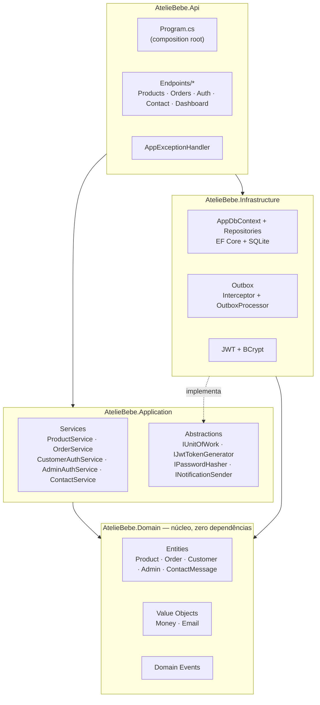
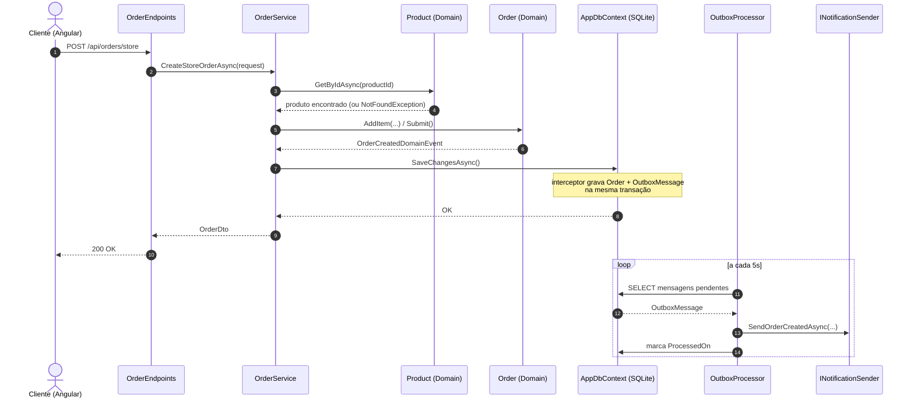

# Ateliê Layette Baby

[](https://dotnet.microsoft.com/)
[](https://learn.microsoft.com/aspnet/core/fundamentals/minimal-apis)
[](https://learn.microsoft.com/ef/core/)
[](https://www.sqlite.org/)
[](https://jwt.io/)
[](https://xunit.net/)
[](https://angular.dev/)
[](https://www.typescriptlang.org/)
[](https://rxjs.dev/)
[](https://getbootstrap.com/)
[](https://vitest.dev/)

Plataforma de e-commerce e gestão de encomendas para um ateliê especializado em **fraldas de ombro e boca bordadas** (individuais ou em kit) — a técnica de bordado (à mão ou computadorizado) varia por produto e é descrita individualmente no catálogo. O sistema cobre a jornada completa: vitrine pública com catálogo e carrinho, checkout com ou sem cadastro, pedidos personalizados sob medida, área do cliente, e um painel administrativo para gestão de produtos, encomendas e mensagens de contato.

Monorepo com dois projetos independentes:

| Diretório | Stack | Papel |
|---|---|---|
| [`server/`](./server) | .NET 10 · ASP.NET Core Minimal APIs · EF Core · SQLite | API REST, Clean Architecture |
| [`client/`](./client) | Angular 22 · standalone components · Bootstrap 5 | SPA (loja pública + painel admin) |

Os requisitos deste README (RF/RNF) têm uma versão formal, no padrão *Spec-Driven Development* (user stories + critérios de aceite EARS, design técnico e plano de tarefas rastreável), em [`spec/`](./spec): [`requirements.md`](./spec/requirements.md), [`design.md`](./spec/design.md) e [`tasks.md`](./spec/tasks.md).

## Sumário

- [Tecnologias](#tecnologias)
- [Arquitetura](#arquitetura)
  - [Backend](#backend-server)
  - [Frontend](#frontend-client)
  - [Eventos de domínio, Outbox e notificações](#eventos-de-domínio-outbox-e-notificações)
  - [Autenticação e autorização](#autenticação-e-autorização)
- [Como executar](#como-executar)
- [Requisitos](#requisitos)
  - [Requisitos funcionais](#requisitos-funcionais)
  - [Requisitos não funcionais](#requisitos-não-funcionais)
- [Regras de negócio](#regras-de-negócio)
  - [Catálogo](#catálogo)
  - [Pedidos e ciclo de vida](#pedidos-e-ciclo-de-vida)
  - [Contas de cliente e administrador](#contas-de-cliente-e-administrador)
  - [Contato](#contato)
  - [Valores monetários](#valores-monetários)
  - [Painel administrativo (dashboard)](#painel-administrativo-dashboard)
  - [Tratamento de erros](#tratamento-de-erros)

## Tecnologias

**Backend**

- .NET 10 / ASP.NET Core Minimal APIs (sem controllers — endpoints funcionais agrupados por feature)
- Entity Framework Core 10 + SQLite, com migrations versionadas
- Autenticação `JwtBearer` com claims de papel (`admin` / `customer`)
- BCrypt para hash de senha
- Padrão *Outbox* implementado sobre um `SaveChanges` interceptor + `BackgroundService`
- OpenAPI habilitado em ambiente de desenvolvimento
- xUnit para testes de domínio, com segredos locais (JWT) via `dotnet user-secrets`

**Frontend**

- Angular 22, componentes *standalone* (sem `NgModule`), roteamento com lazy loading (`loadComponent`)
- RxJS para chamadas HTTP reativas
- Bootstrap 5 + Bootstrap Icons
- Vitest para testes unitários
- Prettier (100 colunas, aspas simples, parser Angular para templates `.html`)

## Arquitetura

### Backend (`server/`)

Clean Architecture em quatro projetos, com dependências fluindo sempre para dentro (`Api` → `Application` / `Infrastructure` → `Domain`; `Domain` não depende de nenhum outro projeto):



- **Domain** modela entidades ricas (`Product`, `Order`, `Customer`, `Admin`, `ContactMessage`) que protegem suas próprias invariantes através de métodos de fábrica e comportamento (`Product.Reserve`, `Order.ChangeStatus`), e levantam eventos de domínio quando algo relevante acontece.
- **Application** expõe um serviço por feature (`IProductService`, `IOrderService`, `ICustomerAuthService`, `IAdminAuthService`, `IContactService`, `IDashboardService`), dependendo apenas de abstrações (`IUnitOfWork`, `IPasswordHasher`, `IJwtTokenGenerator`, `INotificationSender`) — nunca de `Infrastructure` diretamente.
- **Infrastructure** implementa persistência (EF Core + SQLite), repositórios, geração/validação de JWT, hashing de senha e o mecanismo de outbox.
- **Api** mapeia cada feature em um grupo de *minimal API endpoints* (`Endpoints/*Endpoints.cs`). Rotas públicas ficam em `/api/{feature}`; rotas administrativas ficam em `/api/admin/{feature}`, protegidas pela policy `AdminOnly`. `Program.cs` é o composition root: registra autenticação/CORS/tratamento de exceção, mapeia os endpoints e roda a inicialização do banco antes de subir o servidor.

### Frontend (`client/`)

```
src/app/
├── core/            Serviços singleton, models/DTOs, guards de rota, interceptor HTTP
├── features/
│   ├── public/      Loja: home, catálogo, produto, carrinho, checkout, login/cadastro, minha conta, contato e encomendas (unificado), galeria
│   └── admin/       Painel: dashboard, produtos, encomendas, mensagens de contato
└── shared/
    └── components/  Reservado para componentes reutilizáveis entre features
```

Cada serviço em `core/services/` espelha uma feature do backend (ex.: `product.service.ts` fala com `/api/products` e `/api/admin/products`). O `authInterceptor` decide automaticamente qual token Bearer anexar (admin ou cliente) com base na URL da requisição. Toda a UI e as rotas públicas estão em português (`/loja`, `/carrinho`, `/minha-conta`, `/contato`...), com `LOCALE_ID` fixado em `pt-BR`.

### Eventos de domínio, Outbox e notificações

```
Entidade levanta evento  →  SaveChanges interceptor grava na tabela Outbox (mesma transação)  →  BackgroundService faz polling (5s)  →  INotificationSender
```

Quando uma entidade de domínio muda de forma relevante (pedido criado, status alterado, cliente cadastrado, mensagem de contato recebida), ela registra um evento de domínio. O `DomainEventsToOutboxInterceptor` — um interceptor de `SaveChanges` do EF Core — serializa esse evento como uma linha na tabela `OutboxMessages`, **na mesma transação** da mudança de estado que o originou, garantindo que o evento nunca seja perdido mesmo que o processo caia logo em seguida.

Um `BackgroundService` (`OutboxProcessor`) faz *polling* a cada 5 segundos, lê lotes de até 20 mensagens pendentes, desserializa cada evento pelo seu tipo CLR e despacha para **dois canais independentes**: `INotificationSender` (WhatsApp, via `WhatsAppNotificationSender`) e `IEmailSender` (e-mail, via `ResendEmailSender`, RF47). O e-mail é tentado primeiro e suas exceções são sempre capturadas e logadas ali mesmo — uma falha ou ausência de configuração num canal nunca impede o outro. A entrega é *at-least-once*, mas só em relação ao WhatsApp: falhas ali incrementam o contador de tentativas da mensagem (até 5, então o registro é abandonado); e-mail, por ser tentado a cada passagem sem afetar esse contador, tem sua própria tentativa em toda vez que a mensagem ainda não foi processada.

Um pedido criado (`OrderCreatedDomainEvent`) dispara **duas** mensagens em cada canal: a confirmação para o cliente e um alerta de "novo pedido" para o ateliê (`Admin:NotificationEmail`/`Admin:NotificationPhone`, RF50) — mesma infraestrutura, dois destinatários. Já a redefinição de senha (`PasswordResetRequestedDomainEvent`, RF51) usa **só** o canal de e-mail: um link de redefinição não justifica a burocracia de aprovar mais um template no WhatsApp Business, e e-mail já cobre bem esse caso de uso.

Exemplo de ponta a ponta — criação de um pedido de loja:



### Autenticação e autorização

Dois fluxos de autenticação independentes, compartilhando o mesmo esquema `JwtBearer`, mas com papéis e policies distintos:

| | Papel (claim) | Policy | Endpoints |
|---|---|---|---|
| Cliente | `customer` | `CustomerOnly` | `/api/auth/*`, `/api/orders/mine` |
| Administrador | `admin` | `AdminOnly` | `/api/admin/auth/login`, `/api/admin/*` |

O token JWT carrega `NameIdentifier`, `Name`, `Email` e `Role`, assinado com HMAC-SHA256 e expiração configurável (`Jwt:ExpiryMinutes`, padrão 480 min). Não existe endpoint de auto-cadastro de administrador — o único admin é semeado na primeira inicialização do banco (`DbInitializer`), com credenciais configuráveis via `AdminSeed:Email` / `AdminSeed:Password`.

## Como executar

### Backend

```bash
cd server
dotnet build AtelieBebe.slnx

# primeira vez apenas: gera um segredo JWT local (nunca commitado)
dotnet user-secrets set "Jwt:Secret" "<uma-chave-aleatoria-de-pelo-menos-32-caracteres>" --project src/AtelieBebe.Api

dotnet run --project src/AtelieBebe.Api        # http://localhost:5120
```

`appsettings.json` mantém `Jwt:Secret` vazio de propósito — o valor real fica apenas no cofre local do [`dotnet user-secrets`](https://learn.microsoft.com/aspnet/core/security/app-secrets), fora do controle de versão. Sem esse passo, a API sobe normalmente mas a geração de token falha em tempo de execução (chave curta demais para HMAC-SHA256).

`PagBank:Token` (RF40) segue o mesmo padrão — vazio em `appsettings.json`, configurado localmente via `dotnet user-secrets set "PagBank:Token" "<token>" --project src/AtelieBebe.Api` e, em produção, pela variável de ambiente `PagBank__Token` (mais `PagBank__Sandbox=true` se o token for de uma conta de teste, em vez da conta real). Sem token configurado **em produção**, o checkout de loja funciona normalmente, só sem oferecer pagamento online (`IPaymentGateway.IsConfigured` retorna `false`, e `CreatePreferenceAsync` não é chamado). Em **desenvolvimento** (`dotnet run`), sem token configurado, entra em ação um `FakePaymentGateway` que simula a página de pagamento hospedada pela própria SPA (`/pagamento-simulado/:orderId`) — deixa pré-visualizar o fluxo completo de pagamento antes das credenciais reais existirem, sem chamar nenhuma API externa.

`Resend:ApiKey` (RF47) segue o mesmo padrão de segredo em branco — `dotnet user-secrets set "Resend:ApiKey" "<chave>" --project src/AtelieBebe.Api` localmente, `Resend__ApiKey` em produção. `Resend:FromEmail` precisa ser um endereço de um domínio verificado no painel do Resend (mesmo processo de DNS já usado para o e-mail do domínio) — sem isso o envio falha mesmo com a chave certa.

`AdminNotification:Email`/`AdminNotification:Phone` (RF50) não são segredos — ficam direto em `appsettings.json` (o telefone já vem preenchido com o WhatsApp do ateliê; o e-mail fica em branco até o admin decidir para onde mandar os alertas de novo pedido).

Ao subir, a API aplica automaticamente as migrations pendentes e semeia um administrador padrão (`admin@ateliebebe.com.br` / `admin123`, salvo configuração em contrário) e um catálogo de produtos de exemplo. O banco SQLite fica em `src/AtelieBebe.Api/atelie-bebe.db`.

Para gerar/aplicar migrations:

```bash
dotnet ef migrations add <Nome> --project src/AtelieBebe.Infrastructure --startup-project src/AtelieBebe.Api
dotnet ef database update --project src/AtelieBebe.Infrastructure --startup-project src/AtelieBebe.Api
```

Para rodar os testes de domínio:

```bash
dotnet test test/AtelieBebe.Domain.Tests/AtelieBebe.Domain.Tests.csproj
```

### Frontend

```bash
cd client
npm install
npm start      # ng serve — http://localhost:4200
npm run build   # build de produção em dist/
npm test        # testes unitários (Vitest)
```

`client/src/environments/environment.ts` aponta `apiUrl` para `http://localhost:5120/api`. Se o backend rodar em outra porta, ajuste esse arquivo e a lista `Cors:AllowedOrigins` em `appsettings.json`.

### Backup do banco de dados (produção)

O banco (SQLite, um único arquivo) não tem nenhuma rotina de backup por padrão — se o servidor tiver um problema, os pedidos e cadastros de clientes se perdem. `server/ops/backup-db.sh` faz um backup consistente (via `sqlite3 .backup`, não uma cópia de arquivo crua) e mantém só os 10 backups mais recentes, apagando os mais antigos.

Para instalar na VPS (rode uma vez):

```bash
sudo cp /var/www/atelie-bebe/server/ops/backup-db.sh /usr/local/bin/atelie-bebe-backup.sh
sudo chmod +x /usr/local/bin/atelie-bebe-backup.sh
( sudo crontab -l 2>/dev/null; echo "*/30 * * * * /usr/local/bin/atelie-bebe-backup.sh >> /var/log/atelie-bebe-backup.log 2>&1" ) | sudo crontab -
```

Isso roda o backup a cada 30 minutos, salvando em `/var/backups/atelie-bebe/` (fora da pasta de publicação, então sobrevive a deploys), sempre mantendo só as 10 cópias mais recentes (`KEEP_COUNT` no script) — com esse intervalo, cobre as últimas 5 horas. Confira o caminho do banco no início do script (`DB_PATH`) — o padrão assume `ConnectionStrings:Default` sem alteração (`Data Source=atelie-bebe.db`, relativo ao diretório de trabalho do serviço, que é a pasta de publicação).

**Isso cobre só backup local, no mesmo servidor** — não protege contra a perda do VPS inteiro (disco corrompido, conta suspensa, etc.). `server/ops/sync-offsite.sh` complementa isso sincronizando `/var/backups/atelie-bebe/` para o Google Drive via `rclone`, encadeado depois do backup local no mesmo cron.

**Instalar o rclone e autorizar o Google Drive (rode uma vez, tem uma etapa manual que só você pode fazer — é um login OAuth na sua conta Google):**

```bash
# na VPS
curl https://rclone.org/install.sh | sudo bash
sudo rclone config
```

No assistente do `rclone config`: `n` (novo remoto) → nome `gdrive` → escolha o número correspondente a "Google Drive" → deixe `client_id`/`client_secret` em branco (Enter) → scope `1` (acesso completo) → deixe `root_folder_id`/`service_account_file` em branco → `n` para configuração avançada → em **"Use auto config?"** responda `n` (a VPS não tem navegador). O rclone vai imprimir um comando parecido com `rclone authorize "drive"`.

Copie esse comando e rode-o na sua própria máquina (Windows), com o rclone instalado localmente ([rclone.org/downloads](https://rclone.org/downloads/)) — isso abre o navegador, você loga na sua conta Google e autoriza o rclone. Ao final, o terminal local imprime um bloco de texto (começa com `{"access_token":...}`) — copie esse bloco inteiro e cole de volta no prompt `result>` que está esperando na VPS. Confirme com `y` para salvar o remoto e `q` para sair do assistente.

Depois de configurado, instale a sincronização no cron (substitui a linha antiga do backup local, encadeando a sincronização logo depois):

```bash
sudo cp /var/www/atelie-bebe/server/ops/sync-offsite.sh /usr/local/bin/atelie-bebe-sync-offsite.sh
sudo chmod +x /usr/local/bin/atelie-bebe-sync-offsite.sh
( sudo crontab -l 2>/dev/null | grep -v atelie-bebe; echo "*/30 * * * * /usr/local/bin/atelie-bebe-backup.sh && /usr/local/bin/atelie-bebe-sync-offsite.sh >> /var/log/atelie-bebe-backup.log 2>&1" ) | sudo crontab -
```

Teste rodando `sudo /usr/local/bin/atelie-bebe-sync-offsite.sh` manualmente uma vez e conferindo se os arquivos aparecem na pasta "atelie-bebe-backups" do Google Drive. Como o script roda `rclone sync` (não `copy`), qualquer arquivo apagado localmente pela retenção dos 10 mais recentes também é removido do Drive — o Drive espelha exatamente o conteúdo de `/var/backups/atelie-bebe/`, nunca acumula além disso.

## Requisitos

### Atores

| Ator | Descrição |
|---|---|
| Visitante | Usuário não autenticado navegando na loja pública |
| Cliente | Visitante autenticado (`customer`), com acesso à área "Minha Conta" |
| Administrador | Usuário autenticado (`admin`), com acesso ao painel de gestão |

### Requisitos funcionais

| ID | Requisito | Ator |
|---|---|---|
| RF01 | O sistema deve permitir listar produtos ativos do catálogo, com filtro opcional por categoria | Visitante |
| RF02 | O sistema deve permitir listar produtos em destaque | Visitante |
| RF03 | O sistema deve permitir listar as categorias de produtos disponíveis | Visitante |
| RF04 | O sistema deve permitir consultar o detalhe de um produto pelo seu slug | Visitante |
| RF05 | O sistema deve permitir finalizar um pedido de loja (checkout) a partir do carrinho, com ou sem autenticação | Visitante / Cliente |
| RF06 | O sistema deve oferecer uma página única de "Contato e Encomendas" que reúne dúvidas gerais e pedidos de encomenda personalizada; ao enviar, monta uma mensagem com os dados informados e abre uma conversa no WhatsApp do ateliê (nenhum dado é persistido pelo backend nesse fluxo) | Visitante / Cliente |
| RF07 | O sistema deve permitir consultar um pedido específico pelo seu ID, sem exigir autenticação (página de confirmação) | Visitante / Cliente |
| RF08 | O sistema deve permitir que um cliente autenticado liste todos os pedidos vinculados à sua conta | Cliente |
| RF09 | O sistema deve permitir o cadastro de uma nova conta de cliente, validando e-mail único e senha com no mínimo 6 caracteres | Visitante |
| RF10 | O sistema deve permitir login de cliente por e-mail e senha, retornando um token de acesso (JWT) | Cliente |
| RF11 | O sistema deve permitir login de administrador por e-mail e senha, retornando um token de acesso (JWT) com papel administrativo | Administrador |
| RF12 | O sistema deve permitir listar todo o catálogo de produtos, incluindo inativos | Administrador |
| RF13 | O sistema deve permitir cadastrar novos produtos no catálogo | Administrador |
| RF14 | O sistema deve permitir editar os dados de um produto existente (nome, descrição, preço, categoria, imagem, destaque) | Administrador |
| RF15 | ~~O sistema deve permitir ajustar manualmente o estoque de um produto~~ — **removido**: o ateliê não mantém estoque, todo produto é feito sob encomenda | — |
| RF16 | O sistema deve permitir ativar ou inativar um produto, removendo-o (ou não) da vitrine pública | Administrador |
| RF17 | O sistema deve permitir listar pedidos, com filtro opcional por status | Administrador |
| RF18 | O sistema deve permitir alterar o status de um pedido, respeitando a máquina de estados definida | Administrador |
| RF19 | O sistema deve permitir consultar as mensagens de contato recebidas pela API (canal reservado para uso administrativo/futuro — o formulário público atual não envia mais mensagens por aqui, ver RF06) | Administrador |
| RF20 | O sistema deve exibir um painel com indicadores consolidados: total de pedidos, pedidos em aberto, receita total, receita do mês, total de produtos, total de clientes, distribuição de pedidos por status e pedidos recentes | Administrador |
| RF21 | ~~O sistema deve reservar automaticamente o estoque de um produto ao confirmar um pedido de loja~~ — **removido**: sem controle de estoque, não há o que reservar | — |
| RF22 | ~~O sistema deve registrar um evento de estoque baixo~~ — **removido**: sem controle de estoque, não há alerta de estoque baixo | — |
| RF23 | O sistema deve notificar o cliente sempre que o status de um pedido for alterado | Sistema |
| RF24 | O sistema deve notificar o cliente na confirmação de criação de um pedido | Sistema |
| RF25 | O sistema deve impedir a alteração dos itens de um pedido após ele sair do status inicial "Recebido" | Sistema |
| RF26 | O sistema deve paginar as listagens de produtos (loja e admin), encomendas (admin) e mensagens de contato (admin), aceitando `page`/`pageSize` e devolvendo o total de itens e páginas | Visitante / Administrador |
| RF27 | O sistema deve permitir associar um produto a um ou mais clientes específicos, tornando-o exclusivo — visível e encomendável apenas por eles, ausente das listagens (loja, categorias, destaque) e respondendo 404 no detalhe para quem não tem acesso | Administrador / Cliente |
| RF28 | O sistema deve permitir que o cliente informe, ao adicionar qualquer produto ao carrinho, o texto a ser bordado e a quantidade de peças com esse mesmo bordado, persistindo essa personalização no pedido e exibindo-a no detalhe administrativo da encomenda | Cliente / Administrador |
| RF30 | O sistema deve exigir um CPF válido e único no cadastro de cliente (`POST /api/auth/register`), rejeitando CPF ausente, com dígitos verificadores inválidos ou já usado por outra conta; contas criadas antes deste requisito permanecem válidas sem CPF | Visitante |
| RF31 | O sistema deve permitir que o administrador liste todas as contas de cliente cadastradas (nome, e-mail, telefone, CPF e data de cadastro) | Administrador |
| RF32 | O sistema deve exigir um CPF válido no checkout de loja (`POST /api/orders/store`) e na encomenda personalizada (`POST /api/orders/custom`), rejeitando pedido sem CPF ou com CPF inválido; pedidos criados antes deste requisito permanecem válidos sem CPF | Cliente |
| RF33 | O sistema deve exigir que o cliente esteja autenticado para finalizar a compra — quem chega em `/checkout` sem sessão é levado para login/cadastro e retorna ao checkout após autenticar; não há mais checkout como convidado | Cliente |
| RF34 | O sistema deve pré-preencher, no checkout, os dados do cliente autenticado — nome, e-mail, telefone e CPF a partir do cadastro (`GET /api/auth/me`), e o endereço de entrega a partir do pedido mais recente que tiver um (`GET /api/orders/mine`) — sem impedir que o cliente edite qualquer campo antes de confirmar | Cliente |
| RF35 | O sistema deve calcular um frete estimado no checkout de loja, com base no estado (UF) de destino e na quantidade de itens do carrinho, somando-o ao subtotal dos produtos para compor o total do pedido (`Orders.ShippingCostAmount`); pedidos criados antes deste requisito permanecem com frete zero | Cliente |
| RF36 | O sistema deve mascarar o CPF do cliente nas telas administrativas que o exibem (listagem de clientes, detalhe de encomenda), mostrando apenas o bloco do meio (`***.XXX.XXX-**`) — o CPF completo continua armazenado e é retornado pela API normalmente, só a exibição nessas telas é mascarada | Administrador |
| RF37 | O sistema deve permitir que o administrador troque, pelo painel (`/admin/imagens`), a foto principal da página inicial e a foto da página "Sobre", enviando um arquivo diretamente, sem precisar de deploy de código | Administrador |
| RF38 | O sistema deve permitir que o administrador envie a foto de um produto como arquivo (upload), além de continuar aceitando colar uma URL, no formulário de produto do admin | Administrador |
| RF39 | O sistema deve permitir que o administrador adicione e remova fotos da galeria pública (`/galeria`) pelo painel administrativo (`/admin/galeria`), sem precisar de deploy de código | Administrador |
| RF40 | O sistema deve oferecer PIX e cartão de crédito como meios de pagamento no checkout de loja, via checkout hospedado do PagBank: ao criar o pedido, se o gateway estiver configurado, o cliente é redirecionado a uma página de pagamento hospedada; o status do pagamento (`Orders.PaymentStatus`) é atualizado de forma assíncrona via webhook (`POST /api/payments/pagbank/webhook`), sempre reconsultando a API do PagBank pelo id do pedido em vez de confiar no conteúdo da notificação; sem gateway configurado, o pedido é criado normalmente, sem redirecionamento | Cliente / Sistema |
| RF41 | O sistema deve permitir que o administrador filtre a listagem de encomendas (`/admin/encomendas`) por status de pagamento, veja esse status em cada linha e, no detalhe de uma encomenda ainda não paga, gere um novo link de pagamento (novo checkout do PagBank) para copiar/reenviar ao cliente ou abrir diretamente | Administrador |
| RF42 | O sistema deve expor metadados de SEO para as páginas públicas — título, descrição, Open Graph e Twitter Card por página (com imagem e tipo específicos no detalhe do produto), link canônico, `robots.txt` e um `sitemap.xml` gerado dinamicamente com as páginas estáticas e todos os produtos ativos e públicos | Visitante / Sistema |
| RF43 | O sistema deve carregar Google Analytics (GA4) e/ou Meta Pixel quando um ID de rastreamento estiver configurado, registrando visualizações de página a cada navegação; sem nenhum ID configurado, nenhum script de terceiro é carregado | Sistema |
| RF44 | O sistema deve permitir que o visitante busque produtos pelo nome na loja (`/loja?busca=`), combinável com o filtro de categoria já existente, reiniciando a paginação para a primeira página a cada nova busca | Visitante |
| RF45 | O sistema deve permitir que um cliente que comprou um produto (qualquer status de pedido) deixe uma avaliação (nota de 1 a 5 estrelas e comentário opcional) na página do produto, publicada imediatamente e limitada a uma avaliação por cliente por produto; a média e o total de avaliações aparecem ao lado do nome do produto | Cliente |
| RF46 | O sistema deve permitir que o administrador edite nome, e-mail, CPF e telefone de uma conta de cliente já cadastrada (`/admin/clientes/:id/editar`), rejeitando e-mail ou CPF já usados por outra conta | Administrador |
| RF47 | O sistema deve enviar e-mails transacionais (pedido recebido, status atualizado, boas-vindas, confirmação de contato) via Resend, como canal independente do WhatsApp — a falha ou ausência de configuração de um canal nunca impede o outro; sem `Resend:ApiKey` configurado, nenhum e-mail é enviado, sem erro visível ao usuário | Sistema |
| RF48 | O sistema deve permitir que o administrador exporte a listagem de encomendas (respeitando os filtros de status/pagamento ativos) como um arquivo CSV, pelo botão "Exportar CSV" em `/admin/encomendas` | Administrador |
| RF49 | O sistema deve permitir que o administrador adicione, remova e substitua fotos adicionais de um produto (além da foto de capa), exibidas como galeria com miniaturas clicáveis na página pública do produto | Administrador / Visitante |
| RF50 | O sistema deve notificar o ateliê (e-mail e/ou WhatsApp, conforme configurado) sempre que um novo pedido for criado, além da confirmação já enviada ao cliente | Sistema |
| RF51 | O sistema deve permitir que um cliente redefina sua senha por e-mail (`/esqueci-senha`, `/redefinir-senha`) através de um link de uso único válido por 1 hora, sem exigir a senha atual; a resposta de solicitação nunca revela se o e-mail informado está cadastrado | Cliente |
| RF52 | O sistema deve permitir que o administrador anexe um código de rastreio a uma encomenda, exibido ao cliente na página do pedido | Administrador / Cliente |
| RF53 | O sistema deve permitir que um cliente autenticado exclua sua própria conta (`/minha-conta`), mediante confirmação de senha — contas sem nenhum pedido são removidas por completo; contas com pedido têm os dados pessoais anonimizados e o login desativado, mantendo o histórico de pedidos (nome/e-mail/telefone/CPF da compra são uma cópia própria do pedido, não afetada pela anonimização) | Cliente |
| RF54 | O sistema deve registrar toda mensagem enviada pela página de Contato e Encomendas (`/contato`) como `ContactMessage`, visível em `/admin/mensagens`, além de continuar abrindo a conversa no WhatsApp — as duas coisas acontecem juntas, uma falha ao registrar nunca impede o WhatsApp de abrir | Visitante / Cliente / Sistema |
| RF55 | O sistema deve permitir que o administrador aplique uma promoção (desconto percentual com início e fim definidos) a um produto ou a vários de uma vez; a promoção ativa e expira automaticamente conforme a data/hora, sem necessidade de intervenção manual, e o preço promocional é o que efetivamente é cobrado no checkout | Administrador / Sistema |
| RF56 | O sistema deve exportar a listagem de encomendas em CSV com uma linha por item do pedido (produto, quantidade, texto bordado e cor da linha), não uma linha por pedido | Administrador |
| RF57 | O sistema deve coletar o endereço completo do cliente no cadastro (`/cadastro`), com preenchimento automático de rua/bairro/cidade/estado a partir do CEP via ViaCEP, no mesmo padrão já usado no checkout | Visitante |
| RF58 | O sistema deve permitir que o cliente escolha a cor da linha de bordado (a partir de uma paleta fixa), junto do texto a bordar, ao adicionar qualquer produto ao carrinho | Cliente |
| RF59 | O sistema deve permitir que o administrador crie cupons de desconto (código, percentual, validade e limite de usos opcionais) que o cliente digita no checkout, independentes das promoções automáticas por produto | Administrador / Cliente |
| RF60 | O sistema deve limitar a 5 tentativas por minuto, por IP, nos endpoints onde um "chute" de senha/código é o ataque (login de cliente, login de admin, redefinição de senha, exclusão de conta, validação de cupom), respondendo `429` a partir da 6ª tentativa | Sistema |
| RF61 | O sistema deve expor um endpoint `GET /health` que confirma tanto que o processo está no ar quanto que o banco de dados está acessível, para monitoramento externo de uptime | Sistema |
| RF62 | O painel administrativo deve exibir ticket médio, os 5 produtos mais vendidos e um gráfico de vendas dos últimos 30 dias, além dos indicadores já existentes | Administrador |

### Requisitos não funcionais

| ID | Requisito |
|---|---|
| RNF01 | A comunicação entre cliente e servidor deve ocorrer por uma API RESTful, documentada via OpenAPI em ambiente de desenvolvimento |
| RNF02 | Senhas de clientes e administradores devem ser armazenadas apenas como hash (BCrypt), nunca em texto plano |
| RNF03 | O acesso às rotas administrativas deve exigir um token JWT válido com papel `admin` |
| RNF04 | O acesso às rotas exclusivas de cliente deve exigir um token JWT válido com papel `customer` |
| RNF05 | Erros da aplicação devem ser retornados em um formato padronizado (`ProblemDetails`), sem expor detalhes internos em falhas inesperadas (HTTP 500) |
| RNF06 | O disparo de notificações não deve bloquear a resposta da requisição que originou o evento (processamento assíncrono via outbox) |
| RNF07 | A persistência de um evento de domínio deve ser atômica em relação à alteração de dados que o originou (mesma transação) |
| RNF08 | A interface deve ser responsiva e totalmente localizada em português brasileiro (pt-BR) |
| RNF09 | O banco de dados de produção deve ter uma rotina de backup diário automatizada, armazenada fora da pasta de publicação (sobrevive a deploys) |

## Regras de negócio

### Catálogo

- Nome, slug e categoria são obrigatórios; o slug é gerado automaticamente a partir do nome e, em caso de colisão, recebe um sufixo aleatório de 6 caracteres.
- Produtos podem ser marcados como **destaque** (`Featured`) para aparecer na home, e **ativos/inativos** (`Active`); apenas produtos ativos aparecem na listagem e busca pública — produtos inativos continuam visíveis e editáveis no painel admin.
- Não há controle de estoque: o ateliê fabrica cada peça sob encomenda, então todo produto está sempre disponível para compra, em qualquer quantidade — não existe reserva de estoque, alerta de estoque baixo, nem status "esgotado" na loja.
- Um produto sem nenhum cliente associado é **público** (visível a todos, como hoje). Associar um ou mais clientes o torna **exclusivo**: some das listagens públicas (loja, categorias, destaque) e do detalhe (404) para quem não está na lista de acesso — inclusive administradores continuam vendo tudo nas telas administrativas, independentemente da regra de visibilidade pública.
- Todo produto, exclusivo ou público, aceita personalização de bordado (texto + cor da linha, escolhida numa paleta fixa de 14 cores + quantidade de peças) — é obrigatório informar tanto o texto quanto a cor antes de adicionar ao carrinho, então a compra sempre passa pela página de detalhe do produto (não há mais botão de "adicionar rápido" na grade da loja). Texto e cor formam, junto com o produto, a identidade da linha do carrinho — quantidades da mesma combinação se somam, combinações diferentes viram linhas separadas.
- Um produto pode ter uma promoção ativa (`DiscountPercentage` + `PromotionStartsAt`/`PromotionEndsAt`) — o preço efetivo (`EffectivePrice`) só reflete o desconto enquanto o instante atual está dentro da janela configurada; fora dela, a promoção continua salva mas inativa, sem precisar de nenhuma tarefa agendada para "desligar" na hora certa. O preço efetivo é o que realmente é cobrado ao criar um pedido de loja — o preço unitário enviado pelo cliente na requisição é sempre ignorado para produtos reais do catálogo. O admin pode aplicar a mesma promoção a vários produtos de uma vez (`/admin/produtos`, seleção múltipla).
- A busca da loja (`?busca=`) filtra por nome do produto (case-insensitive, substring), combinável com o filtro de categoria; qualquer mudança em busca ou categoria reinicia a paginação para a página 1.
- Um cliente só pode avaliar um produto que já constou como item em algum pedido seu (qualquer status — não precisa estar entregue), e só uma vez por produto; a avaliação (nota 1-5 + comentário opcional) aparece publicamente de imediato, sem moderação prévia do admin.
- Além da foto de capa (`ImageUrl`, usada em cards/listagens), um produto pode ter fotos adicionais numa galeria (`ProductImages`, ordem preservada) — só aparecem no detalhe do produto, como miniaturas clicáveis abaixo da foto principal. `Product.SetImages(...)` substitui a galeria inteira de uma vez (mesmo padrão de "substituir tudo" já usado em `SetAllowedCustomers`).

### Pedidos e ciclo de vida

- Um pedido é de um dos dois tipos:
  - **Loja** (`Loja`): um ou mais itens do catálogo.
  - **Personalizado** (`Personalizada`): encomenda sob medida, representada como um único item com o valor estimado informado pelo cliente e detalhes livres em JSON (`CustomDetailsJson`).
- Pedidos de loja exigem pelo menos um item; a validação ocorre tanto na camada de aplicação quanto no domínio (`Order.Submit`).
- No checkout, o campo CEP busca o endereço automaticamente via [ViaCEP](https://viacep.com.br/) (rua, bairro, cidade, estado) assim que o cliente digita os 8 dígitos; os campos continuam editáveis e, se o CEP não for encontrado, uma mensagem de erro é exibida sem apagar o restante do formulário.
- Itens só podem ser adicionados a um pedido enquanto ele está no status inicial `Recebido`; qualquer tentativa de alterar itens após isso é rejeitada — o conteúdo do pedido é imutável a partir do momento em que entra em processamento.
- O checkout de loja (`/api/orders/store`, a partir do carrinho) é aberto a visitantes não autenticados; quando a requisição vem de um cliente logado, o pedido é automaticamente vinculado à conta (`CustomerId`). Consultar um pedido específico por ID (`GET /api/orders/{id}`) não exige autenticação — é assim que a página de confirmação de pedido funciona para convidados.
- O endpoint `/api/orders/custom` (criação de encomenda personalizada via API) continua implementado, mas **a página pública de contato/encomenda não o chama mais** — ela monta a solicitação como mensagem de WhatsApp em vez de criar um pedido no backend (ver seção [Contato](#contato)).
- O total do pedido nunca é armazenado: é sempre recalculado como a soma dos subtotais dos itens (`preço unitário × quantidade`) no momento da leitura.
- O status segue uma máquina de estados estrita, sem pular etapas nem retroceder:

  ```mermaid
  stateDiagram-v2
      [*] --> Recebido
      Recebido --> EmProducao
      Recebido --> Cancelado
      EmProducao --> Pronto
      EmProducao --> Cancelado
      Pronto --> Enviado
      Pronto --> Cancelado
      Enviado --> Entregue
      Entregue --> [*]
      Cancelado --> [*]
  ```

  `Entregue` e `Cancelado` são estados terminais: nenhuma transição é permitida a partir deles. Qualquer transição fora do mapa acima é rejeitada com erro de domínio.
- Toda transição de status válida emite `OrderStatusChangedDomainEvent` (notificação ao cliente); a criação/confirmação de um pedido emite `OrderCreatedDomainEvent`, que também dispara o alerta de novo pedido para o ateliê (RF50).
- O administrador pode anexar um código de rastreio livre (`Orders.TrackingCode`, RF52) a qualquer momento — não é uma etapa obrigatória do fluxo de status, mas a tela de edição só exibe o campo a partir do status `Enviado`. O código aparece para o cliente na página do pedido assim que salvo; string em branco limpa o código.
- O pagamento é rastreado separadamente do status de produção/entrega, em `Orders.PaymentStatus` (`Pendente` | `Pago` | `Recusado`) — um pedido pode estar `EmProducao` com pagamento ainda `Pendente`, por exemplo. Ao criar um pedido de loja, se o gateway de pagamento (PagBank) estiver configurado, um checkout hospedado é criado e sua URL é devolvida na resposta (`PaymentUrl`) para redirecionar o cliente; sem configuração (`PagBank:Token` em branco), o pedido é criado normalmente e nenhuma URL é retornada — igual ao padrão já usado para notificações via WhatsApp. O webhook (`POST /api/payments/pagbank/webhook`) nunca confia no conteúdo da notificação recebida, apenas no id do pedido do PagBank: sempre reconsulta `GET /orders/{id}` na API do PagBank antes de atualizar o pedido correspondente (pelo campo `reference_id`, que é o id do nosso pedido), e a marcação como `Pago` é idempotente — uma notificação duplicada ou fora de ordem nunca rebaixa um pagamento já aprovado.
- **Cupons de desconto (RF59)**: código digitado pelo cliente no checkout, independente das promoções automáticas por produto (Requisito 43). `Coupon.IsValid` combina três condições — ativo, dentro da validade (se houver) e abaixo do limite de usos (se houver) — todas checadas de novo no momento da criação do pedido, não só na pré-visualização do checkout, então um cupom que expira ou esgota entre a validação e a confirmação do pedido é rejeitado com segurança. O desconto incide só sobre `ItemsTotal` (nunca sobre o frete) e é subtraído do total via `Money.Subtract`, que nunca deixa o resultado ficar negativo. `POST /api/coupons/validate` (público) deixa o checkout mostrar o desconto antes de confirmar o pedido, sem custo (não incrementa o contador de usos) — só `POST /api/orders/store` com um `couponCode` de fato incrementa `UsesCount`.

### Contas de cliente e administrador

- Cadastro de cliente exige e-mail único (verificado antes do registro) e senha com **mínimo de 6 caracteres**; a senha nunca é persistida em texto plano, apenas seu hash BCrypt.
- Login — tanto de cliente quanto de administrador — retorna sempre a mesma mensagem genérica (*"E-mail ou senha inválidos"*) para e-mail inexistente ou senha incorreta, evitando enumeração de contas por diferença de resposta.
- Não existe rota pública de cadastro de administrador: o único admin é criado pela seed inicial do banco.
- E-mails são normalizados (trim + minúsculas) e validados por formato antes de virarem um value object `Email` — inválidos são rejeitados na borda do domínio, não na camada de apresentação.
- O administrador pode editar nome, e-mail, CPF, telefone e endereço de qualquer conta de cliente (`/admin/clientes/:id/editar`) — mas não a senha; a edição rejeita e-mail ou CPF já usados por **outra** conta (a própria conta pode manter os mesmos valores sem conflito).
- **Endereço no cadastro (RF57)**: o formulário de cadastro (`/cadastro`) coleta o endereço completo (CEP, rua, número, complemento, bairro, cidade, estado), com o mesmo preenchimento automático via ViaCEP já usado no checkout. Os campos ficam salvos como colunas próprias em `Customer` (não um JSON, diferente do endereço de entrega do pedido) — contas criadas antes deste requisito simplesmente não têm esses campos preenchidos, sem quebrar nada.
- **Redefinição de senha (RF51)**: `PasswordResetToken` guarda só o hash SHA-256 do token (nunca o valor bruto, que só existe no link do e-mail e na requisição que o resgata), com validade de 1 hora e uso único (`UsedAt` marcado no resgate, uma segunda tentativa com o mesmo token falha). `POST /api/auth/forgot-password` sempre responde `204`, exista ou não o e-mail, para não revelar quais contas estão cadastradas.
- **Exclusão de conta pelo cliente (RF53, LGPD)**: exige a senha atual. Sem nenhum pedido vinculado, a conta é removida do banco. Com pedido(s), a conta é **anonimizada** em vez de removida — `Customer.Anonymize` zera nome (`"Cliente removido"`), e-mail (substituído por um endereço sintético único), telefone e CPF, e invalida a senha, mas mantém a linha — porque `Orders.CustomerName/Email/Phone/Cpf` são uma cópia própria feita no momento da compra, não uma referência viva ao cadastro, e o ateliê pode ter obrigação legal/fiscal de manter esse histórico. Uma conta anonimizada nunca mais consegue logar e some da tela de edição administrativa (`isAnonymized: true`).

### Contato

- A página pública **"Contato e Encomendas"** (`/contato`) unifica dúvida geral e pedido de encomenda personalizada em um único formulário. Um alternador ("É uma encomenda personalizada") revela os campos específicos da peça (tipo, tamanho, tecido, cor, nome para bordar); os demais campos (nome, e-mail e telefone) são compartilhados pelos dois casos.
- Ao enviar, o formulário abre `https://wa.me/<número-do-ateliê>?text=<mensagem>` em uma nova aba, iniciando a conversa diretamente no WhatsApp, **e** chama `POST /api/contact` em paralelo para registrar a mesma mensagem como `ContactMessage`, visível em `/admin/mensagens` (RF54). As duas coisas são independentes: se o registro falhar (backend fora do ar, etc.), o WhatsApp já abriu e o cliente nem percebe — é *best-effort*, não bloqueia a conversa.
- Quando o e-mail não é informado (campo opcional no formulário, diferente do telefone), o registro usa um e-mail sintético (`sem-email-<telefone>@contato.local`) só para satisfazer a obrigatoriedade de `ContactMessage.Email` — o WhatsApp continua funcionando normalmente com base no telefone.
- A rota antiga `/encomenda-personalizada` foi mantida como redirecionamento (`redirectTo`) para `/contato`, preservando links e favoritos existentes.
- O número de WhatsApp usado no link (`WHATSAPP_NUMBER` em `contact.ts`, `+55 11 91313-0481`) é o número real do ateliê, o mesmo já exibido publicamente na página e no rodapé.
- O endpoint `POST /api/orders/custom` (criação de um pedido de verdade a partir de uma encomenda personalizada) continua implementado e funcional, mas a página de contato não o chama — uma encomenda personalizada vira só uma `ContactMessage` registrada, nunca um `Order`, já que o valor é apenas uma estimativa até o ateliê confirmar os detalhes pelo WhatsApp.

### Valores monetários

- Todo valor monetário passa pelo value object `Money` (quantia + moeda), que nunca aceita valores negativos e sempre arredonda para 2 casas decimais (`MidpointRounding.AwayFromZero`).
- Operações aritméticas entre `Money` (soma, multiplicação por quantidade) preservam essas invariantes e impedem misturar moedas diferentes.

### Painel administrativo (dashboard)

- O resumo do dashboard (`/api/admin/dashboard`) exclui pedidos **cancelados** de todas as métricas de receita e contagem de pedidos "em aberto".
- "Pedidos em aberto" são os que estão em qualquer status anterior a `Entregue` (`Recebido`, `EmProducao`, `Pronto`, `Enviado`).
- Receita do mês corrente é calculada a partir do início do mês em UTC, não do fuso horário local.
- **Métricas adicionais (RF62)**: ticket médio (`RevenueTotal / TotalOrders`, zero quando não há pedidos), os 5 produtos mais vendidos por quantidade (agregados a partir dos itens de todos os pedidos não cancelados) e um gráfico de barras simples (CSS puro, sem biblioteca de gráficos) com a receita diária dos últimos 30 dias — todos calculados a partir do mesmo carregamento de pedidos já feito para o restante do resumo, sem consulta extra ao banco.

### Segurança e disponibilidade

- **Limite de tentativas (RF60)**: `/api/auth/login`, `/api/admin/auth/login`, `/api/auth/reset-password`, `/api/auth/delete-account` e `/api/coupons/validate` aceitam no máximo 5 requisições por minuto por combinação de IP do cliente + rota (não um limite único compartilhado entre rotas) — a 6ª tentativa no mesmo minuto recebe `429 Too Many Requests` sem chegar a tocar o serviço de aplicação. Atrás do Nginx em produção, `ForwardedHeadersOptions` confia no `X-Forwarded-For` do proxy local para enxergar o IP real do visitante — sem isso, todo tráfego apareceria vindo do próprio Nginx, e o limite por IP na prática viraria um limite global.
- **Health check (RF61)**: `GET /health` roda um `DatabaseHealthCheck` que tenta `Database.CanConnectAsync()` — retorna `200 Healthy` só quando a API está no ar **e** consegue falar com o banco, não apenas quando o processo está rodando. Pensado para um monitor de uptime externo (ex.: UptimeRobot) apontar para essa rota.

### Tratamento de erros

Exceções de domínio e aplicação são convertidas em respostas HTTP consistentes no formato `ProblemDetails` por um `IExceptionHandler` central:

| Exceção | Status HTTP |
|---|---|
| `NotFoundException` | 404 |
| `ConflictException` | 409 |
| `UnauthorizedAppException` | 401 |
| `DomainException` | 400 |
| Não tratada | 500 (mensagem genérica; detalhes vão para o log, nunca para a resposta) |

### SEO e analytics

- Cada página pública chama `SeoService.update(...)` (`core/services/seo.service.ts`) para definir `<title>`, meta description, Open Graph, Twitter Card e o link canônico — o detalhe do produto usa `og:type=product` e a própria foto do produto; as demais páginas usam `og:type=website` e a foto padrão do hero da home.
- `GET /api/sitemap.xml` é gerado a cada requisição (não é um arquivo estático) a partir das páginas fixas mais todo produto ativo e público — reflete o catálogo atual sem precisar de rebuild. `robots.txt` (estático, em `client/public/`) aponta o `Sitemap:` para essa URL e bloqueia áreas administrativas/de conta.
- `AnalyticsService` (`core/services/analytics.service.ts`) só carrega os scripts do Google Analytics (GA4) e/ou Meta Pixel quando `environment.analytics.googleAnalyticsId`/`metaPixelId` estão preenchidos — em branco (padrão, até o ateliê criar as contas), nenhum script de terceiro é sequer injetado no DOM.
