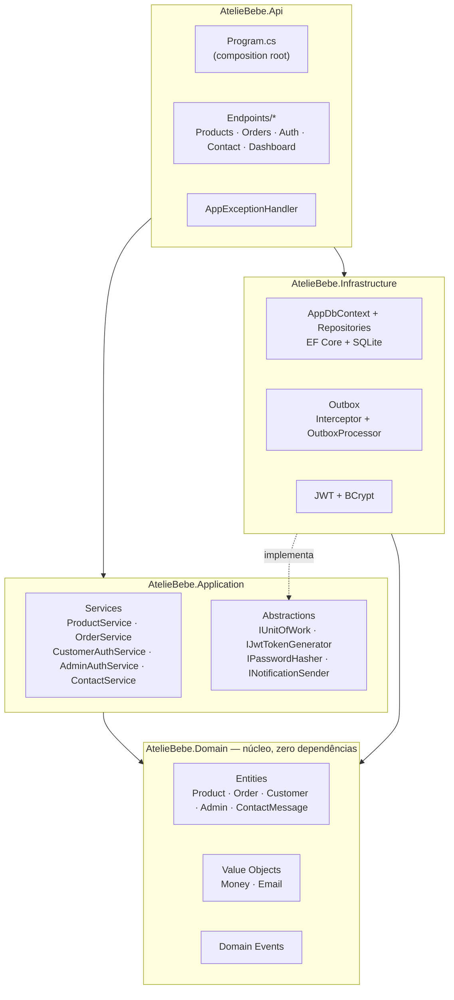
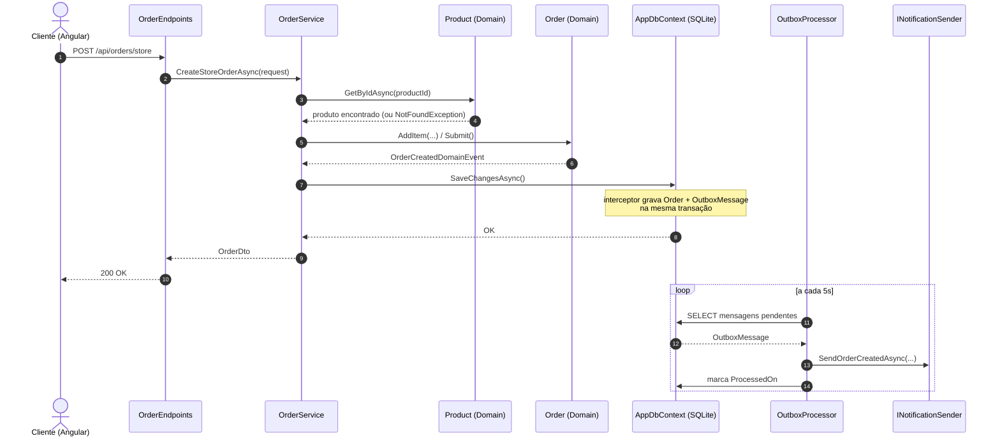

# Ateliê Layette Baby

[](https://dotnet.microsoft.com/)
[](https://learn.microsoft.com/aspnet/core/fundamentals/minimal-apis)
[](https://learn.microsoft.com/ef/core/)
[](https://www.sqlite.org/)
[](https://jwt.io/)
[](https://xunit.net/)
[](https://angular.dev/)
[](https://www.typescriptlang.org/)
[](https://rxjs.dev/)
[](https://getbootstrap.com/)
[](https://vitest.dev/)

Plataforma de e-commerce e gestão de encomendas para um ateliê especializado em **fraldas de ombro e boca com bordado computadorizado** (individuais ou em kit). O sistema cobre a jornada completa: vitrine pública com catálogo e carrinho, checkout com ou sem cadastro, pedidos personalizados sob medida, área do cliente, e um painel administrativo para gestão de produtos, encomendas e mensagens de contato.

Monorepo com dois projetos independentes:

| Diretório | Stack | Papel |
|---|---|---|
| [`server/`](./server) | .NET 10 · ASP.NET Core Minimal APIs · EF Core · SQLite | API REST, Clean Architecture |
| [`client/`](./client) | Angular 22 · standalone components · Bootstrap 5 | SPA (loja pública + painel admin) |

Os requisitos deste README (RF/RNF) têm uma versão formal, no padrão *Spec-Driven Development* (user stories + critérios de aceite EARS, design técnico e plano de tarefas rastreável), em [`spec/`](./spec): [`requirements.md`](./spec/requirements.md), [`design.md`](./spec/design.md) e [`tasks.md`](./spec/tasks.md).

## Sumário

- [Tecnologias](#tecnologias)
- [Arquitetura](#arquitetura)
  - [Backend](#backend-server)
  - [Frontend](#frontend-client)
  - [Eventos de domínio, Outbox e notificações](#eventos-de-domínio-outbox-e-notificações)
  - [Autenticação e autorização](#autenticação-e-autorização)
- [Como executar](#como-executar)
- [Requisitos](#requisitos)
  - [Requisitos funcionais](#requisitos-funcionais)
  - [Requisitos não funcionais](#requisitos-não-funcionais)
- [Regras de negócio](#regras-de-negócio)
  - [Catálogo](#catálogo)
  - [Pedidos e ciclo de vida](#pedidos-e-ciclo-de-vida)
  - [Contas de cliente e administrador](#contas-de-cliente-e-administrador)
  - [Contato](#contato)
  - [Valores monetários](#valores-monetários)
  - [Painel administrativo (dashboard)](#painel-administrativo-dashboard)
  - [Tratamento de erros](#tratamento-de-erros)

## Tecnologias

**Backend**

- .NET 10 / ASP.NET Core Minimal APIs (sem controllers — endpoints funcionais agrupados por feature)
- Entity Framework Core 10 + SQLite, com migrations versionadas
- Autenticação `JwtBearer` com claims de papel (`admin` / `customer`)
- BCrypt para hash de senha
- Padrão *Outbox* implementado sobre um `SaveChanges` interceptor + `BackgroundService`
- OpenAPI habilitado em ambiente de desenvolvimento
- xUnit para testes de domínio, com segredos locais (JWT) via `dotnet user-secrets`

**Frontend**

- Angular 22, componentes *standalone* (sem `NgModule`), roteamento com lazy loading (`loadComponent`)
- RxJS para chamadas HTTP reativas
- Bootstrap 5 + Bootstrap Icons
- Vitest para testes unitários
- Prettier (100 colunas, aspas simples, parser Angular para templates `.html`)

## Arquitetura

### Backend (`server/`)

Clean Architecture em quatro projetos, com dependências fluindo sempre para dentro (`Api` → `Application` / `Infrastructure` → `Domain`; `Domain` não depende de nenhum outro projeto):



- **Domain** modela entidades ricas (`Product`, `Order`, `Customer`, `Admin`, `ContactMessage`) que protegem suas próprias invariantes através de métodos de fábrica e comportamento (`Product.Reserve`, `Order.ChangeStatus`), e levantam eventos de domínio quando algo relevante acontece.
- **Application** expõe um serviço por feature (`IProductService`, `IOrderService`, `ICustomerAuthService`, `IAdminAuthService`, `IContactService`, `IDashboardService`), dependendo apenas de abstrações (`IUnitOfWork`, `IPasswordHasher`, `IJwtTokenGenerator`, `INotificationSender`) — nunca de `Infrastructure` diretamente.
- **Infrastructure** implementa persistência (EF Core + SQLite), repositórios, geração/validação de JWT, hashing de senha e o mecanismo de outbox.
- **Api** mapeia cada feature em um grupo de *minimal API endpoints* (`Endpoints/*Endpoints.cs`). Rotas públicas ficam em `/api/{feature}`; rotas administrativas ficam em `/api/admin/{feature}`, protegidas pela policy `AdminOnly`. `Program.cs` é o composition root: registra autenticação/CORS/tratamento de exceção, mapeia os endpoints e roda a inicialização do banco antes de subir o servidor.

### Frontend (`client/`)

```
src/app/
├── core/            Serviços singleton, models/DTOs, guards de rota, interceptor HTTP
├── features/
│   ├── public/      Loja: home, catálogo, produto, carrinho, checkout, login/cadastro, minha conta, contato e encomendas (unificado), galeria
│   └── admin/       Painel: dashboard, produtos, encomendas, mensagens de contato
└── shared/
    └── components/  Reservado para componentes reutilizáveis entre features
```

Cada serviço em `core/services/` espelha uma feature do backend (ex.: `product.service.ts` fala com `/api/products` e `/api/admin/products`). O `authInterceptor` decide automaticamente qual token Bearer anexar (admin ou cliente) com base na URL da requisição. Toda a UI e as rotas públicas estão em português (`/loja`, `/carrinho`, `/minha-conta`, `/contato`...), com `LOCALE_ID` fixado em `pt-BR`.

### Eventos de domínio, Outbox e notificações

```
Entidade levanta evento  →  SaveChanges interceptor grava na tabela Outbox (mesma transação)  →  BackgroundService faz polling (5s)  →  INotificationSender
```

Quando uma entidade de domínio muda de forma relevante (pedido criado, status alterado, cliente cadastrado, mensagem de contato recebida), ela registra um evento de domínio. O `DomainEventsToOutboxInterceptor` — um interceptor de `SaveChanges` do EF Core — serializa esse evento como uma linha na tabela `OutboxMessages`, **na mesma transação** da mudança de estado que o originou, garantindo que o evento nunca seja perdido mesmo que o processo caia logo em seguida.

Um `BackgroundService` (`OutboxProcessor`) faz *polling* a cada 5 segundos, lê lotes de até 20 mensagens pendentes, desserializa cada evento pelo seu tipo CLR e despacha para `INotificationSender`. A entrega é *at-least-once*: falhas incrementam um contador de tentativas (até 5) e o erro é registrado na própria linha, sem derrubar o processador. Hoje a única implementação de `INotificationSender` é `LoggingNotificationSender`, que apenas registra em log — não há envio real de e-mail/SMS.

Exemplo de ponta a ponta — criação de um pedido de loja:



### Autenticação e autorização

Dois fluxos de autenticação independentes, compartilhando o mesmo esquema `JwtBearer`, mas com papéis e policies distintos:

| | Papel (claim) | Policy | Endpoints |
|---|---|---|---|
| Cliente | `customer` | `CustomerOnly` | `/api/auth/*`, `/api/orders/mine` |
| Administrador | `admin` | `AdminOnly` | `/api/admin/auth/login`, `/api/admin/*` |

O token JWT carrega `NameIdentifier`, `Name`, `Email` e `Role`, assinado com HMAC-SHA256 e expiração configurável (`Jwt:ExpiryMinutes`, padrão 480 min). Não existe endpoint de auto-cadastro de administrador — o único admin é semeado na primeira inicialização do banco (`DbInitializer`), com credenciais configuráveis via `AdminSeed:Email` / `AdminSeed:Password`.

## Como executar

### Backend

```bash
cd server
dotnet build AtelieBebe.slnx

# primeira vez apenas: gera um segredo JWT local (nunca commitado)
dotnet user-secrets set "Jwt:Secret" "<uma-chave-aleatoria-de-pelo-menos-32-caracteres>" --project src/AtelieBebe.Api

dotnet run --project src/AtelieBebe.Api        # http://localhost:5120
```

`appsettings.json` mantém `Jwt:Secret` vazio de propósito — o valor real fica apenas no cofre local do [`dotnet user-secrets`](https://learn.microsoft.com/aspnet/core/security/app-secrets), fora do controle de versão. Sem esse passo, a API sobe normalmente mas a geração de token falha em tempo de execução (chave curta demais para HMAC-SHA256).

Ao subir, a API aplica automaticamente as migrations pendentes e semeia um administrador padrão (`admin@ateliebebe.com.br` / `admin123`, salvo configuração em contrário) e um catálogo de produtos de exemplo. O banco SQLite fica em `src/AtelieBebe.Api/atelie-bebe.db`.

Para gerar/aplicar migrations:

```bash
dotnet ef migrations add <Nome> --project src/AtelieBebe.Infrastructure --startup-project src/AtelieBebe.Api
dotnet ef database update --project src/AtelieBebe.Infrastructure --startup-project src/AtelieBebe.Api
```

Para rodar os testes de domínio:

```bash
dotnet test test/AtelieBebe.Domain.Tests/AtelieBebe.Domain.Tests.csproj
```

### Frontend

```bash
cd client
npm install
npm start      # ng serve — http://localhost:4200
npm run build   # build de produção em dist/
npm test        # testes unitários (Vitest)
```

`client/src/environments/environment.ts` aponta `apiUrl` para `http://localhost:5120/api`. Se o backend rodar em outra porta, ajuste esse arquivo e a lista `Cors:AllowedOrigins` em `appsettings.json`.

## Requisitos

### Atores

| Ator | Descrição |
|---|---|
| Visitante | Usuário não autenticado navegando na loja pública |
| Cliente | Visitante autenticado (`customer`), com acesso à área "Minha Conta" |
| Administrador | Usuário autenticado (`admin`), com acesso ao painel de gestão |

### Requisitos funcionais

| ID | Requisito | Ator |
|---|---|---|
| RF01 | O sistema deve permitir listar produtos ativos do catálogo, com filtro opcional por categoria | Visitante |
| RF02 | O sistema deve permitir listar produtos em destaque | Visitante |
| RF03 | O sistema deve permitir listar as categorias de produtos disponíveis | Visitante |
| RF04 | O sistema deve permitir consultar o detalhe de um produto pelo seu slug | Visitante |
| RF05 | O sistema deve permitir finalizar um pedido de loja (checkout) a partir do carrinho, com ou sem autenticação | Visitante / Cliente |
| RF06 | O sistema deve oferecer uma página única de "Contato e Encomendas" que reúne dúvidas gerais e pedidos de encomenda personalizada; ao enviar, monta uma mensagem com os dados informados e abre uma conversa no WhatsApp do ateliê (nenhum dado é persistido pelo backend nesse fluxo) | Visitante / Cliente |
| RF07 | O sistema deve permitir consultar um pedido específico pelo seu ID, sem exigir autenticação (página de confirmação) | Visitante / Cliente |
| RF08 | O sistema deve permitir que um cliente autenticado liste todos os pedidos vinculados à sua conta | Cliente |
| RF09 | O sistema deve permitir o cadastro de uma nova conta de cliente, validando e-mail único e senha com no mínimo 6 caracteres | Visitante |
| RF10 | O sistema deve permitir login de cliente por e-mail e senha, retornando um token de acesso (JWT) | Cliente |
| RF11 | O sistema deve permitir login de administrador por e-mail e senha, retornando um token de acesso (JWT) com papel administrativo | Administrador |
| RF12 | O sistema deve permitir listar todo o catálogo de produtos, incluindo inativos | Administrador |
| RF13 | O sistema deve permitir cadastrar novos produtos no catálogo | Administrador |
| RF14 | O sistema deve permitir editar os dados de um produto existente (nome, descrição, preço, categoria, imagem, destaque) | Administrador |
| RF15 | ~~O sistema deve permitir ajustar manualmente o estoque de um produto~~ — **removido**: o ateliê não mantém estoque, todo produto é feito sob encomenda | — |
| RF16 | O sistema deve permitir ativar ou inativar um produto, removendo-o (ou não) da vitrine pública | Administrador |
| RF17 | O sistema deve permitir listar pedidos, com filtro opcional por status | Administrador |
| RF18 | O sistema deve permitir alterar o status de um pedido, respeitando a máquina de estados definida | Administrador |
| RF19 | O sistema deve permitir consultar as mensagens de contato recebidas pela API (canal reservado para uso administrativo/futuro — o formulário público atual não envia mais mensagens por aqui, ver RF06) | Administrador |
| RF20 | O sistema deve exibir um painel com indicadores consolidados: total de pedidos, pedidos em aberto, receita total, receita do mês, total de produtos, total de clientes, distribuição de pedidos por status e pedidos recentes | Administrador |
| RF21 | ~~O sistema deve reservar automaticamente o estoque de um produto ao confirmar um pedido de loja~~ — **removido**: sem controle de estoque, não há o que reservar | — |
| RF22 | ~~O sistema deve registrar um evento de estoque baixo~~ — **removido**: sem controle de estoque, não há alerta de estoque baixo | — |
| RF23 | O sistema deve notificar o cliente sempre que o status de um pedido for alterado | Sistema |
| RF24 | O sistema deve notificar o cliente na confirmação de criação de um pedido | Sistema |
| RF25 | O sistema deve impedir a alteração dos itens de um pedido após ele sair do status inicial "Recebido" | Sistema |
| RF26 | O sistema deve paginar as listagens de produtos (loja e admin), encomendas (admin) e mensagens de contato (admin), aceitando `page`/`pageSize` e devolvendo o total de itens e páginas | Visitante / Administrador |
| RF27 | O sistema deve permitir associar um produto a um ou mais clientes específicos, tornando-o exclusivo — visível e encomendável apenas por eles, ausente das listagens (loja, categorias, destaque) e respondendo 404 no detalhe para quem não tem acesso | Administrador / Cliente |
| RF28 | O sistema deve permitir que o cliente informe, ao adicionar qualquer produto ao carrinho, o texto a ser bordado e a quantidade de peças com esse mesmo bordado, persistindo essa personalização no pedido e exibindo-a no detalhe administrativo da encomenda | Cliente / Administrador |

### Requisitos não funcionais

| ID | Requisito |
|---|---|
| RNF01 | A comunicação entre cliente e servidor deve ocorrer por uma API RESTful, documentada via OpenAPI em ambiente de desenvolvimento |
| RNF02 | Senhas de clientes e administradores devem ser armazenadas apenas como hash (BCrypt), nunca em texto plano |
| RNF03 | O acesso às rotas administrativas deve exigir um token JWT válido com papel `admin` |
| RNF04 | O acesso às rotas exclusivas de cliente deve exigir um token JWT válido com papel `customer` |
| RNF05 | Erros da aplicação devem ser retornados em um formato padronizado (`ProblemDetails`), sem expor detalhes internos em falhas inesperadas (HTTP 500) |
| RNF06 | O disparo de notificações não deve bloquear a resposta da requisição que originou o evento (processamento assíncrono via outbox) |
| RNF07 | A persistência de um evento de domínio deve ser atômica em relação à alteração de dados que o originou (mesma transação) |
| RNF08 | A interface deve ser responsiva e totalmente localizada em português brasileiro (pt-BR) |

## Regras de negócio

### Catálogo

- Nome, slug e categoria são obrigatórios; o slug é gerado automaticamente a partir do nome e, em caso de colisão, recebe um sufixo aleatório de 6 caracteres.
- Produtos podem ser marcados como **destaque** (`Featured`) para aparecer na home, e **ativos/inativos** (`Active`); apenas produtos ativos aparecem na listagem e busca pública — produtos inativos continuam visíveis e editáveis no painel admin.
- Não há controle de estoque: o ateliê fabrica cada peça sob encomenda, então todo produto está sempre disponível para compra, em qualquer quantidade — não existe reserva de estoque, alerta de estoque baixo, nem status "esgotado" na loja.
- Um produto sem nenhum cliente associado é **público** (visível a todos, como hoje). Associar um ou mais clientes o torna **exclusivo**: some das listagens públicas (loja, categorias, destaque) e do detalhe (404) para quem não está na lista de acesso — inclusive administradores continuam vendo tudo nas telas administrativas, independentemente da regra de visibilidade pública.
- Todo produto, exclusivo ou público, aceita personalização de bordado (texto + quantidade de peças) — é obrigatório informar o texto antes de adicionar ao carrinho, então a compra sempre passa pela página de detalhe do produto (não há mais botão de "adicionar rápido" na grade da loja).

### Pedidos e ciclo de vida

- Um pedido é de um dos dois tipos:
  - **Loja** (`Loja`): um ou mais itens do catálogo.
  - **Personalizado** (`Personalizada`): encomenda sob medida, representada como um único item com o valor estimado informado pelo cliente e detalhes livres em JSON (`CustomDetailsJson`).
- Pedidos de loja exigem pelo menos um item; a validação ocorre tanto na camada de aplicação quanto no domínio (`Order.Submit`).
- No checkout, o campo CEP busca o endereço automaticamente via [ViaCEP](https://viacep.com.br/) (rua, bairro, cidade, estado) assim que o cliente digita os 8 dígitos; os campos continuam editáveis e, se o CEP não for encontrado, uma mensagem de erro é exibida sem apagar o restante do formulário.
- Itens só podem ser adicionados a um pedido enquanto ele está no status inicial `Recebido`; qualquer tentativa de alterar itens após isso é rejeitada — o conteúdo do pedido é imutável a partir do momento em que entra em processamento.
- O checkout de loja (`/api/orders/store`, a partir do carrinho) é aberto a visitantes não autenticados; quando a requisição vem de um cliente logado, o pedido é automaticamente vinculado à conta (`CustomerId`). Consultar um pedido específico por ID (`GET /api/orders/{id}`) não exige autenticação — é assim que a página de confirmação de pedido funciona para convidados.
- O endpoint `/api/orders/custom` (criação de encomenda personalizada via API) continua implementado, mas **a página pública de contato/encomenda não o chama mais** — ela monta a solicitação como mensagem de WhatsApp em vez de criar um pedido no backend (ver seção [Contato](#contato)).
- O total do pedido nunca é armazenado: é sempre recalculado como a soma dos subtotais dos itens (`preço unitário × quantidade`) no momento da leitura.
- O status segue uma máquina de estados estrita, sem pular etapas nem retroceder:

  ```mermaid
  stateDiagram-v2
      [*] --> Recebido
      Recebido --> EmProducao
      Recebido --> Cancelado
      EmProducao --> Pronto
      EmProducao --> Cancelado
      Pronto --> Enviado
      Pronto --> Cancelado
      Enviado --> Entregue
      Entregue --> [*]
      Cancelado --> [*]
  ```

  `Entregue` e `Cancelado` são estados terminais: nenhuma transição é permitida a partir deles. Qualquer transição fora do mapa acima é rejeitada com erro de domínio.
- Toda transição de status válida emite `OrderStatusChangedDomainEvent` (notificação ao cliente); a criação/confirmação de um pedido emite `OrderCreatedDomainEvent`.

### Contas de cliente e administrador

- Cadastro de cliente exige e-mail único (verificado antes do registro) e senha com **mínimo de 6 caracteres**; a senha nunca é persistida em texto plano, apenas seu hash BCrypt.
- Login — tanto de cliente quanto de administrador — retorna sempre a mesma mensagem genérica (*"E-mail ou senha inválidos"*) para e-mail inexistente ou senha incorreta, evitando enumeração de contas por diferença de resposta.
- Não existe rota pública de cadastro de administrador: o único admin é criado pela seed inicial do banco.
- E-mails são normalizados (trim + minúsculas) e validados por formato antes de virarem um value object `Email` — inválidos são rejeitados na borda do domínio, não na camada de apresentação.

### Contato

- A página pública **"Contato e Encomendas"** (`/contato`) unifica dúvida geral e pedido de encomenda personalizada em um único formulário. Um alternador ("É uma encomenda personalizada") revela os campos específicos da peça (tipo, tamanho, tecido, cor, nome para bordar); os demais campos (nome, e-mail e telefone) são compartilhados pelos dois casos.
- Ao enviar, o formulário **não chama a API** — ele monta uma mensagem de texto a partir dos campos preenchidos e abre `https://wa.me/<número-do-ateliê>?text=<mensagem>` em uma nova aba, iniciando a conversa diretamente no WhatsApp. Nenhum dado do formulário é persistido pelo backend nesse fluxo.
- A rota antiga `/encomenda-personalizada` foi mantida como redirecionamento (`redirectTo`) para `/contato`, preservando links e favoritos existentes.
- O número de WhatsApp usado no link (`WHATSAPP_NUMBER` em `contact.ts`, `+55 11 91234-5678`) é o número real do ateliê, o mesmo já exibido publicamente na página e no rodapé.
- O endpoint `POST /api/contact` e o serviço `ContactService` continuam implementados e funcionais (persistem a mensagem e disparam `ContactMessageReceivedDomainEvent`), mas não são mais chamados por nenhuma tela pública — ficam disponíveis para um canal futuro (ex.: um formulário alternativo, ou integração server-side) sem exigir mudança de backend.

### Valores monetários

- Todo valor monetário passa pelo value object `Money` (quantia + moeda), que nunca aceita valores negativos e sempre arredonda para 2 casas decimais (`MidpointRounding.AwayFromZero`).
- Operações aritméticas entre `Money` (soma, multiplicação por quantidade) preservam essas invariantes e impedem misturar moedas diferentes.

### Painel administrativo (dashboard)

- O resumo do dashboard (`/api/admin/dashboard`) exclui pedidos **cancelados** de todas as métricas de receita e contagem de pedidos "em aberto".
- "Pedidos em aberto" são os que estão em qualquer status anterior a `Entregue` (`Recebido`, `EmProducao`, `Pronto`, `Enviado`).
- Receita do mês corrente é calculada a partir do início do mês em UTC, não do fuso horário local.

### Tratamento de erros

Exceções de domínio e aplicação são convertidas em respostas HTTP consistentes no formato `ProblemDetails` por um `IExceptionHandler` central:

| Exceção | Status HTTP |
|---|---|
| `NotFoundException` | 404 |
| `ConflictException` | 409 |
| `UnauthorizedAppException` | 401 |
| `DomainException` | 400 |
| Não tratada | 500 (mensagem genérica; detalhes vão para o log, nunca para a resposta) |
