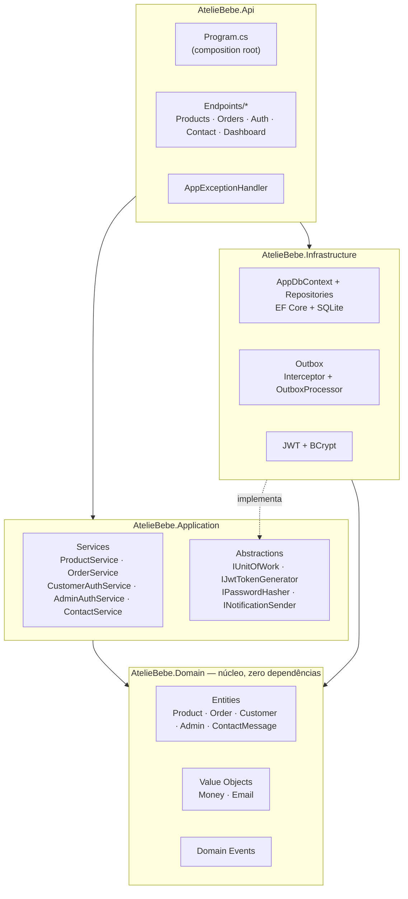
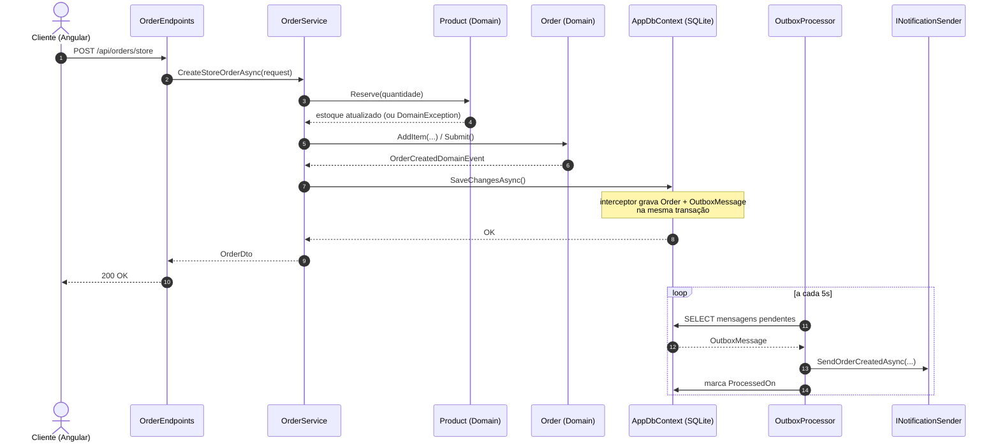

# Ateliê Bebê

Plataforma de e-commerce e gestão de encomendas para um ateliê de enxovais e itens artesanais de bebê. O sistema cobre a jornada completa: vitrine pública com catálogo e carrinho, checkout com ou sem cadastro, pedidos personalizados sob medida, área do cliente, e um painel administrativo para gestão de produtos, encomendas e mensagens de contato.

Monorepo com dois projetos independentes:

| Diretório | Stack | Papel |
|---|---|---|
| [`server/`](./server) | .NET 10 · ASP.NET Core Minimal APIs · EF Core · SQLite | API REST, Clean Architecture |
| [`client/`](./client) | Angular 22 · standalone components · Bootstrap 5 | SPA (loja pública + painel admin) |

## Sumário

- [Tecnologias](#tecnologias)
- [Arquitetura](#arquitetura)
  - [Backend](#backend-server)
  - [Frontend](#frontend-client)
  - [Eventos de domínio, Outbox e notificações](#eventos-de-domínio-outbox-e-notificações)
  - [Autenticação e autorização](#autenticação-e-autorização)
- [Como executar](#como-executar)
- [Regras de negócio](#regras-de-negócio)
  - [Catálogo e estoque](#catálogo-e-estoque)
  - [Pedidos e ciclo de vida](#pedidos-e-ciclo-de-vida)
  - [Contas de cliente e administrador](#contas-de-cliente-e-administrador)
  - [Contato](#contato)
  - [Valores monetários](#valores-monetários)
  - [Painel administrativo (dashboard)](#painel-administrativo-dashboard)
  - [Tratamento de erros](#tratamento-de-erros)

## Tecnologias

**Backend**

- .NET 10 / ASP.NET Core Minimal APIs (sem controllers — endpoints funcionais agrupados por feature)
- Entity Framework Core 10 + SQLite, com migrations versionadas
- Autenticação `JwtBearer` com claims de papel (`admin` / `customer`)
- BCrypt para hash de senha
- Padrão *Outbox* implementado sobre um `SaveChanges` interceptor + `BackgroundService`
- OpenAPI habilitado em ambiente de desenvolvimento

**Frontend**

- Angular 22, componentes *standalone* (sem `NgModule`), roteamento com lazy loading (`loadComponent`)
- RxJS para chamadas HTTP reativas
- Bootstrap 5 + Bootstrap Icons
- Vitest para testes unitários
- Prettier (100 colunas, aspas simples, parser Angular para templates `.html`)

## Arquitetura

### Backend (`server/`)

Clean Architecture em quatro projetos, com dependências fluindo sempre para dentro (`Api` → `Application` / `Infrastructure` → `Domain`; `Domain` não depende de nenhum outro projeto):



- **Domain** modela entidades ricas (`Product`, `Order`, `Customer`, `Admin`, `ContactMessage`) que protegem suas próprias invariantes através de métodos de fábrica e comportamento (`Product.Reserve`, `Order.ChangeStatus`), e levantam eventos de domínio quando algo relevante acontece.
- **Application** expõe um serviço por feature (`IProductService`, `IOrderService`, `ICustomerAuthService`, `IAdminAuthService`, `IContactService`, `IDashboardService`), dependendo apenas de abstrações (`IUnitOfWork`, `IPasswordHasher`, `IJwtTokenGenerator`, `INotificationSender`) — nunca de `Infrastructure` diretamente.
- **Infrastructure** implementa persistência (EF Core + SQLite), repositórios, geração/validação de JWT, hashing de senha e o mecanismo de outbox.
- **Api** mapeia cada feature em um grupo de *minimal API endpoints* (`Endpoints/*Endpoints.cs`). Rotas públicas ficam em `/api/{feature}`; rotas administrativas ficam em `/api/admin/{feature}`, protegidas pela policy `AdminOnly`. `Program.cs` é o composition root: registra autenticação/CORS/tratamento de exceção, mapeia os endpoints e roda a inicialização do banco antes de subir o servidor.

### Frontend (`client/`)

```
src/app/
├── core/            Serviços singleton, models/DTOs, guards de rota, interceptor HTTP
├── features/
│   ├── public/      Loja: home, catálogo, produto, carrinho, checkout, login/cadastro, minha conta, contato, galeria, encomenda personalizada
│   └── admin/       Painel: dashboard, produtos, encomendas, mensagens de contato
└── shared/
    └── components/  Reservado para componentes reutilizáveis entre features
```

Cada serviço em `core/services/` espelha uma feature do backend (ex.: `product.service.ts` fala com `/api/products` e `/api/admin/products`). O `authInterceptor` decide automaticamente qual token Bearer anexar (admin ou cliente) com base na URL da requisição. Toda a UI e as rotas públicas estão em português (`/loja`, `/carrinho`, `/minha-conta`, `/encomenda-personalizada`...), com `LOCALE_ID` fixado em `pt-BR`.

### Eventos de domínio, Outbox e notificações

```
Entidade levanta evento  →  SaveChanges interceptor grava na tabela Outbox (mesma transação)  →  BackgroundService faz polling (5s)  →  INotificationSender
```

Quando uma entidade de domínio muda de forma relevante (pedido criado, status alterado, cliente cadastrado, estoque baixo, mensagem de contato recebida), ela registra um evento de domínio. O `DomainEventsToOutboxInterceptor` — um interceptor de `SaveChanges` do EF Core — serializa esse evento como uma linha na tabela `OutboxMessages`, **na mesma transação** da mudança de estado que o originou, garantindo que o evento nunca seja perdido mesmo que o processo caia logo em seguida.

Um `BackgroundService` (`OutboxProcessor`) faz *polling* a cada 5 segundos, lê lotes de até 20 mensagens pendentes, desserializa cada evento pelo seu tipo CLR e despacha para `INotificationSender`. A entrega é *at-least-once*: falhas incrementam um contador de tentativas (até 5) e o erro é registrado na própria linha, sem derrubar o processador. Hoje a única implementação de `INotificationSender` é `LoggingNotificationSender`, que apenas registra em log — não há envio real de e-mail/SMS.

Exemplo de ponta a ponta — criação de um pedido de loja:



### Autenticação e autorização

Dois fluxos de autenticação independentes, compartilhando o mesmo esquema `JwtBearer`, mas com papéis e policies distintos:

| | Papel (claim) | Policy | Endpoints |
|---|---|---|---|
| Cliente | `customer` | `CustomerOnly` | `/api/auth/*`, `/api/orders/mine` |
| Administrador | `admin` | `AdminOnly` | `/api/admin/auth/login`, `/api/admin/*` |

O token JWT carrega `NameIdentifier`, `Name`, `Email` e `Role`, assinado com HMAC-SHA256 e expiração configurável (`Jwt:ExpiryMinutes`, padrão 480 min). Não existe endpoint de auto-cadastro de administrador — o único admin é semeado na primeira inicialização do banco (`DbInitializer`), com credenciais configuráveis via `AdminSeed:Email` / `AdminSeed:Password`.

## Como executar

### Backend

```bash
cd server
dotnet build AtelieBebe.slnx
dotnet run --project src/AtelieBebe.Api        # http://localhost:5120
```

Ao subir, a API aplica automaticamente as migrations pendentes e semeia um administrador padrão (`admin@ateliebebe.com.br` / `admin123`, salvo configuração em contrário) e um catálogo de produtos de exemplo. O banco SQLite fica em `src/AtelieBebe.Api/atelie-bebe.db`.

Para gerar/aplicar migrations:

```bash
dotnet ef migrations add <Nome> --project src/AtelieBebe.Infrastructure --startup-project src/AtelieBebe.Api
dotnet ef database update --project src/AtelieBebe.Infrastructure --startup-project src/AtelieBebe.Api
```

### Frontend

```bash
cd client
npm install
npm start      # ng serve — http://localhost:4200
npm run build   # build de produção em dist/
npm test        # testes unitários (Vitest)
```

`client/src/environments/environment.ts` aponta `apiUrl` para `http://localhost:5120/api`. Se o backend rodar em outra porta, ajuste esse arquivo e a lista `Cors:AllowedOrigins` em `appsettings.json`.

## Regras de negócio

### Catálogo e estoque

- Nome, slug e categoria são obrigatórios; o slug é gerado automaticamente a partir do nome e, em caso de colisão, recebe um sufixo aleatório de 6 caracteres.
- Estoque nunca pode ser negativo — tentar defini-lo como negativo, seja via ajuste manual ou reserva, é rejeitado.
- Produtos podem ser marcados como **destaque** (`Featured`) para aparecer na home, e **ativos/inativos** (`Active`); apenas produtos ativos aparecem na listagem e busca pública — produtos inativos continuam visíveis e editáveis no painel admin.
- Reservar estoque para um pedido de loja (`Reserve`) falha explicitamente se a quantidade pedida exceder o disponível — não há venda com estoque negativo.
- Sempre que o estoque de um produto cai para **3 unidades ou menos** (`LowStockThreshold`), um evento de estoque baixo é emitido, tanto ao ajustar estoque manualmente quanto ao reservar por um pedido.

### Pedidos e ciclo de vida

- Um pedido é de um dos dois tipos:
  - **Loja** (`Loja`): um ou mais itens do catálogo, com reserva automática de estoque no momento da criação.
  - **Personalizado** (`Personalizada`): encomenda sob medida, representada como um único item com o valor estimado informado pelo cliente e detalhes livres em JSON (`CustomDetailsJson`).
- Pedidos de loja exigem pelo menos um item; a validação ocorre tanto na camada de aplicação quanto no domínio (`Order.Submit`).
- Itens só podem ser adicionados a um pedido enquanto ele está no status inicial `Recebido`; qualquer tentativa de alterar itens após isso é rejeitada — o conteúdo do pedido é imutável a partir do momento em que entra em processamento.
- O checkout (`/api/orders/store` e `/api/orders/custom`) é aberto a visitantes não autenticados; quando a requisição vem de um cliente logado, o pedido é automaticamente vinculado à conta (`CustomerId`). Consultar um pedido específico por ID (`GET /api/orders/{id}`) não exige autenticação — é assim que a página de confirmação de pedido funciona para convidados.
- O total do pedido nunca é armazenado: é sempre recalculado como a soma dos subtotais dos itens (`preço unitário × quantidade`) no momento da leitura.
- O status segue uma máquina de estados estrita, sem pular etapas nem retroceder:

  ```mermaid
  stateDiagram-v2
      [*] --> Recebido
      Recebido --> EmProducao
      Recebido --> Cancelado
      EmProducao --> Pronto
      EmProducao --> Cancelado
      Pronto --> Enviado
      Pronto --> Cancelado
      Enviado --> Entregue
      Entregue --> [*]
      Cancelado --> [*]
  ```

  `Entregue` e `Cancelado` são estados terminais: nenhuma transição é permitida a partir deles. Qualquer transição fora do mapa acima é rejeitada com erro de domínio.
- Toda transição de status válida emite `OrderStatusChangedDomainEvent` (notificação ao cliente); a criação/confirmação de um pedido emite `OrderCreatedDomainEvent`.

### Contas de cliente e administrador

- Cadastro de cliente exige e-mail único (verificado antes do registro) e senha com **mínimo de 6 caracteres**; a senha nunca é persistida em texto plano, apenas seu hash BCrypt.
- Login — tanto de cliente quanto de administrador — retorna sempre a mesma mensagem genérica (*"E-mail ou senha inválidos"*) para e-mail inexistente ou senha incorreta, evitando enumeração de contas por diferença de resposta.
- Não existe rota pública de cadastro de administrador: o único admin é criado pela seed inicial do banco.
- E-mails são normalizados (trim + minúsculas) e validados por formato antes de virarem um value object `Email` — inválidos são rejeitados na borda do domínio, não na camada de apresentação.

### Contato

- Mensagens enviadas pelo formulário público de contato exigem nome e mensagem não vazios; são persistidas e disparam `ContactMessageReceivedDomainEvent`, que hoje gera um log de confirmação (sem envio real de e-mail).
- Mensagens ficam visíveis apenas no painel administrativo (`/api/admin/*`), ordenadas da mais recente para a mais antiga.

### Valores monetários

- Todo valor monetário passa pelo value object `Money` (quantia + moeda), que nunca aceita valores negativos e sempre arredonda para 2 casas decimais (`MidpointRounding.AwayFromZero`).
- Operações aritméticas entre `Money` (soma, multiplicação por quantidade) preservam essas invariantes e impedem misturar moedas diferentes.

### Painel administrativo (dashboard)

- O resumo do dashboard (`/api/admin/dashboard`) exclui pedidos **cancelados** de todas as métricas de receita e contagem de pedidos "em aberto".
- "Pedidos em aberto" são os que estão em qualquer status anterior a `Entregue` (`Recebido`, `EmProducao`, `Pronto`, `Enviado`).
- Receita do mês corrente é calculada a partir do início do mês em UTC, não do fuso horário local.
- Produtos com estoque baixo contados no dashboard consideram apenas produtos **ativos** com estoque ≤ 3.

### Tratamento de erros

Exceções de domínio e aplicação são convertidas em respostas HTTP consistentes no formato `ProblemDetails` por um `IExceptionHandler` central:

| Exceção | Status HTTP |
|---|---|
| `NotFoundException` | 404 |
| `ConflictException` | 409 |
| `UnauthorizedAppException` | 401 |
| `DomainException` | 400 |
| Não tratada | 500 (mensagem genérica; detalhes vão para o log, nunca para a resposta) |
