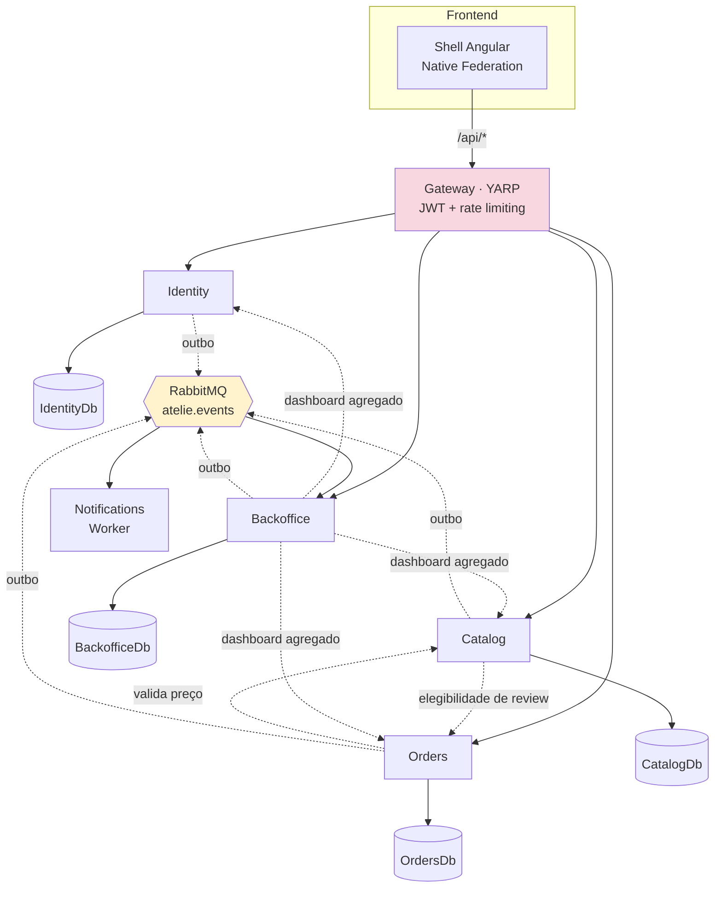
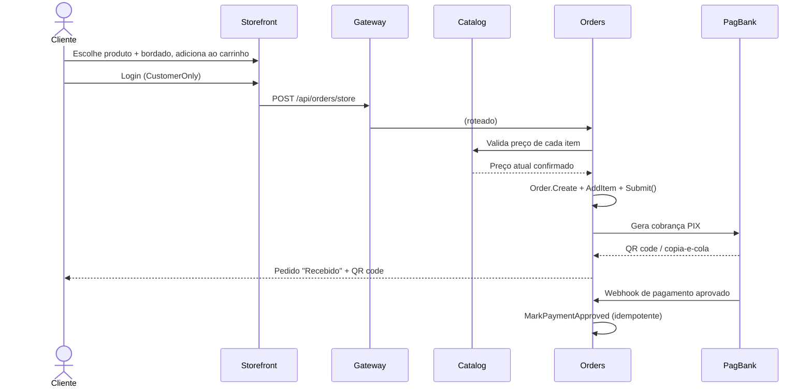
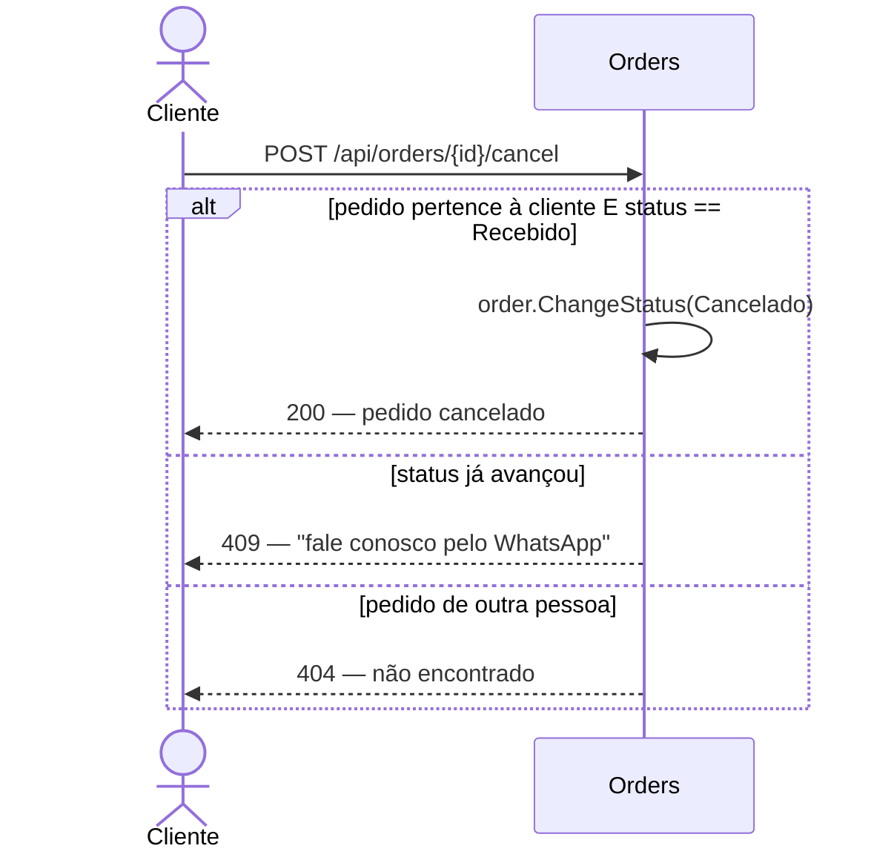
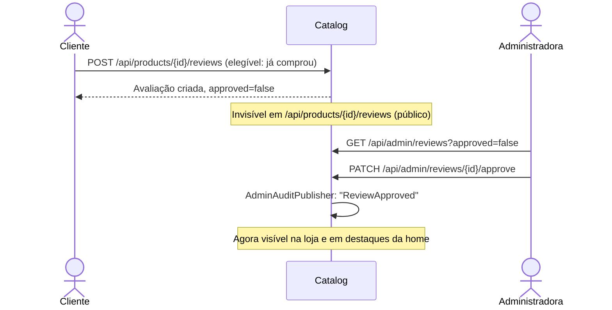
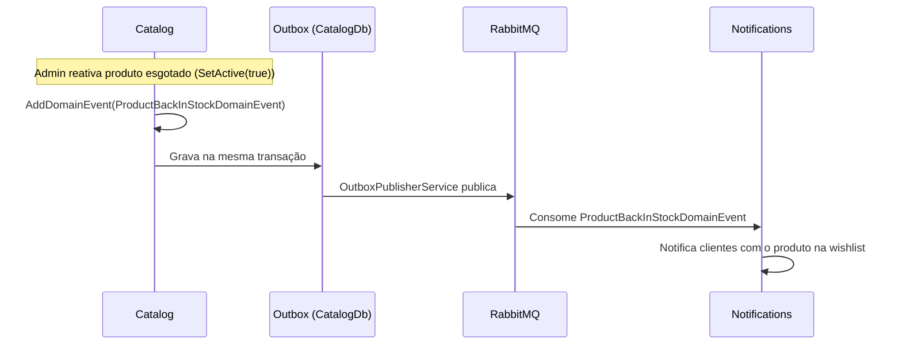
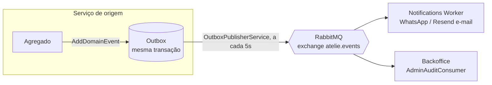
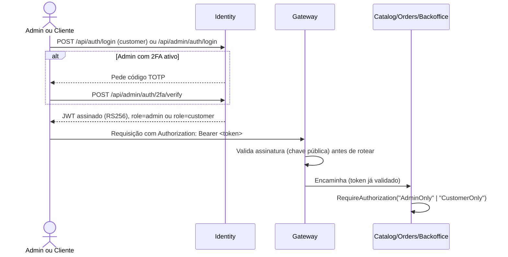

# Ateliê Layette Baby — arquitetura de microsserviços

Esta é a arquitetura em produção: **`layettebaby.com.br` roda inteiramente sobre o que está
documentado aqui** desde a migração de 2026-09-08 (ver "Status" no fim deste documento). O antigo
monólito `server/`/`client/` (raiz do repositório) foi mantido parado por algumas semanas como
rollback e não recebe mais mudanças — qualquer trabalho novo entra aqui, em `microservices/`.

Este documento segue um estilo inspirado em Spec-Driven Development: além de arquitetura e "como
rodar", cobre a visão de negócio, como o domínio foi descoberto (domain storytelling/event
storming), os requisitos funcionais/não funcionais atuais, autenticação/autorização, e a estratégia
de testes (unitários, TDD, BDD, UI/e2e e carga) — com os projetos de teste reais linkados de cada
subseção, não apenas descritos em prosa.

## Sumário

- [Visão de negócio](#visão-de-negócio)
- [Arquitetura](#arquitetura)
- [Domain Storytelling](#domain-storytelling)
- [Event Storming](#event-storming)
- [Requisitos](#requisitos)
- [Autenticação e Autorização](#autenticação-e-autorização)
- [Estratégia de testes](#estratégia-de-testes)
- [Rodando localmente com `dotnet run` (sem Docker)](#rodando-localmente-com-dotnet-run-sem-docker)
- [Rodando com Docker Compose](#rodando-com-docker-compose)
- [Rodando no Kubernetes (Docker Desktop)](#rodando-no-kubernetes-docker-desktop)
- [CI](#ci)
- [Fora do escopo (deliberado)](#fora-do-escopo-deliberado)
- [Status](#status)

## Visão de negócio

O Ateliê Layette Baby é especializado exclusivamente em **fraldas de ombro e boca bordadas** para
bebês — não é uma loja de enxoval genérica. As únicas categorias de produto são "Kit Ombro e Boca",
"Fralda de Ombro" e "Fralda de Boca" (reforçado em código: `Catalog`'s `DbInitializer` remove no
startup qualquer produto seedado fora dessas categorias). Toda peça pode ser personalizada com um
bordado (texto + cor da linha), escolhido pelo cliente na própria página do produto antes de
adicionar ao carrinho.

Duas personas usam o sistema:

- **Cliente final** — navega a loja sem precisar de conta, monta o carrinho com personalização por
  item, faz login apenas para finalizar a compra (checkout exige `CustomerOnly`), acompanha pedidos
  em "Minha conta", pode cancelar um pedido enquanto ele não entrou em produção, avalia produtos que
  comprou, e pode favoritar peças (`/favoritos`) ou ser convidada a comprar de novo quando um item
  favoritado volta ao estoque.
- **Administradora do ateliê** — dona do negócio, pode cadastrar outras administradoras (funcionárias,
  por exemplo) e escolher exatamente quais áreas cada uma acessa — ver "Permissões granulares por
  administradora" abaixo. Gerencia catálogo, promoções, cupons, pedidos (mudança de status, código de
  rastreio), moderação de avaliações, mensagens de contato, newsletter, imagens do site/galeria, e
  acompanha um dashboard agregado com auditoria de ações administrativas. Cada administradora protege
  a própria conta com 2FA opcional (TOTP) e pode trocar sua própria senha a qualquer momento.

## Arquitetura

| Serviço | Dono de | Porta interna |
|---|---|---|
| `identity` | Admin (+2FA), Customer (auth, CPF, verificação de e-mail, endereço) — assina os JWTs (RS256) | 8080 |
| `catalog` | Product, GalleryImage, SiteImage, ProductReview, WishlistItem, upload de arquivos, previews de SEO para bots | 8080 |
| `orders` | Order, Coupon, CartSnapshot (+lembrete de carrinho abandonado), pagamento (PagBank) | 8080 |
| `backoffice` | ContactMessage, NewsletterSubscriber, AuditLog, Dashboard (agregação), Sitemap | 8080 |
| `notifications` | Worker — consome eventos do RabbitMQ, envia WhatsApp/e-mail | 8080 (só health) |
| `gateway` | YARP — único ponto de entrada HTTP, roteia por prefixo de path, rate limiting, valida JWT | 8080 |

`shared/AtelieBebe.SharedKernel`: `Entity`/`ValueObject`/exceções, infraestrutura do outbox
transacional, cliente RabbitMQ (publish/subscribe), autenticação JWT compartilhada (RS256),
`AdminAuditPublisher` (publica um evento de auditoria a cada ação administrativa relevante).



Cada serviço grava seus próprios eventos de domínio na própria tabela outbox (mesma transação da
mudança de estado) e um `OutboxPublisherService` os publica no RabbitMQ (exchange `atelie.events`,
routing key = nome do evento). `Notifications` (WhatsApp/e-mail) e `Backoffice` (auditoria via
`AdminAuditConsumer`) consomem o que interessa a cada um. Chamadas síncronas entre serviços existem
só onde é inevitável (Orders→Catalog para validar preço, Catalog→Orders para elegibilidade de
review, Backoffice→Identity/Catalog/Orders para o dashboard) — o resto é resolvido no frontend,
chamando o Gateway por serviço.

O frontend é um microfrontend Angular (Native Federation): `shell` é o host servido em `/`, que
carrega `storefront` (loja pública) e `admin` (painel administrativo) como remotes em runtime —
cada um é um projeto Angular independente, testável e deployável isoladamente.

## Domain Storytelling

Quatro histórias cobrindo os fluxos que mais concentram regras de negócio — ator → atividade →
objeto de trabalho, na notação de domain storytelling.

### 1. Cliente compra uma peça personalizada

**Cliente** navega a **Loja** → abre um **Produto** → escolhe texto e cor do bordado → adiciona ao
**Carrinho** → faz login (ou cria conta) → confirma o **Pedido** no Checkout → paga via **PIX** →
recebe a confirmação.



### 2. Cliente cancela um pedido antes da produção começar

**Cliente** acessa **Minha conta** → escolhe um pedido com status "Recebido" → cancela. O sistema
recusa se a produção já começou, orientando a falar pelo WhatsApp.



Coberto ponta a ponta pelo BDD em
[`AtelieBebe.Orders.Core.Tests/Features/CancelamentoDePedido.feature`](services/orders/AtelieBebe.Orders.Core.Tests/Features/CancelamentoDePedido.feature).

### 3. Administradora modera uma avaliação

**Cliente** que comprou um produto envia uma **Avaliação** (nota + comentário + foto opcional) →
avaliação nasce pendente, invisível na loja → **Administradora** aprova ou rejeita no painel → só
avaliações aprovadas aparecem na página do produto e na home.



### 4. Sistema convida a cliente a comprar de novo (eventos de domínio)

Sem nenhuma ação manual: um produto favoritado volta ao estoque, ou um carrinho fica montado sem
finalizar por tempo demais — o próprio agregado levanta o evento, o outbox garante que ele não se
perde, e o worker de notificações decide o que fazer.



## Event Storming

Todos os eventos de domínio reais do código — cada um nasce dentro de um agregado (nunca é
"levantado" por um serviço de aplicação diretamente) e é persistido no outbox na mesma transação da
mudança de estado.

| Evento | Agregado / serviço | Disparado por | Consumido por |
|---|---|---|---|
| `CustomerRegisteredDomainEvent` | `Customer` (Identity) | `Customer.Register()` | Notifications (e-mail de boas-vindas) |
| `EmailVerificationRequestedDomainEvent` | `Customer` (Identity) | `Customer.RequestEmailVerification()` | Notifications (e-mail com link) |
| `PasswordResetRequestedDomainEvent` | `Customer` (Identity) | `Customer.RequestPasswordReset()` | Notifications (e-mail com link) |
| `ProductBackInStockDomainEvent` | `Product` (Catalog) | `Product.SetActive(true)`, reativando um produto inativo | Notifications (avisa quem tem na wishlist) |
| `WishlistReminderDomainEvent` | `WishlistItem` (Catalog) | Job periódico de lembrete de favoritos | Notifications |
| `OrderCreatedDomainEvent` | `Order` (Orders) | `Order.Submit()` | Notifications (confirmação + aviso à administradora) |
| `OrderStatusChangedDomainEvent` | `Order` (Orders) | `Order.ChangeStatus()` | Notifications (avisa a cliente da mudança) |
| `AbandonedCartReminderDomainEvent` | `CartSnapshot` (Orders) | Job periódico de carrinho abandonado | Notifications |
| `ContactMessageReceivedDomainEvent` | `ContactMessage` (Backoffice) | `ContactMessage.Create()` | Notifications (avisa a administradora) |

Além do outbox de domínio, cada ação administrativa relevante (aprovar review, mudar status de
pedido, ativar 2FA, etc.) publica separadamente via `AdminAuditPublisher` (SharedKernel) para a fila
de auditoria, consumida só pelo `Backoffice` (`AdminAuditConsumer`) e gravada como `AuditLog` — um
canal deliberadamente à parte dos eventos de domínio, porque auditoria é uma preocupação
transversal (toda ação de todo serviço), não parte do modelo de nenhum agregado de negócio.



## Requisitos

Numeração própria desta arquitetura (RF/RNF), no formato EARS já usado em `spec/requirements.md`
para o monólito — cobrindo o sistema como ele existe hoje, bem além do RF01–RF26 original.

### Funcionais

- **RF01** — Quando uma visitante acessa a loja, o sistema deve listar produtos ativos paginados,
  com filtro por categoria e busca por nome.
- **RF02** — Quando uma cliente abre um produto exclusivo (`IsExclusive`) sem estar na lista de
  clientes autorizadas, o sistema deve tratá-lo como inexistente (404), nunca revelar que existe.
- **RF03** — Quando uma cliente adiciona um item ao carrinho, o sistema deve exigir texto e cor do
  bordado antes de permitir a adição.
- **RF04** — Quando uma cliente finaliza o checkout, o sistema deve revalidar o preço de cada item
  contra o Catalog no momento da criação do pedido, nunca confiar no preço enviado pelo cliente.
- **RF05** — Quando um pedido é criado, o sistema deve gerar uma cobrança PIX e persistir o QR code
  para sobreviver a um reload da página de confirmação.
- **RF06** — Quando uma cliente tenta cancelar um pedido, o sistema deve permitir somente enquanto o
  status for "Recebido", recusando com orientação de contato nos demais casos.
- **RF07** — Quando uma administradora muda o status de um pedido, o sistema deve validar a
  transição contra a máquina de estados (`Recebido → EmProducao → Pronto → Enviado → Entregue`,
  com `Cancelado` acessível a partir dos três primeiros).
- **RF08** — Quando uma cliente envia uma avaliação, o sistema deve criá-la como pendente e
  exigir que ela já tenha comprado o produto (checagem cross-service com Orders).
- **RF09** — Quando uma administradora aprova uma avaliação, o sistema deve torná-la visível na
  loja e elegível para aparecer nos destaques da home.
- **RF10** — Quando um cupom é aplicado, o sistema deve recusar se ele estiver expirado, desativado,
  com limite de usos atingido, ou com código em formato inválido (letras/números apenas).
- **RF11** — Quando um produto tem uma promoção ativa (dentro da janela configurada), o sistema deve
  calcular o preço efetivo automaticamente, sem job nenhum — a checagem é por horário, on-demand.
- **RF12** — Quando uma administradora reativa um produto que estava inativo, o sistema deve emitir
  um aviso de reposição de estoque para quem tiver esse produto favoritado.
- **RF13** — Quando um carrinho fica montado sem finalizar por tempo demais, o sistema deve emitir
  um lembrete de carrinho abandonado.
- **RF14** — Quando uma visitante compartilha o link de um produto num app de mensagens, o sistema
  deve servir um preview OG/Twitter Card server-renderizado (bots não executam JavaScript).
- **RF15** — Quando uma administradora ativa 2FA, o sistema deve exigir a verificação de um código
  TOTP contra o segredo antes de marcar a conta como protegida.
- **RF16** — Quando uma cliente pede exclusão de conta (LGPD), o sistema deve anonimizar os dados
  pessoais preservando o histórico de pedidos (que já guarda sua própria cópia dos dados na compra).
- **RF17** — Quando uma administradora exclui um produto que aparece em algum pedido, o sistema deve
  recusar a exclusão para preservar a integridade do histórico.
- **RF18** — Quando uma administradora com a permissão "Gerenciar Administradores" cadastra uma nova
  conta administrativa, o sistema deve exigir a escolha explícita de quais áreas (produtos,
  encomendas, cupons, avaliações, mensagens, newsletter, clientes, imagens do site, dashboard,
  gerenciar administradores) essa conta poderá acessar — nenhuma permissão é concedida por padrão.
- **RF19** — Quando uma administradora tenta acessar uma área do painel sem a permissão
  correspondente, o sistema deve recusar (403), tanto na API de cada serviço quanto ocultando o item
  de menu no painel.
- **RF20** — Quando a última administradora com a permissão "Gerenciar Administradores" tenta perder
  essa permissão (removida por edição ou por exclusão da própria conta), o sistema deve recusar,
  para nunca ficar sem ninguém capaz de gerenciar administradores.
- **RF21** — Qualquer administradora deve poder alterar a própria senha e ativar/desativar 2FA sem
  precisar da permissão "Gerenciar Administradores" — são ações de autoatendimento sobre a própria
  conta, não sobre outras contas.

### Não funcionais

- **RNF01** — O sistema deve validar e assinar tokens JWT com RSA (RS256): Identity assina com a
  chave privada, os demais serviços validam só com a pública — nenhum serviço além de Identity pode
  forjar um token.
- **RNF02** — O Gateway deve aplicar rate limiting nas rotas de autenticação, independente do rate
  limiting que cada serviço já aplica na própria borda.
- **RNF03** — A perda de conexão com o RabbitMQ não deve derrubar operações síncronas (login,
  pedido, listagem) — apenas a publicação de eventos falha graciosamente (log + retry, descartada
  após 5 tentativas).
- **RNF04** — Os bancos de dados devem ter backup automatizado diário (`ops/backup-dbs.sh`, `BACKUP
  DATABASE` nativo do SQL Server) com sincronização para armazenamento externo (Google Drive via
  rclone) e retenção das 10 cópias mais recentes.
- **RNF05** — Toda a interface, mensagens de erro e dados semeados devem estar em português do
  Brasil (`pt-BR`).
- **RNF06** — Nenhum serviço deve ler segredos (senha do banco, credenciais do RabbitMQ, tokens de
  API) fora de variáveis de ambiente (`.env`, nunca commitado).

## Autenticação e Autorização

RS256 compartilhado via `AtelieBebe.SharedKernel.Auth`: **Identity** é o único serviço que assina
tokens (guarda a chave privada); **Gateway**, **Catalog**, **Orders** e **Backoffice** só validam,
usando a chave pública montada a partir do mesmo par de chaves (`keys/jwt-private.pem` /
`jwt-public.pem`, gerado uma vez, nunca commitado). Dois fluxos independentes, mesmo esquema JWT
bearer, roles diferentes:



- **Admin** (`AdminAuthService`, policy `AdminOnly`, role `admin`) — login com e-mail/senha (BCrypt)
  e, se `TwoFactorEnabled`, um segundo passo com código TOTP contra `TwoFactorSecret` antes de emitir
  o token. Backend do painel administrativo inteiro.
- **Customer** (`CustomerAuthService`, policy `CustomerOnly`, role `customer`) — login com e-mail/
  senha, cadastro com CPF (validado com dígitos verificadores reais, não só formato), verificação de
  e-mail e redefinição de senha por link com token de uso único.

### Permissões granulares por administradora

Desde 2026-09, `AdminOnly` sozinho não basta mais pra distinguir o que cada administradora pode
fazer — pode existir mais de uma conta administrativa, cada uma com um subconjunto de áreas
liberadas. `AtelieBebe.SharedKernel.Auth.AdminPermission` é um `[Flags] enum` (Products, Orders,
Coupons, Reviews, ContactMessages, Newsletter, Customers, SiteContent, Dashboard,
**AdminManagement**) — cada serviço registra uma policy por flag (`"Admin.Products"`,
`"Admin.Orders"`, ...) em `JwtAuthenticationExtensions`, e cada grupo de endpoints admin troca
`RequireAuthorization("AdminOnly")` pela policy da sua área. Identity emite uma claim `permission`
por flag concedida — o token carrega a lista, nenhum serviço precisa consultar Identity de volta pra
saber o que aquele admin pode fazer.

- **`AdminManagement`** é só mais uma flag — quem a possui pode cadastrar novas administradoras
  (`POST /api/admin/admins`) e editar a permissão de qualquer uma, inclusive a própria. Trocar a
  própria senha e ativar/desativar 2FA continuam self-service, sem exigir `AdminManagement`.
- `AdminManagementService` recusa (409) remover `AdminManagement` da última administradora que a
  possui, e recusa uma administradora excluir a própria conta — nunca se pode ficar sem ninguém
  capaz de gerenciar administradores.
- A administradora seedada no primeiro boot (`AdminSeed:Email`/`AdminSeed:Password`) recebe todas as
  permissões (`AdminPermission.All`) — sem isso, ninguém poderia conceder a primeira permissão a
  mais ninguém. A migração `AddAdminPermissions` faz o mesmo, como backfill único, para qualquer
  administradora que já existisse antes desse modelo (nunca como default de modelo — ver o
  comentário em `AdminConfiguration.cs` sobre por que isso teria reativado silenciosamente o acesso
  total em toda futura administradora criada com zero permissões).
- No painel (`admin-layout.html`), cada item de menu só aparece se `AdminAuthService.hasPermission(...)`
  for verdadeiro — só o front-end esconder o link não substitui a policy no backend, é só uma
  conveniência de UX.

No frontend, `auth.interceptor.ts` decide qual dos dois tokens anexar a cada chamada olhando se a
URL contém `/admin/` — nunca envia nenhum dos dois para um host de terceiro (ex.: ViaCEP).

## Estratégia de testes

Cobertura real (não só descrita) para uma fatia representativa de cada tipo de teste — o padrão
estabelecido aqui deve ser replicado para os serviços/telas ainda não cobertos à medida que o
sistema cresce.

### Testes unitários (xUnit)

Um projeto `*.Core.Tests` por serviço com banco, mais um para o `SharedKernel` — cobrindo as
invariantes de domínio mais valiosas de cada um, sem tocar EF Core/banco (mesmo padrão do monólito
em `server/test/AtelieBebe.Domain.Tests`):

| Projeto | Cobre |
|---|---|
| [`shared/AtelieBebe.SharedKernel.Tests`](shared/AtelieBebe.SharedKernel.Tests) | `Money`, `Email`, `Cpf` — os value objects usados por todo o sistema |
| [`services/orders/AtelieBebe.Orders.Core.Tests`](services/orders/AtelieBebe.Orders.Core.Tests) | Máquina de estados de `Order`, `Coupon`, `OrderItem` — mais o BDD abaixo |
| [`services/catalog/AtelieBebe.Catalog.Core.Tests`](services/catalog/AtelieBebe.Catalog.Core.Tests) | `Product` — acesso exclusivo, promoções, evento de reposição de estoque |
| [`services/identity/AtelieBebe.Identity.Core.Tests`](services/identity/AtelieBebe.Identity.Core.Tests) | `Customer` (cadastro, anonimização LGPD), `Admin` (2FA) |
| [`services/backoffice/AtelieBebe.Backoffice.Core.Tests`](services/backoffice/AtelieBebe.Backoffice.Core.Tests) | `ContactMessage`, `NewsletterSubscriber` |

Rodar todos os de um serviço: `cd services/orders/AtelieBebe.Orders.Core.Tests && dotnet test`
(mesma ideia nos outros diretórios), ou os 109 de uma vez com
[`AtelieBebe.Microservices.slnx`](AtelieBebe.Microservices.slnx) na raiz de `microservices/`:
`dotnet test AtelieBebe.Microservices.slnx` (usada também pelo job `unit-tests` do CI, abaixo).

### TDD (red-green-refactor)

Exemplo real, não hipotético: `Coupon.Create` normalizava o código (trim + uppercase) mas nunca
validava o formato — um código como `"BEM VINDA-10"` era aceito. O teste
`CouponTests.Create_CodeWithSpacesOrSymbols_ThrowsDomainException` foi escrito primeiro (🔴 vermelho
— 4 casos falhando, "No exception was thrown"), depois `Coupon.Create` ganhou a validação por regex
`^[A-Z0-9]+$` (🟢 verde — os mesmos 4 casos passando, os outros 34 testes de Orders continuando
verdes). Veja o teste e a validação em
[`CouponTests.cs`](services/orders/AtelieBebe.Orders.Core.Tests/Domain/CouponTests.cs) e
[`Coupon.cs`](services/orders/AtelieBebe.Orders.Core/Domain/Entities/Coupon.cs).

### BDD (Reqnroll)

[`Reqnroll`](https://reqnroll.net/) + `Reqnroll.xUnit`, cenários em português no mesmo projeto de
testes do Orders — [`Features/CancelamentoDePedido.feature`](services/orders/AtelieBebe.Orders.Core.Tests/Features/CancelamentoDePedido.feature)
cobre a história de domínio nº 2 (cancelamento pela cliente) direto contra `OrderService`, com
`IOrdersUnitOfWork`/`IOrderRepository` mockados via NSubstitute — sem banco, sem HTTP:

```gherkin
Esquema do Cenário: Cliente não pode cancelar pedido que já saiu de Recebido
    Dado que o pedido muda para o status "<status>"
    Quando a própria cliente pede o cancelamento do pedido
    Então o cancelamento é recusado com a mensagem "Só é possível cancelar o pedido..."
```

Roda junto dos unitários: `cd services/orders/AtelieBebe.Orders.Core.Tests && dotnet test`.

### Testes de UI / e2e (Playwright)

[`frontend/shell/e2e/`](frontend/shell/e2e) — Playwright contra os 3 `ng serve` reais (shell +
storefront + admin, portas 4210/4201/4202, mesma topologia da seção "Rodando localmente" abaixo),
exercitando o app pelo navegador de verdade, não por render isolado de componente:

- `home-and-shop.spec.ts` — home → loja → abrir um produto do catálogo seedado; busca sem resultado.
- `add-to-cart.spec.ts` — produto → escolher bordado + cor → adicionar ao carrinho → conferir no
  `/carrinho` (o carrinho vive em `localStorage`, então é uma navegação de verdade, não um clique no
  modal de resumo).
- `login-validation.spec.ts` — validação client-side do formulário de login (sem dependência de
  conta real: formulário reativo Angular, nenhuma chamada ao backend).

```bash
cd frontend/shell
npm run test:e2e             # sobe os 3 dev servers sozinho e roda tudo
```

Rode sempre via `npm run test:e2e` (ou `./node_modules/.bin/playwright test`). `home-and-shop` e
`add-to-cart` dependem do backend rodando localmente (Gateway + Catalog com produtos seedados) —
`login-validation` roda sozinha, sem nenhum serviço .NET no ar.

**Pegadinha de Windows — grafia da letra de unidade:** se o clone estiver, por exemplo, em
`C:\IA\...` no disco mas for acessado via `C:\ia\...` (NTFS não faz distinção, então os dois
"funcionam"), o Playwright resolve o mesmo arquivo de teste por dois caminhos com grafia diferente e
corrompe o registro interno de suítes — `"Playwright Test did not expect test() to be called here"`,
com 0 testes coletados, mesmo rodando via `npm run test:e2e` (não é um problema de `npx` resolver um
`@playwright/test` duplicado; confirmado que só existe uma cópia instalada). A correção é abrir o
terminal a partir do caminho com a grafia real do diretório no disco — confira com
`(Get-Item "C:\ia\...").FullName` no PowerShell.

### Testes de carga (k6)

[`load-tests/gateway-smoke.js`](load-tests/gateway-smoke.js) — duas cargas simultâneas contra o
Gateway: navegação no catálogo (`ramping-vus`, até 20 VUs) e login (`constant-vus`, 5 VUs),
com thresholds de latência (`p(95)<500ms` na listagem de produtos, `p(95)<1500ms` no login — mais
folgado porque o hash BCrypt é proposital e lento) e de taxa de erro (`<1%`). Criação de pedido fica
fora da carga padrão (evita gravar linhas reais e dispachar notificações a cada iteração) — só entra
com `-e INCLUDE_ORDER_CREATION=true`, e nunca contra produção.

```bash
k6 run load-tests/gateway-smoke.js                                    # local, :5100
k6 run -e LOAD_TEST_CUSTOMER_EMAIL=... -e LOAD_TEST_CUSTOMER_PASSWORD=... load-tests/gateway-smoke.js  # inclui o cenário de login
```

## Rodando localmente com `dotnet run` (sem Docker)

Pré-requisito único: gerar o par de chaves RSA (uma vez):

```bash
cd keys
openssl genrsa -out jwt-private.pem 2048
openssl rsa -in jwt-private.pem -pubout -out jwt-public.pem
```

Cada serviço tem seu `appsettings.Development.json` já apontando pra `localhost` nas portas abaixo.
Rode cada um (na pasta `Api`/`Worker` do serviço) com `ASPNETCORE_ENVIRONMENT=Development`:

| Serviço | Porta sugerida |
|---|---|
| identity | 5199 |
| catalog | 5200 |
| orders | 5121 |
| backoffice | 5122 |
| notifications | 5123 |
| gateway | 5100 |

RabbitMQ precisa estar rodando (`docker run -d -p 5672:5672 -p 15672:15672 rabbitmq:4-management`)
para o outbox/auditoria funcionar — sem ele, tudo continua funcionando (logins, pedidos, listagem),
só a publicação de eventos falha graciosamente (log + retry) e é descartada depois de 5 tentativas.
Um SQL Server local também é necessário (`ConnectionStrings:Default` em cada
`appsettings.Development.json`) — os 4 serviços com banco rodam `Database.MigrateAsync()`
automaticamente no startup.

Depois de tudo no ar, `http://localhost:5100/api/...` é o único endereço que o backend precisa
expor ao frontend. Para o frontend, veja os 3 `ng serve` na seção de testes de UI acima (portas
4210/4201/4202).

## Rodando com Docker Compose

```bash
cp .env.example .env   # preencher os valores — nunca commitar
docker compose build
docker compose up -d
```

Sobe RabbitMQ + SQL Server + os 6 serviços com os hostnames internos (`http://catalog:8080` etc.) já
configurados em cada `appsettings.json`. Gateway exposto em `http://localhost:5100`. Painel do
RabbitMQ em `http://localhost:15672`. Dados persistem em volumes nomeados (`docker compose down` sem
`-v` preserva os bancos).

## Rodando no Kubernetes (Docker Desktop)

Habilite o Kubernetes em Docker Desktop → Settings → Kubernetes (usa o mesmo storage de imagens do
`docker compose build`, sem precisar de um registry). Depois:

```bash
kubectl apply -f k8s/00-namespace.yaml
kubectl create secret generic jwt-keys -n atelie-bebe-dev \
  --from-file=jwt-private.pem=keys/jwt-private.pem \
  --from-file=jwt-public.pem=keys/jwt-public.pem
kubectl apply -f k8s/
kubectl get pods -n atelie-bebe-dev
```

O Service do Gateway é `NodePort` (porta 30500), mas o Kubernetes do Docker Desktop nem sempre expõe
NodePorts automaticamente no `localhost` do Windows — o jeito confiável de acessar é `kubectl
port-forward`:

```bash
kubectl port-forward -n atelie-bebe-dev svc/gateway 5100:8080
```

Gateway fica então em `http://localhost:5100`, igual ao Docker Compose. Sem Ingress Controller por
enquanto — cada outro serviço é só ClusterIP, alcançável de dentro do cluster.

### New Relic (opcional, precisa de `helm` e uma conta New Relic)

```bash
helm repo add newrelic https://newrelic.github.io/k8s-agents-operator
helm install newrelic-agents newrelic/k8s-agents-operator -n atelie-bebe-dev
```

Os Deployments já têm a anotação `newrelic.com/inject-dotnet: "true"` — o operador injeta o agente
.NET automaticamente, sem mexer em Dockerfile. Só falta preencher `NEW_RELIC_LICENSE_KEY` no Secret
`app-secrets` (`k8s/01-secrets.yaml`) com uma chave de uma conta New Relic (tem tier gratuito).

## CI

[`.github/workflows/microservices-ci.yml`](../.github/workflows/microservices-ci.yml) — dispara em
push/PR que tocam `microservices/**`. Dois jobs: `unit-tests` (`dotnet test
AtelieBebe.Microservices.slnx`, os 121 testes) e `e2e` (gera um par de chaves RS256 e um `.env` com
valores dummy — suficientes porque os 3 specs não fazem login, pagamento nem disparam
WhatsApp/e-mail/New Relic —, sobe o `docker compose`, espera o Gateway responder, roda `npm run
test:e2e` e, reaproveitando a mesma stack já de pé, o smoke de carga do k6 contra o Gateway via
`docker run --network host`). Não roda o `server/`/`client/` do monólito antigo.

## Fora do escopo (deliberado)

- Ingress Controller / TLS no cluster local (Kubernetes) — a VPS de produção usa Nginx/Certbot
  direto.
- O monólito antigo (`server/`/`client/`) rodar no CI — só os testes unitários, e2e e de carga do
  `microservices/` (ver "CI" acima).
- Suíte de testes exaustiva (100% de cobertura) — a "Estratégia de testes" acima cobre uma fatia
  real e representativa de cada tipo; o padrão deve se expandir aos poucos.

## Status

- [x] SharedKernel + Identity + Catalog + Orders + Backoffice + Notifications + Gateway — testados
      ponta a ponta (local e Docker Compose): login, RS256, pedido com preço validado entre
      serviços, dashboard agregado, auditoria via RabbitMQ, rate limiting no Gateway.
- [x] Dockerfiles + `docker-compose.yml` — testado, os 7 containers sobem e funcionam.
- [x] Manifests de Kubernetes (`k8s/`) — aplicados e testados no Kubernetes do Docker Desktop: os 7
      pods (incluindo RabbitMQ) ficam `1/1 Running`, e o mesmo roteiro de curl (login, produto,
      pedido com preço validado entre serviços, dashboard agregado, auditoria via RabbitMQ) funciona
      através do Gateway via `kubectl port-forward`. Ajustes feitos durante o teste: probes de
      readiness/liveness tinham `initialDelaySeconds` curto demais pro cold start do .NET + migração
      EF Core (derrubava os pods antes de subirem); o probe do RabbitMQ trocou de
      `rabbitmq-diagnostics` (CLI Erlang pesada, estourava timeout) para um `tcpSocket` simples.
- [x] Microfrontend Angular (`frontend/shell` + remotes `storefront`/`admin`, Native Federation) —
      testado no navegador rodando os 3 `ng serve` em paralelo (portas 4210/4201/4202) contra o
      Gateway via `kubectl port-forward`: home com dados reais do Catalog, loja paginada, login admin
      com JWT anexado corretamente às chamadas seguintes, dashboard com dados agregados e formatação
      pt-BR (moeda/número) funcionando. Duas armadilhas de Native Federation valeram a pena registrar:
      (1) `app.config.ts` de um remote carregado via `loadChildren` nunca é usado — só o `Routes`; os
      providers (HttpClient/interceptor/LOCALE_ID) têm que estar no `app.config.ts` do shell; (2)
      `registerLocaleData` não pode importar `@angular/common/locales/pt` pelo specifier normal — não
      é coberto por `shareAll()` nem por `skip` no `federation.config.mjs`, e falha em runtime; a
      correção foi copiar o array de dados do locale para um arquivo local do projeto
      (`shell/src/locale-pt.ts`) e importá-lo por caminho relativo, o que contorna o import map do
      Native Federation por completo. Testado ponta a ponta no navegador cobrindo todas as telas
      públicas (home, loja, produto com customização de bordado, carrinho, cadastro com ViaCEP,
      checkout, confirmação de pedido com PDF, minha conta, sobre, galeria, contato) e todas as
      telas de admin (dashboard, produtos, encomendas, cupons, clientes, mensagens, imagens do
      site, galeria, newsletter, auditoria, segurança).
- [x] **Migração de produção real** (2026-09-08) — `layettebaby.com.br` na VPS Hostinger roda a
      arquitetura de microsserviços via Docker Compose, substituindo o monólito. Dados reais
      migrados (clientes, pedidos, produtos, imagens, mensagens de contato, newsletter, auditoria)
      do banco único do monólito para os 4 bancos por serviço via `ATTACH DATABASE` + `INSERT
      SELECT` com listas de colunas nomeadas (a ordem das colunas difere entre o monólito, que
      acumulou 20 migrations incrementais, e os novos serviços, com uma única migration gerada de
      uma vez — usar `SELECT *` teria inserido valores nas colunas erradas). Hashes de senha BCrypt
      são portáveis como estão (mesmo algoritmo/work factor nos dois lados). Correções feitas antes
      do corte: `docker-compose.yml` passou a receber segredos via `.env` (antes rodava só com os
      valores vazios já commitados), RabbitMQ/Gateway passaram a expor portas só em `127.0.0.1`
      (antes expostos a `0.0.0.0`, incluindo RabbitMQ com credenciais padrão `guest`/`guest`), e o
      frontend ganhou `fileReplacements` no `angular.json` (sem isso, `environment.production.ts`
      nunca era aplicado) e resolução de URL dos remotes por hostname em vez de hardcoded
      `localhost`. Frontend servido como arquivos estáticos pelo Nginx (não containerizado) em
      `/` (shell) e `/mf/storefront/`, `/mf/admin/` (remotes) — mesma abordagem já usada para o
      monólito, evitando a necessidade de Dockerfiles para os 3 apps Angular. O monólito antigo
      fica parado (não removido) por algumas semanas como rollback, com banco/uploads intactos.
- [x] **Migração SQLite → SQL Server** (2026-09) — os 4 serviços com banco (Identity, Catalog,
      Orders, Backoffice) rodam sobre uma única instância de SQL Server compartilhada (um banco por
      serviço), com backup automatizado via `ops/backup-dbs.sh` (`BACKUP DATABASE` nativo + sync
      para Google Drive).
- [x] **Estratégia de testes** (2026-09) — testes unitários (5 projetos xUnit, 121 testes), um
      exemplo real de TDD, BDD com Reqnroll, testes de UI/e2e com Playwright e um script de carga
      com k6 — ver "Estratégia de testes" acima. Todos rodados e verificados de ponta a ponta: 121/121
      testes unitários, 7/7 e2e, e o smoke de carga do k6 dentro de todos os thresholds (p95 de 57ms na
      listagem de produtos, limite era 500ms; 0% de erro).
- [x] **`.slnx` único + CI** (2026-09) — `AtelieBebe.Microservices.slnx` na raiz de `microservices/`
      roda os 121 testes com um `dotnet test` só; `.github/workflows/microservices-ci.yml` faz o mesmo
      em CI (job `unit-tests`) e sobe o `docker compose` pra rodar os 7 e2e mais o smoke de carga do
      k6 (job `e2e`) a cada push/PR em `microservices/**` — ver "CI" acima. Confirmado rodando de
      verdade no GitHub Actions (não só o YAML escrito): ambos os jobs `success` na primeira
      execução real.
- [x] **Permissões granulares por administradora** (2026-09) — pode haver mais de uma conta
      administrativa, cada uma com um subconjunto de áreas liberadas (`AdminPermission`, um `[Flags]
      enum` por área); quem tem `AdminManagement` cadastra outras administradoras e edita permissões
      (inclusive as próprias); trocar a própria senha e 2FA continuam self-service. Guarda contra
      ficar sem ninguém que possa gerenciar administradores — ver "Permissões granulares por
      administradora" acima. Validado de ponta a ponta contra a stack real: criação de admin
      limitado, 403 nas áreas não concedidas, 200 nas concedidas, troca de senha, e as duas travas de
      segurança (não remover a própria conta, não remover o último `AdminManagement`).
- [x] **Vulnerabilidades de dependências corrigidas** (2026-09) — `Microsoft.OpenApi` (GHSA-v5pm-xwqc-g5wc)
      e `System.Security.Cryptography.Xml` (GHSA-mmjf-rqrv-855v e correlatas) atualizados no monólito
      e no microservices; `SQLitePCLRaw.lib.e_sqlite3` fixado numa versão sem a CVE-2025-6965 na
      ferramenta `DataMigration`. `dotnet list package --vulnerable` limpo nos dois projetos.
- [ ] New Relic — chart do Helm identificado e testado (`newrelic/k8s-agents-operator`), anotações já
      nos manifests; falta aplicar num cluster ativo e uma license key real. **Não avancei aqui** —
      exige um cluster de verdade e uma license key real da New Relic, que eu não tenho como
      provisionar.
