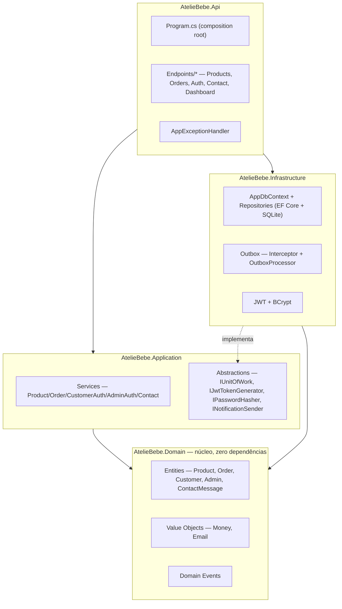
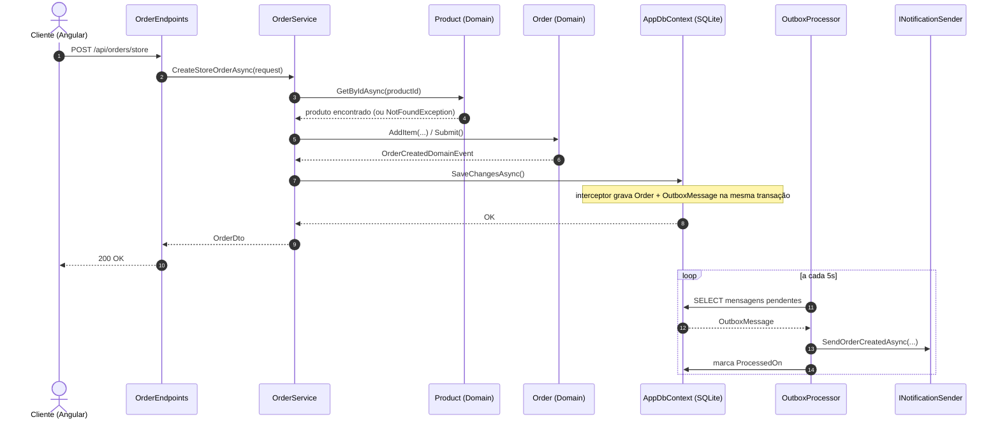
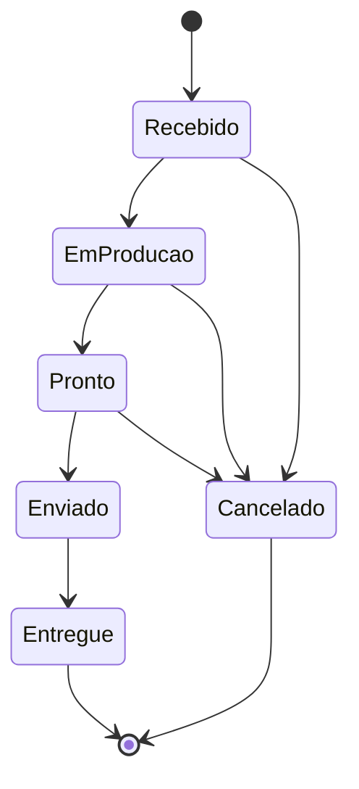
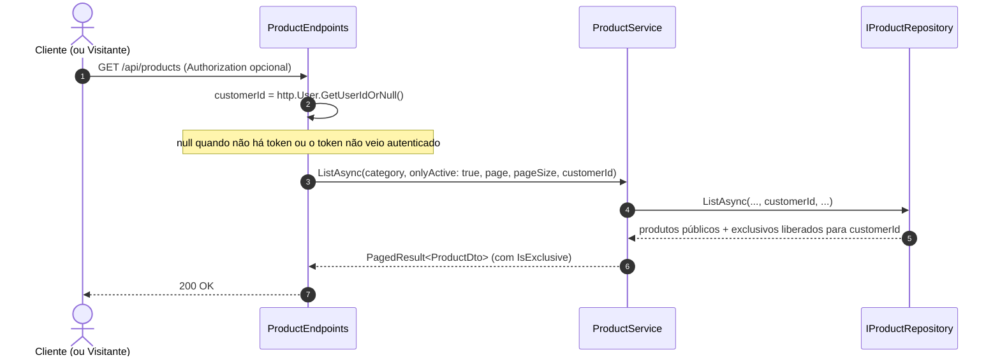
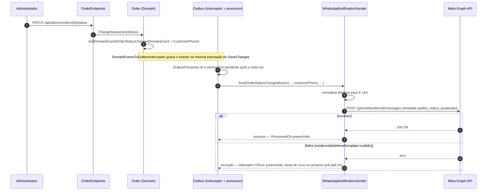

# Design Document — Ateliê Layette Baby

## Overview

O Ateliê Layette Baby é um monorepo com dois projetos independentes: uma API backend em **.NET 10** (Clean Architecture, ASP.NET Core Minimal APIs, EF Core + SQLite) e uma SPA frontend em **Angular 22** (standalone components, Bootstrap 5). Este documento descreve como os requisitos em `requirements.md` são satisfeitos pela arquitetura implementada.

## Architecture

### Camadas do backend

Clean Architecture em quatro projetos, dependências fluindo sempre para dentro (`Domain` não depende de nada):



### Fluxo ponta a ponta — criação de pedido de loja (Requisito 2)



### Máquina de estados do pedido (Requisito 8)



Implementada em `Order.ChangeStatus` (`server/src/AtelieBebe.Domain/Entities/Order.cs`) via um dicionário estático de transições permitidas — qualquer transição fora do mapa lança `DomainException`.

### Frontend

Angular standalone components, roteamento com lazy-loading (`loadComponent`), estado local via `signal`/`computed` (sem NgRx). Estrutura:

```
src/app/
├── core/            services (1 por feature do backend), models/DTOs, guards, interceptor HTTP
├── features/
│   ├── public/      home, shop, product-detail, cart, checkout, auth, my-account, contact, gallery, about
│   └── admin/       dashboard, products, orders, contact-messages, login
└── shared/          reservado para componentes reutilizáveis
```

`authInterceptor` decide qual token Bearer anexar (admin ou cliente) conforme a presença de `/admin/` na URL da requisição — mas só faz isso para requisições cuja URL começa com `environment.apiUrl`; qualquer outra chamada (ex.: `CepService` para a ViaCEP) passa direto, sem token (Requisito 2, item 13).

`CepService` (`core/services/cep.service.ts`) consulta `https://viacep.com.br/ws/{cep}/json/` (sem autenticação) e é usado pelo `Checkout` (Requisito 2): um `valueChanges` no campo de CEP, debounced e filtrado para 8 dígitos, dispara a busca e preenche rua/bairro/cidade/estado.

## Components and Interfaces

### Backend — serviços de aplicação

| Interface | Implementação | Requisitos atendidos |
|---|---|---|
| `IProductService` | `ProductService` | 1, 7 |
| `IOrderService` | `OrderService` | 2, 4, 8 |
| `ICustomerAuthService` | `CustomerAuthService` | 5 |
| `IAdminAuthService` | `AdminAuthService` | 6 |
| `IContactService` | `ContactService` | 9 |
| `IDashboardService` | `DashboardService` (Infrastructure/Persistence/Queries) | 10 |

### Backend — abstrações de infraestrutura

| Interface | Papel |
|---|---|
| `IUnitOfWork` | Agrega os repositórios (`Products`, `Orders`, `Customers`, `Admins`, `ContactMessages`) e `SaveChangesAsync` |
| `IPasswordHasher` | BCrypt hash/verify (Requisito 5, 6) |
| `IJwtTokenGenerator` | Emissão de token JWT com claims de papel `admin`/`customer` |
| `INotificationSender` | Ponto de extensão para envio real de notificações; hoje só `LoggingNotificationSender` |

### Endpoints REST (Minimal API)

| Método/Rota | Auth | Requisito |
|---|---|---|
| `GET /api/products`, `/featured`, `/categories`, `/{slug}` | Pública | 1 |
| `POST /api/orders/store` | Opcional (vincula se autenticado) | 2 |
| `POST /api/orders/custom` | Opcional | 3 (canal ainda implementado, não usado pela UI atual) |
| `GET /api/orders/{id}` | Pública | 4 |
| `GET /api/orders/mine` | `CustomerOnly` | 4 |
| `POST /api/auth/register`, `/login` | Pública | 5 |
| `POST /api/admin/auth/login` | Pública | 6 |
| `GET/POST/PUT/PATCH /api/admin/products/*` | `AdminOnly` | 7 |
| `GET/PATCH /api/admin/orders/*` | `AdminOnly` | 8 |
| `POST /api/contact` | Pública | 9 (canal reservado) |
| `GET /api/admin/contact-messages` | `AdminOnly` | 9 |
| `GET /api/admin/dashboard` | `AdminOnly` | 10 |

### Frontend — componentes por requisito

| Componente | Rota | Requisito |
|---|---|---|
| `Shop`, `Home`, `ProductDetail` | `/loja`, `/`, `/produto/:slug` | 1 |
| `CartPage`, `Checkout` | `/carrinho`, `/checkout` | 2 |
| `Contact` | `/contato` (e redirect de `/encomenda-personalizada`) | 3 |
| `OrderConfirmation`, `MyAccount` | `/pedido/:id`, `/minha-conta` | 4 |
| `LoginPage`, `RegisterPage` | `/entrar`, `/cadastro` | 5 |
| `AdminLogin` | `/admin/login` | 6 |
| `AdminProductList`, `AdminProductForm` | `/admin/produtos*` | 7 |
| `AdminOrderList`, `AdminOrderDetail` | `/admin/encomendas*` | 8 |
| `AdminContactMessages` | `/admin/mensagens` | 9 |
| `AdminDashboard` | `/admin/dashboard` | 10 |

## Requisito 13 — Paginação de listagens

### Backend

Um envelope genérico reutilizado pelas quatro listagens, em vez de quatro DTOs de paginação separados:

```csharp
// AtelieBebe.Application/Common/PagedResult.cs
public sealed record PagedResult<T>(IReadOnlyList<T> Items, int Page, int PageSize, int TotalItems)
{
    public int TotalPages => TotalItems == 0 ? 0 : (int)Math.Ceiling(TotalItems / (double)PageSize);
}
```

`Application/Common/Pagination.cs` centraliza a normalização (`page < 1 → 1`; `pageSize` fixado entre 1 e 100) — hoje usada de forma idêntica em quatro pontos, o suficiente para justificar extrair em vez de repetir o `Math.Clamp` quatro vezes.

Pontos alterados (assinatura ganha `page`/`pageSize`; retorno passa de `IReadOnlyList<T>`/`Task<...>` para `PagedResult<T>`):

| Camada | Membro | Endpoints afetados |
|---|---|---|
| `IProductRepository` | `ListAsync(category, onlyActive, page, pageSize, ct)` — usa `.Skip().Take()` + `.CountAsync()` no `IQueryable` do EF Core | `GET /api/products`, `GET /api/admin/products` |
| `IOrderRepository` | `ListAsync(status, page, pageSize, ct)` | `GET /api/admin/orders` |
| `IContactMessageRepository` | `ListAsync(page, pageSize, ct)` | `GET /api/admin/contact-messages` |
| `ProductService`, `OrderService`, `ContactService` | métodos `ListAsync` correspondentes passam a devolver `PagedResult<Dto>` | — |

`ListFeaturedAsync`, `ListCategoriesAsync`, `ListByCustomerAsync` (encomendas do cliente) **não** mudam — fora do escopo do Requisito 13.

Cada endpoint aplica seu próprio `pageSize` padrão antes de repassar ao serviço (loja pública: 12; as três listagens admin: 20), e ambos os parâmetros da query string são opcionais (`int page = 1, int pageSize = <default-do-endpoint>`).

### Frontend

- **Modelo** `client/src/app/core/models/pagination.model.ts`: `interface PagedResult<T> { items: T[]; page: number; pageSize: number; totalItems: number; totalPages: number; }`.
- **Componente reutilizável** `client/src/app/shared/components/pagination/` (dá finalmente um uso à pasta `shared/components`, hoje vazia): recebe `page`/`totalPages` de entrada, emite `pageChange`, desabilha "Anterior"/"Próxima" nos limites. Usado por `Shop`, `AdminProductList`, `AdminOrderList`, `AdminContactMessages`.
- **Serviços** (`ProductService.list/listAllForAdmin`, `OrderService.list` admin, `ContactService.list`) passam a aceitar `page`/`pageSize` e retornar `Observable<PagedResult<T>>`.
- **`Shop`** reflete a página atual na query string (`?pagina=N`), no mesmo padrão já usado para `?categoria=`, e volta para a página 1 ao trocar de categoria. As três listas do admin mantêm a página como estado local do componente (sem refletir na URL) — a navegação de volta/avançar do navegador é menos relevante ali do que na loja pública.

### Testing Strategy (adendo)

`PagedResult<T>.TotalPages` e a normalização de `page`/`pageSize` foram a primeira lógica não trivial da camada `Application` a ganhar testes — até então só `AtelieBebe.Domain.Tests` existia. `AtelieBebe.Application.Tests` (xUnit, referenciando `AtelieBebe.Application`) cobre: cálculo de `TotalPages` (incluindo total zero), `page` menor que 1, `pageSize` fora do intervalo `[1,100]`, e página solicitada além do fim retornando lista vazia com `totalItems`/`totalPages` corretos.

## Data Models

Entidades de domínio (`AtelieBebe.Domain/Entities`), todas herdando de `Entity` (Id + eventos de domínio) e implementando `IAggregateRoot` quando expostas por repositório próprio:

- **Product** — `Name, Slug, Description, Price (Money), Category, ImageUrl, Active, Featured`. Invariantes: nome/slug/categoria obrigatórios. Sem controle de estoque — todo produto é fabricado sob encomenda, então é sempre comprável em qualquer quantidade. Catálogo especializado (Requisito 1): `DbInitializer.SeedProductsAsync` remove qualquer produto cuja `Category` esteja fora do conjunto permitido ("Kit Ombro e Boca", "Fralda de Ombro", "Fralda de Boca") a cada inicialização, antes de semear os produtos que faltarem — não há relação de chave estrangeira entre `OrderItem.ProductId` e `Product`, então excluir um produto não afeta pedidos que já o referenciam.
- **Order** (raiz) + **OrderItem** (filho) — `CustomerId?, CustomerName, CustomerEmail (Email), Type (Loja|Personalizada), Status, Items[]`. `Total` é uma propriedade computada (soma dos subtotais dos itens), nunca persistida.
- **Customer** — `Name, Email (Email), PasswordHash, Phone?`.
- **Admin** — `Name, Email (Email), PasswordHash`. Única instância, semeada na inicialização.
- **ContactMessage** — `Name, Email (Email), Message`.

Value Objects:
- **Money** — `Amount (decimal), Currency`. Sempre arredondado a 2 casas (`AwayFromZero`); rejeita valores negativos; impede operações entre moedas diferentes.
- **Email** — normalizado (trim + minúsculas) e validado por regex na construção.

Eventos de domínio (todos `sealed record : DomainEventBase`, carregando `EventId`/`OccurredOn`): `OrderCreatedDomainEvent`, `OrderStatusChangedDomainEvent`, `CustomerRegisteredDomainEvent`, `ContactMessageReceivedDomainEvent`.

## Padrão Outbox (Requisito 11)

`DomainEventsToOutboxInterceptor` (interceptor de `SaveChanges` do EF Core) serializa cada evento de domínio pendente em uma linha `OutboxMessage` (`Type`, `Content` JSON, `OccurredOn`, `Attempts`, `ProcessedOn?`, `Error?`), gravada na mesma transação da mudança que a originou. `OutboxProcessor` (`BackgroundService`) faz *polling* a cada 5s, lotes de até 20, despachando por um `switch` sobre o tipo do evento para `INotificationSender`. Falha incrementa `Attempts` (máx. 5) e grava `Error`, sem interromper o lote.

## Error Handling

`AppExceptionHandler` (`IExceptionHandler` central) mapeia exceções para `ProblemDetails`:

| Exceção | HTTP |
|---|---|
| `NotFoundException` | 404 |
| `ConflictException` | 409 |
| `UnauthorizedAppException` | 401 |
| `DomainException` | 400 |
| Não tratada | 500 (mensagem genérica; detalhe completo só no log) |

## Testing Strategy

- **Backend — domínio** (`server/test/AtelieBebe.Domain.Tests`, xUnit): cobre as invariantes de domínio mais críticas — máquina de estados de `Order` (toda transição permitida e proibida), visibilidade/acesso exclusivo de `Product`, validação e igualdade de `Money`/`Email`, registro de `Customer`. 61 testes.
- **Backend — aplicação** (`server/test/AtelieBebe.Application.Tests`, xUnit): `PagedResult<T>.TotalPages` (incluindo total zero e página além do fim) e a normalização de `page`/`pageSize` em `Pagination.Normalize`. 20 testes.
- **Frontend** (`client/src/app/**/*.spec.ts`, Vitest): `CartService` (add/remover/limpar/totais/persistência, incluindo a chave de mesclagem por bordado), lógica de montagem da mensagem de WhatsApp em `Contact`, guards de rota (`adminGuard`, `customerGuard`), chamadas HTTP de `ProductService` via `HttpClientTestingController`. 26 testes.
- Não há testes de integração ponta a ponta automatizados; verificação de UI é feita manualmente via navegador (Playwright/CDP) a cada mudança de front-end relevante.

## Security

- Senhas: BCrypt (`BCryptPasswordHasher`), nunca texto plano (Requisito 5, 6, RNF02).
- Tokens: JWT HMAC-SHA256, claims `NameIdentifier/Name/Email/Role`, expiração configurável (`Jwt:ExpiryMinutes`, padrão 480 min). Segredo de assinatura fica em `dotnet user-secrets` local — **nunca** commitado (RNF08).
- Autorização: policies `AdminOnly`/`CustomerOnly` via `RequireAuthorization` nos grupos de endpoint.
- CORS: lista de origens permitidas configurável (`Cors:AllowedOrigins`), padrão `http://localhost:4200`.
- Enumeração de contas: mensagem de erro de login idêntica para e-mail inexistente e senha incorreta (Requisito 5, 6).
- `authInterceptor` só anexa o token Bearer a requisições para `environment.apiUrl` — nunca para domínios de terceiros como a ViaCEP (Requisito 2, item 13). Qualquer novo serviço que chame uma API externa herda essa proteção automaticamente, por ser aplicada no interceptor global.

## Requisito 14 e 15 — Produtos exclusivos por cliente e bordado

### Modelo de dados

`Product` (Domain) ganha uma coleção de acessos de cliente, controlada por comportamento (não uma lista pública mutável):

```csharp
private readonly List<ProductCustomerAccessEntry> _allowedCustomerAccess = new();
public IReadOnlyCollection<Guid> AllowedCustomerIds => _allowedCustomerAccess.Select(e => e.CustomerId).ToList().AsReadOnly();
public bool IsExclusive => _allowedCustomerAccess.Count > 0;

public void SetAllowedCustomers(IEnumerable<Guid> customerIds); // substitui o conjunto inteiro — usado pelo admin
public bool HasAccess(Guid? customerId) => !IsExclusive || (customerId is { } id && _allowedCustomerAccess.Any(e => e.CustomerId == id));
```

`ProductCustomerAccessEntry` é uma pequena entidade interna (`CustomerId` + FK sombra `ProductId`) que existe só para o EF Core mapear a coleção como uma tabela própria `ProductCustomerAccess (ProductId, CustomerId)` — mapeada em `ProductConfiguration`/`ProductCustomerAccessEntryConfiguration` como uma relação `HasMany().WithOne()` normal, e não como tipo owned: um tipo owned não pode ser consultado diretamente via `_dbContext.Set<T>()`, o que inviabilizaria o filtro `EXISTS` do repositório (abaixo). O Domain nunca referencia `ProductCustomerAccessEntry` diretamente — só `Guid`s via `AllowedCustomerIds`/`SetAllowedCustomers`/`HasAccess`. Sem relação com `OrderItem`/`Order`; a associação vale só para visibilidade no catálogo, não fica "congelada" no pedido depois de criado.

Toda leitura de `Product` que precise refletir `IsExclusive`/`AllowedCustomerIds` corretamente (`GetByIdAsync`, `GetBySlugAsync`, `ListAsync`, `ListFeaturedAsync`) faz `Include("_allowedCustomerAccess")` — sem isso a coleção fica vazia em memória e `IsExclusive` sempre lê `false`, mesmo com grants no banco.

`Order` não muda de modelo — o texto do bordado viaja em `OrderItem.OptionsJson` (campo já existente), como um JSON simples `{ "embroideryText": "ANA" }`.

### Backend — visibilidade (Requisito 14)

| Camada | Mudança |
|---|---|
| `IProductRepository.ListAsync`, `ListFeaturedAsync` | Ganham parâmetro `Guid? customerId`. Filtro SQL (`ApplyVisibility`): `!EXISTS(access WHERE ProductId = p.Id) OR (customerId != null AND EXISTS(access WHERE ProductId = p.Id AND CustomerId = @customerId))`. Em `ListAsync`, só aplicado quando `onlyActive: true` — a listagem admin (`onlyActive: false`) nunca filtra por visibilidade. `ListFeaturedAsync` também precisa do filtro: um produto exclusivo em destaque não pode vazar pelo card de "Destaques do ateliê" na home. |
| `IProductRepository.GetBySlugAsync` | Mesma regra — se o produto for exclusivo e o `customerId` não tiver acesso, o repositório retorna `null` (o serviço já trata `null` como 404 via `NotFoundException`, sem mudança na `Api`). |
| `IProductRepository.ListCategoriesAsync` | Ganha `Guid? customerId`, mesmo filtro, para a categoria de um produto exclusivo só aparecer no filtro de quem tem acesso. |
| `IProductRepository.SlugExistsAsync` (novo) | Checagem de unicidade de slug em `ProductService.CreateAsync`, sem o filtro de visibilidade — precisa detectar colisão mesmo com um produto exclusivo já usando o slug. |
| `ProductEndpoints.MapProductEndpoints` (`GET /api/products`, `/featured`, `/{slug}`, `/categories`) | Deixam de ser 100% anônimos: continuam **sem** `RequireAuthorization` (visitante sem token continua funcionando), mas passam a ler `http.User` via `ClaimsPrincipalExtensions.GetUserIdOrNull()` (extensão nova, usada também para simplificar `OrderEndpoints`) e repassam o `customerId` ao serviço. Token inválido/expirado não gera 401 aqui — sem `RequireAuthorization`, o middleware de autenticação simplesmente não popula `http.User` como autenticado, e o endpoint trata como anônimo. |
| `GET /api/admin/products` | Sem mudança de filtro — continua mostrando tudo, para todo administrador. |
| `ProductDto` (público) | Ganha `IsExclusive: bool` (sem listar os clientes — não é informação pública). |
| `AdminProductDto` (novo, usado só em `GET/PUT /api/admin/products/{id}...`) | `ProductDto` + `AllowedCustomerIds: Guid[]`. Produzido por `ProductService.GetForAdminAsync`/`SetAllowedCustomersAsync`; a listagem admin (`GET /api/admin/products`) continua usando `ProductDto` — não precisa da lista de clientes por item. |
| **Novo**: `GET /api/admin/customers` | `AdminOnly`. Lista clientes cadastrados (`Id, Name, Email`) via `ICustomerAdminService`, para popular o seletor no formulário de produto. Usa `ICustomerRepository.ListAsync` (novo método — o repositório só tinha `GetByEmailAsync`/`EmailExistsAsync`/`Add`). |
| **Novo**: `PUT /api/admin/products/{id}/customers` | `AdminOnly`. Corpo: `{ customerIds: Guid[] }`. Chama `Product.SetAllowedCustomers(...)` — substitui o conjunto inteiro (o formulário admin envia a seleção completa, não incrementalmente). |

### Backend — bordado (Requisito 15)

`OrderService.CreateStoreOrderAsync` tem uma lacuna a corrigir: hoje só repassa `itemRequest.OptionsJson` para itens **sem** `ProductId` (linha avulsa de encomenda personalizada); para itens de catálogo, `order.AddItem(...)` é chamado **sem** o quarto parâmetro. Passa a ser:

```csharp
order.AddItem(product.Id, product.Name, product.Price, itemRequest.Quantity, itemRequest.OptionsJson);
```

Sem validação extra no backend de que `OptionsJson` só venha preenchido para produtos exclusivos — é uma regra de UI (Requisito 15, item 2), não de integridade de dados; um `OptionsJson` presente em um produto público não quebra nada, só não é oferecido pela interface.

`AdminOrderDetail` (frontend) desserializa `OptionsJson` de cada item e, se tiver `embroideryText`, exibe "Bordado: {texto}" na linha do item.

### Frontend — visibilidade e formulário admin (Requisito 14)

- `Product` (model) ganha `isExclusive: boolean`; novo `AdminProduct extends Product` ganha `allowedCustomerIds: string[]` (retornado por `GET /api/admin/products/{id}`).
- Novo `CustomerAdminService.list()` → `GET /api/admin/customers`, com o model `CustomerSummary`. `AdminProductForm` ganha uma seção "Acesso exclusivo": lista de clientes com checkbox por cliente; ao salvar, chama `ProductService.setAllowedCustomers(id, customerIds)` → `PUT /api/admin/products/{id}/customers`. Produto novo (ainda sem ID) só ganha essa seção depois do primeiro salvamento.
- `Shop`/`Home`/`ProductDetail` não precisam de mudança de autenticação — o token já viaja via `authInterceptor` quando o cliente está logado; a API decide o que incluir.
- Produtos exclusivos exibidos para quem tem acesso ganham um badge visual "Exclusivo pra você" (`badge-soft`, mesmo padrão usado em outras páginas) — diferenciação de UX, não é um requisito de dado novo.

### Frontend — bordado em todos os produtos (Requisito 15)

> Escopo estendido a pedido do cliente: o bordado nasceu restrito a produtos exclusivos e agora vale para toda a loja (ver nota no Requisito 15 em `requirements.md`).

- `CartItem` (model) ganha `embroideryText?: string`.
- `CartService.add(product, quantity, embroideryText?)`: a chave de mesclagem passa de `product.id` para `(product.id, embroideryText ?? null)` — dois itens do mesmo produto com bordado diferente NÃO se somam; com o mesmo texto, somam a quantidade normalmente.
- Não existe mais botão de "adicionar rápido" em nenhuma grade de produto (`Shop`, `Home`) — todo card mostra um link "Personalizar" que leva para `ProductDetail`, único lugar onde o pedido pode ser montado, já que o bordado (obrigatório) precisa ser informado antes de ir ao carrinho.
- `ProductDetail` sempre mostra o campo "Texto para bordar" (obrigatório) e, ao lado, um teclado de alfabeto (A-Z, mais "espaço"/"limpar"/apagar-última-letra) que escreve no mesmo `embroideryText` signal — o cliente pode digitar direto no campo ou tocar nas letras, os dois métodos convergem para o mesmo texto (`appendLetter`/`appendSpace`/`removeLastLetter`/`clearEmbroideryText`, respeitando o `maxlength` de 30).
- `Checkout.submit()`: para cada item do carrinho, `optionsJson` passa de sempre `null` para `item.embroideryText ? JSON.stringify({ embroideryText: item.embroideryText }) : null`.
- `CartPage` exibe o texto do bordado abaixo do nome do produto em cada linha.

### Diagrama — resolução de visibilidade em `GET /api/products`



---

## Requisito 16 — Notificações por WhatsApp (proposto)

> Design ainda não implementado — depende do administrador criar a conta Meta WhatsApp Business Cloud API e obter as credenciais antes de o canal funcionar de fato.

### Por que Meta Cloud API (e a implicação de templates)

A API oficial só permite mensagem de **texto livre** dentro de uma janela de 24h após o cliente escrever para o número do ateliê ("customer service window"). Fora dessa janela — que é o caso de toda notificação automática que o sistema dispara (confirmação de pedido, mudança de status, boas-vindas, etc., iniciadas pela empresa) —, a mensagem PRECISA usar um *message template* pré-cadastrado e aprovado no Meta Business Manager. Isso não é uma escolha de implementação, é uma restrição da própria API: não existe forma de mandar texto livre automatizado fora da janela de 24h. Por isso o design já nasce em torno de templates, um por tipo de notificação.

### Novos templates a criar e aprovar no Meta Business Manager

| Nome do template | Evento | Variáveis (na ordem) |
|---|---|---|
| `pedido_recebido` | `OrderCreatedDomainEvent` | `{{1}}` nome do cliente, `{{2}}` código curto do pedido (8 primeiros caracteres do `OrderId`), `{{3}}` total em R$ |
| `pedido_status_atualizado` | `OrderStatusChangedDomainEvent` | `{{1}}` nome do cliente, `{{2}}` código curto do pedido, `{{3}}` novo status (rótulo em português, ex. "Em produção") |
| `boas_vindas_cliente` | `CustomerRegisteredDomainEvent` | `{{1}}` nome do cliente |
| `confirmacao_contato` | `ContactMessageReceivedDomainEvent` | `{{1}}` nome de quem enviou o contato |

Todos em português (`pt_BR`), categoria "Utility" (não "Marketing" — são transacionais, não promocionais, o que facilita a aprovação e evita a limitação de custo/opt-in de templates de marketing). O texto exato de cada template é definido no Meta Business Manager pelo administrador (fora do código); o backend só manda o nome do template e os valores das variáveis.

### Modelo de dados — telefone passa a ser obrigatório

- `Customer.Phone` e `Order.CustomerPhone` continuam `string?` no C#/banco (sem migration — não vale arriscar quebrar linhas existentes nulas com uma constraint `NOT NULL` retroativa). O que muda é a validação: `Customer.Register` e `Order.Create` passam a lançar `DomainException` quando o telefone vier nulo/vazio, no mesmo padrão que já existe para `Name`.
- `ContactMessage` (Domain) ganha uma propriedade nova `Phone` (obrigatória, mesma validação). Hoje a entidade só tem `Name`/`Email`/`Message` — precisa de migration (`AddPhoneToContactMessages`).
- Os quatro domain events que hoje só carregam e-mail ganham o telefone: `OrderCreatedDomainEvent`, `OrderStatusChangedDomainEvent`, `CustomerRegisteredDomainEvent`, `ContactMessageReceivedDomainEvent` — todos ganham um campo `Phone`/`CustomerPhone` no record.

> Nota de rastreamento com o Requisito 14: `/contato` no frontend hoje NÃO chama `POST /api/contact` — monta um link `wa.me/...` client-side (ver CLAUDE.md). O acceptance criteria 4 deste requisito (confirmação de contato) cobre o endpoint de backend, que "existe e funciona" mas não é exercitado pela página atual; a mudança fica pronta para quando/se a página voltar a usar esse fluxo.

### Backend — canal de envio

| Camada | Mudança |
|---|---|
| `INotificationSender` (Application/Abstractions) | Cada método ganha o telefone do destinatário como parâmetro (`SendOrderCreatedAsync`, `SendOrderStatusChangedAsync`, `SendWelcomeMessageAsync` — renomeado de `SendWelcomeEmailAsync` —, `SendContactAcknowledgementAsync`). |
| **Novo**: `WhatsAppOptions` (Infrastructure/Notifications) | `AccessToken`, `PhoneNumberId`, `ApiVersion` (default `v21.0`) — bound via `IOptions<WhatsAppOptions>`, seção `WhatsApp` do `appsettings.json`/user-secrets, mesmo padrão de `JwtOptions`. `AccessToken` fica em branco no `appsettings.json` versionado, como `Jwt:Secret`. |
| **Novo**: `WhatsAppNotificationSender : INotificationSender` (Infrastructure/Notifications) | `HttpClient` tipado (`AddHttpClient<INotificationSender, WhatsAppNotificationSender>()`) que faz `POST https://graph.facebook.com/{ApiVersion}/{PhoneNumberId}/messages` com `Authorization: Bearer {AccessToken}` e corpo `{ messaging_product: "whatsapp", to: <telefone E.164>, type: "template", template: { name, language: { code: "pt_BR" }, components: [{ type: "body", parameters: [...] }] } }`. Se `AccessToken`/`PhoneNumberId` estiverem vazios, lança uma exceção clara ("WhatsApp não configurado") — cai no fluxo de retry/erro do outbox já existente, sem derrubar a aplicação. Substitui `LoggingNotificationSender` no `AddInfrastructure`. |
| **Novo**: normalização de telefone (`WhatsAppPhoneFormatter`, Infrastructure/Notifications) | Remove tudo que não é dígito; se não começar com `55` (código do Brasil) e tiver 10-11 dígitos (DDD + número), prefixa `55`. É uma heurística best-effort para o formato E.164 que a Cloud API exige — não valida DDD nem o dígito 9 extra dos celulares. |
| `OutboxProcessor.DispatchAsync` | Passa a repassar o telefone de cada evento para o `INotificationSender` correspondente. |
| `Order.Submit()` / `Order.ChangeStatus()` | `AddDomainEvent(new OrderCreatedDomainEvent(Id, CustomerName, CustomerEmail.Value, CustomerPhone!, Total.Amount))` e o equivalente em `OrderStatusChangedDomainEvent` — `CustomerPhone` deixa de ser opcional na prática (validado obrigatório em `Order.Create`). |
| `Customer.Register` | Valida `phone` obrigatório (`DomainException` se vazio) e repassa no `CustomerRegisteredDomainEvent`. |
| `ContactMessage.Create` | Ganha parâmetro `phone` obrigatório; `ContactMessageReceivedDomainEvent` ganha o campo. |
| `RegisterCustomerRequest`, `CreateStoreOrderRequest`, `CreateCustomOrderRequest`, `SubmitContactRequest` | `Phone`/`CustomerPhone` deixam de ser opcionais na validação de negócio (o tipo no DTO pode continuar `string?` — a rejeição acontece no Domain, igual a `Name` hoje; sem duplicar validação na camada de aplicação). |

### Frontend — telefone obrigatório

- `register-page.html`/`.ts`: campo "Telefone (opcional)" vira "Telefone / WhatsApp", com `Validators.required` e mensagem de erro, igual ao padrão de `name`/`email`.
- `checkout.html`/`.ts`: campo "Telefone / WhatsApp" (já existia, sem validação) ganha `Validators.required` + `invalid-feedback`.
- `contact.ts`/`.html` (`/contato`): já tem campo de telefone para montar o link `wa.me`; nenhuma mudança de contrato aqui, pois a página não chama `ContactService.submit` (ver nota de rastreamento acima). Caso o backend de contato volte a ser usado, o campo de telefone já existe na UI.

### Diagrama — envio de notificação de mudança de status



## Requisito 17 — CPF no cadastro de cliente

### Modelo de dados

- **Novo value object** `Cpf` (Domain/ValueObjects, mesmo padrão de `Email`): `Cpf.Create(string)` remove tudo que não é dígito, rejeita comprimento ≠ 11, sequências de dígito repetido (`00000000000`, `11111111111`, etc.) e valida os dois dígitos verificadores pelo algoritmo padrão (módulo 11, pesos 10..2 e 11..2) — lança `DomainException` com a mesma mensagem em português usada pelos outros value objects em caso de valor inválido.
- `Customer.Cpf` é `Cpf?` (nullable) no C#/banco — **não retroativo**: contas existentes antes deste requisito ficam com `Cpf = null` depois da migration, sem quebrar ao carregar (o conversor do EF só chama `Cpf.Create` quando o valor do banco não é nulo). `Customer.Register(name, email, cpf, passwordHash, phone)` exige um `Cpf` não nulo — todo cadastro novo passa a ter CPF.
- Migration `AddCustomerCpf`: coluna `Customers.Cpf` (`TEXT`, `NULL`, tamanho 11) + índice único `IX_Customers_Cpf` — SQLite trata múltiplos `NULL` como distintos num índice único, então contas antigas sem CPF não conflitam entre si nem bloqueiam a unicidade das novas.
- `ICustomerRepository.CpfExistsAsync(string, ct)` (mesmo padrão de `EmailExistsAsync`) — `CustomerAuthService.RegisterAsync` valida unicidade antes de criar a conta, lançando `ConflictException("Já existe uma conta com este CPF.")`.

### Backend — mudanças por camada

| Camada | Mudança |
|---|---|
| `RegisterCustomerRequest` (Application/Auth) | Ganha campo `Cpf` (string, obrigatório — diferente de `Phone`, que continua `string?`). |
| `CustomerAuthService.RegisterAsync` | `Cpf.Create(request.Cpf)` (valida formato/checksum) → `CpfExistsAsync` (valida unicidade) → passa o `Cpf` para `Customer.Register`. Erros de formato viram HTTP 400 (`DomainException`), duplicidade vira HTTP 409 (`ConflictException`), no mesmo padrão já usado para e-mail. |

### Frontend — formulário de cadastro

- `register-page.ts`: novo `FormControl` `cpf` (`Validators.required` + `Validators.pattern` aceitando `000.000.000-00` ou só dígitos) enviado como `cpf` em `RegisterCustomerRequest`. Sem máscara de input (nenhuma lib de máscara no projeto) — o usuário digita livremente, com ou sem pontuação, e o backend normaliza.
- `register-page.html`: campo "CPF" adicionado entre "E-mail" e "Telefone / WhatsApp", mesmo padrão visual (`is-invalid`/`invalid-feedback`) dos demais campos.
- A validação de formato/checksum completa (dígitos verificadores) só existe no backend — o front-end faz uma checagem leve de formato e repassa a mensagem de erro do backend (`err.error.detail`) se o CPF for rejeitado, mesmo padrão já usado para os outros erros de cadastro.
- Novo `PhoneMaskDirective` (`shared/directives/phone-mask.directive.ts`, `[appPhoneMask]`) formata qualquer campo de telefone/WhatsApp como `(11) 91234-5678` conforme o usuário digita (usa `NgControl` para escrever o valor formatado de volta no `FormControl`). Aplicado em `register-page`, `checkout` e `contact` — os três lugares que coletam telefone.

## Requisito 18 — Listagem de clientes no admin

- Reaproveita a infraestrutura já existente para o seletor de clientes exclusivos (Requisito 14): `ICustomerAdminService.ListAsync()` → `GET /api/admin/customers` → `CustomerSummary[]` no frontend (`core/services/customer-admin.service.ts`). Não pagina — o mesmo motivo que já valia para o seletor (precisa da lista completa) vale aqui.
- `CustomerSummaryDto`/`CustomerSummary` (Application + frontend) ganham `Phone`, `Cpf`, `CreatedAt` — campos aditivos, não quebram o consumidor existente (o seletor de produtos só lê `id`/`name`/`email`).
- Nova tela `features/admin/customers/admin-customer-list` (`/admin/clientes`), com link no menu lateral do admin entre "Encomendas" e "Mensagens". Tabela simples (sem paginação, sem filtro) — mostra `—` quando `phone`/`cpf` vêm `null` (contas anteriores ao Requisito 17).

## Requisito 19 — CPF obrigatório no checkout

### Modelo de dados

- `Order.CustomerCpf` é `Cpf?` (nullable no C#/banco), mesmo padrão do Requisito 17 para `Customer.Cpf` — **não retroativo**: pedidos existentes antes deste requisito ficam com `CustomerCpf = null` depois da migration `AddOrderCpf` (coluna `Orders.CustomerCpf`, `TEXT`, `NULL`, tamanho 11, sem índice — CPF de pedido não precisa ser único, diferente do CPF de conta). `Order.Create(...)` exige um `Cpf` não nulo (lança `DomainException` caso contrário) — todo pedido novo passa a ter CPF, no mesmo padrão já usado para `customerPhone` obrigatório.
- `CreateStoreOrderRequest`/`CreateCustomOrderRequest` (Application/Orders) ganham `CustomerCpf` (string, obrigatório); `OrderService` chama `Cpf.Create(request.CustomerCpf)` antes de `Order.Create` — erro de formato vira HTTP 400 (`DomainException`), mesmo padrão do Requisito 17. `OrderDto.CustomerCpf` é `string?` (reflete pedidos antigos sem CPF).

### Frontend — formulário de checkout

- `checkout.ts`: novo `FormControl` `customerCpf` (`Validators.required` + `Validators.pattern`, mesma regra do cadastro) enviado em `CreateStoreOrderRequest`.
- `checkout.html`: campo "CPF" adicionado ao lado de "Telefone / WhatsApp" em "Seus dados", mesmo padrão visual (`is-invalid`/`invalid-feedback`, placeholder `000.000.000-00`) do campo equivalente em `register-page`.
- A encomenda personalizada (`CreateCustomOrderRequest`/`createCustomOrder`) não tem UI própria hoje (ver nota de rastreamento do Requisito 15 sobre `/contato`), então o campo CPF nesse DTO existe só no contrato do backend, sem tela associada.

## Requisito 20 — Login ou cadastro obrigatório para finalizar a compra

### Fluxo

- `app.routes.ts`: a rota `checkout` ganha `canActivate: [customerGuard]` (mesmo guard já usado em `minha-conta`).
- `customer.guard.ts`: passa a ler `state.url` e, ao redirecionar um visitante não autenticado, inclui `queryParams: { returnUrl: state.url }` na `UrlTree` para `/entrar` — antes redirecionava sem preservar o destino.
- `login-page.ts`/`register-page.ts`: novo signal `returnUrl` (lido de `route.snapshot.queryParamMap`, default `/minha-conta`); ao autenticar com sucesso, `router.navigateByUrl(this.returnUrl())` no lugar do `router.navigate(['/minha-conta'])` fixo anterior.
- `login-page.html`/`register-page.html`: o link cruzado para a outra tela (`Cadastre-se`/`Entrar`) propaga `[queryParams]="{ returnUrl: returnUrl() }"`, para não perder o destino ao trocar de tela; quando `returnUrl() === '/checkout'`, um alerta contextual explica que a autenticação é para finalizar o pedido.
- O carrinho (`CartService`, `localStorage`) não depende de autenticação e não é afetado pelo desvio para login/cadastro — o cliente volta ao checkout com os mesmos itens.
- Checkout deixa de ser acessível como convidado; o preenchimento manual de nome/e-mail/telefone/CPF no formulário de checkout continua existindo (não são lidos automaticamente da conta), só que agora sempre atrás de uma sessão autenticada.

## Requisito 21 — Pré-preenchimento de dados no checkout

- Novo endpoint `GET /api/auth/me` (`CustomerOnly`), implementado em `CustomerAuthService.GetProfileAsync` — busca o `Customer` pelo id do JWT (`ICustomerRepository.GetByIdAsync`, já existente) e retorna `CustomerProfileDto(Id, Name, Email, Phone, Cpf)`. Reaproveita o mesmo padrão de extração de id (`http.User.GetUserId()`) já usado em `GET /api/orders/mine`.
- `AuthService.getProfile()` (frontend) chama esse endpoint; `checkout.ts` (`ngOnInit`) o invoca para um cliente autenticado e preenche nome/e-mail/telefone/CPF — substituindo o preenchimento anterior (que só usava `name`/`email` do JWT decodificado em `AuthUser`, sem telefone/CPF).
- Endereço de entrega não tem um "endereço salvo" próprio no `Customer` — em vez de criar esse conceito, `checkout.ts` reaproveita `OrderService.listMine()` (já usado em `my-account`), que devolve os pedidos do cliente ordenados do mais recente para o mais antigo; o primeiro pedido com `shippingAddressJson` não nulo tem seu endereço parseado (`JSON.parse` para o tipo `ShippingAddress` já existente) e usado para `patchValue` de CEP/rua/número/complemento/bairro/cidade/estado. Como `patchValue` do CEP dispara o pipeline de busca do ViaCEP já existente (Requisito de checkout original), o endereço é revalidado/atualizado contra o CEP assim que preenchido — mesmo resultado, sem necessidade de tratamento especial.
- Todos os campos continuam sendo `FormControl`s normais — o pré-preenchimento não os torna somente-leitura, então o cliente pode corrigir qualquer valor antes de confirmar.

## Requisito 22 — Cálculo de frete no checkout

### Modelo de dados

- `Order.ShippingCost` (`Money`, nunca nulo, default `Money.Zero()`) — coluna `Orders.ShippingCostAmount` (`decimal(18,2)`, `DEFAULT 0` via `HasDefaultValueSql("0")`, para não quebrar pedidos existentes na migration `AddOrderShippingCost`), mesmo padrão de conversão `HasConversion` já usado em `OrderItem.UnitPrice`.
- `Order.Total` deixa de ser só a soma dos itens: `ItemsTotal` (nova propriedade computada, soma dos subtotais dos itens — o que `Total` calculava antes) `+ ShippingCost`. `Order.Create(...)` ganha um parâmetro opcional `Money? shippingCost = null` (default zero) — encomendas personalizadas e qualquer outro chamador que não passe frete continuam com `ShippingCost = 0`, sem mudança de comportamento.
- `CreateStoreOrderRequest` ganha `ShippingCost` (decimal, obrigatório) — calculado e enviado pelo frontend, no mesmo padrão de confiança já usado para `EstimatedPrice` na encomenda personalizada (não há gateway de pagamento validando o valor; é uma estimativa exibida ao cliente, não uma cobrança real). `OrderDto` ganha `ItemsTotal` e `ShippingCost` (além do `Total` já existente), para as telas mostrarem o detalhamento subtotal/frete/total.

### Frontend — cálculo da estimativa

- Novo `ShippingService` (`core/services/shipping.service.ts`), **sem chamada HTTP** — é só uma função pura `estimate(state: string, totalItems: number): number`. Não usa a API oficial dos Correios porque essa API (pós-2020) exige contrato/credenciais (usuário SIGEP ou cartão de postagem) que o ateliê não possui, e o cálculo oficial também precisaria de peso/dimensão por produto, que não existe no catálogo hoje.
- Tabela de tarifa-base por UF, agrupada por distância aproximada da origem (São Bernardo do Campo/SP): SP = R$12,90; Sul/Sudeste (PR, SC, RS, RJ, MG, ES) = R$18,90; Centro-Oeste/Nordeste = R$24,90; Norte = R$32,90 (UF desconhecida cai no valor do Centro-Oeste/Nordeste como default). Acréscimo de R$2,50 por item além do primeiro (`totalItems - 1`), somado à tarifa-base — esse total já é o valor final exibido/enviado, sem nenhuma margem adicional (o `MARKUP_MULTIPLIER = 1.5` que existia aqui foi removido a pedido do ateliê).
- `checkout.ts`: novo signal `destinationState` (atualizado via `form.controls.state.valueChanges`, tanto de digitação manual quanto do preenchimento automático por CEP/histórico) e `shippingCost = computed(() => shippingService.estimate(destinationState(), cart.totalItems()))` — recalcula automaticamente sempre que o estado ou a quantidade de itens do carrinho mudam. Enviado como `shippingCost` em `createStoreOrder(...)`.
- `checkout.html`: resumo do pedido passa a mostrar "Subtotal", "Frete estimado" e "Total" (subtotal + frete) separados, em vez de só um total.
- `order-confirmation.html` e `admin-order-detail.html`: mostram a mesma quebra (Subtotal/Frete/Total) quando `o.shippingCost` é maior que zero — pedidos antigos (frete zero) continuam mostrando só o total, sem uma linha de "Frete: R$ 0,00" sem sentido.

## Requisito 23 — CPF mascarado nas telas administrativas

- Novo `CpfMaskPipe` (`shared/pipes/cpf-mask.pipe.ts`, standalone), mesmo padrão de pasta de `shared/directives/`. `transform(cpf)`: remove tudo que não é dígito, valida que sobraram 11 dígitos (senão devolve o valor original sem tentar mascarar — protege contra dado malformado) e devolve `***.<dígitos 3-5>.<dígitos 6-8>-**`; `null`/`undefined`/string vazia viram `—`.
- Aplicado via `| cpfMask` em dois lugares — `admin-customer-list.html` (coluna CPF da tabela) e `admin-order-detail.html` (card "Cliente") — ambos os únicos pontos do frontend que hoje exibem CPF fora de um campo de formulário (formulários de cadastro/checkout continuam mostrando o valor real digitado pelo próprio usuário, sem máscara — não faz sentido mascarar o que a pessoa acabou de digitar).
- Só a exibição é mascarada — os endpoints (`GET /api/admin/customers`, `GET /api/admin/orders`) continuam retornando o CPF completo (sem máscara) na resposta JSON; a máscara é uma decisão de UI, não uma restrição de API. Reduz exposição na tela/print/compartilhamento de tela, mas não impede alguém com acesso ao painel de inspecionar a resposta de rede.
- `CpfMaskPipe` tem cobertura de teste unitário dedicada (`cpf-mask.pipe.spec.ts`) por lidar com dado pessoal sensível — casos: CPF cru (11 dígitos), CPF formatado, `null`/`undefined`/vazio, e valor inválido (não mascara).

## Requisitos 24-26 — Upload de imagens pelo admin (site, produto, galeria)

Os três requisitos compartilham a mesma infraestrutura de upload; documentados juntos.

### Armazenamento de arquivos

- Novo `IFileStorageService` (Application/Abstractions) — `SaveAsync(folder, fileName, stream)` devolve a URL pública; `DeleteAsync(url)` apaga o arquivo (best-effort, usado pela galeria ao remover uma foto). Implementação `LocalFileStorageService` (Infrastructure/Storage) salva em `Uploads:Path` (config; default `<content-root>/uploads` — em produção, deve apontar para uma pasta **fora** do diretório de publicação, ex. `/var/www/atelie-bebe/uploads` via `Uploads__Path` no `api.env`, porque `dotnet publish -o .../publish` substitui esse diretório inteiro a cada deploy).
- `Program.cs` monta `app.UseStaticFiles(...)` servindo essa pasta sob `Uploads:PublicPath` (default `/api/uploads`) — de propósito um prefixo `/api/...`, para reaproveitar a regra de proxy `/api/*` que o Nginx já tem em produção, sem precisar editar a config do Nginx.
- `ImageUploadValidator` (Api/Common) centraliza a validação (extensão em `.jpg/.jpeg/.png/.webp`, tamanho até 8MB) reaproveitada pelos três endpoints de upload abaixo.
- Frontend: como a API devolve URLs raiz-relativas (corretas em produção, mesma origem via Nginx), `resolveAssetUrl()` (`core/utils/asset-url.ts`) resolve essas URLs contra a origem real da API — necessário só em dev local, onde `ng serve` (porta 4200) e `dotnet run` (porta 5120) são origens diferentes; em produção é um no-op. Um `AssetUrlPipe` (`shared/pipes/asset-url.pipe.ts`) expõe a mesma função como `| assetUrl` para uso direto em template (cards de produto em loop, onde não dá para pré-processar em TS).

### Requisito 24 — Imagens do site (home-hero, about)

- `SiteImage` (Domain): `Key` (único) + `Url` + `UpdatedAt`; upsert por chave (`SiteImageService.SetImageAsync`). `GET /api/site-images` (público, lista todas) e `POST /api/admin/site-images/{key}` (multipart, admin-only, chave restrita a `home-hero`/`about` via `AllowedKeys` em `SiteImageEndpoints`).
- `home.ts`/`about.ts`: buscam a lista no `ngOnInit`, e se existir uma entrada para a chave do slot, substituem o `signal` que por padrão aponta para o asset estático atual (`/images/hero-fraldas.jpg`, `/images/sobre-fraldas.png`) — não há necessidade de seed no banco, o fallback já cobre a instalação nova.
- Tela admin `/admin/imagens` (`admin-site-images.ts`/`.html`): dois slots fixos (definidos em `SLOTS`, espelhando `AllowedKeys` do backend), cada um com prévia + botão de upload.

### Requisito 25 — Upload de foto do produto

- Não precisou de entidade nova — `Product.ImageUrl` já existe. Novo endpoint `POST /api/admin/products/uploads` (multipart) salva em `products/` e devolve só `{ url }`; o formulário (`admin-product-form.ts`) usa essa URL para dar `patchValue({ imageUrl: url })` no `FormControl` existente — o fluxo de salvar o produto (criar/editar) não muda.
- Campo "URL da imagem" continua um `<input type="text">` normal, editável — o botão de upload é um atalho ao lado, não substitui a digitação manual da URL.

### Requisito 26 — Galeria gerenciável

- `GalleryImage` (Domain): `Url` + `CreatedAt`, sem "slot" fixo — é uma coleção de tamanho variável (`GalleryImageService.AddAsync`/`DeleteAsync`, `IGalleryImageRepository.ListAsync` ordenado por `CreatedAt` desc). `DeleteAsync` remove a linha do banco E chama `IFileStorageService.DeleteAsync` para apagar o arquivo físico, evitando acúmulo de arquivos órfãos.
- `GET /api/gallery-images` (público) / `POST /api/admin/gallery-images` (multipart, cria) / `DELETE /api/admin/gallery-images/{id}` (admin-only).
- `gallery.ts` (público): busca a lista no `ngOnInit`; se vier vazia, mantém o array de 12 fotos placeholder (`picsum.photos`) que já existia — evita a página ficar vazia numa instalação nova, antes do primeiro upload. A navegação do lightbox (Requisito de galeria já existente) não muda, só a fonte dos dados.
- Tela admin `/admin/galeria` (`admin-gallery.ts`/`.html`): grade de fotos com botão de exclusão em cada uma + botão "Adicionar foto" no topo.

## Requisito 27 — Pagamento online no checkout (PagBank)

### Modelo de dados

- Novo enum `PaymentStatus` (Domain/Enums): `Pendente` (default) | `Pago` | `Recusado`. `Order` ganha `PaymentStatus` e `ExternalPaymentId` (`string?`, o id do pagamento no PagBank) — mapeados via `HasConversion<string>()` (mesmo padrão do enum-para-string já usado em `OrderStatus`/`OrderType`), migration `AddOrderPaymentStatus`. Independente de `Order.Status` (produção/entrega) — os dois eixos evoluem separadamente.
- `Order.MarkPaymentApproved(externalPaymentId)`/`MarkPaymentRejected(externalPaymentId)`: métodos de domínio, não construtor/factory — chamados só pelo fluxo de webhook. `MarkPaymentApproved` é **idempotente por design**: se `PaymentStatus` já é `Pago`, o método retorna sem fazer nada — protege contra uma notificação duplicada ou fora de ordem rebaixar (ou reprocessar) um pagamento já confirmado; `MarkPaymentRejected` tem a mesma guarda (nunca rebaixa um `Pago`).

### Abstração do gateway de pagamento

- `IPaymentGateway` (Application/Abstractions), mesmo papel de fronteira que `INotificationSender` já cumpre para o WhatsApp: `IsConfigured` (bool), `CreatePreferenceAsync(orderId, description, amount, customerEmail)` → `PaymentPreference?` (URL do checkout hospedado + id do checkout), `GetPaymentAsync(paymentId)` → `PaymentDetails?` (status normalizado + o id do nosso pedido). Retorna `null` em vez de lançar quando não configurado ou quando a chamada à API do PagBank falha — nenhum desses casos deve derrubar a criação do pedido nem o processamento do webhook. A interface é agnóstica de gateway de propósito — quando o ateliê trocou de Mercado Pago para PagBank, só a implementação concreta mudou, nada em `OrderService`/endpoints precisou ser tocado.
- `PagBankGateway` (Infrastructure/Payments) é a única implementação, via `HttpClient` nomeado apontando para `https://api.pagseguro.com/` em produção ou `https://sandbox.api.pagseguro.com/` quando `PagBank:Sandbox` é `true` (o `HttpClient` é configurado com acesso ao `IServiceProvider` — `AddHttpClient<TClient,TImpl>((sp, client) => ...)` — só para poder ler essa flag na hora de montar a `BaseAddress`). `PagBankOptions.Token` (config `PagBank:Token`, vazio em `appsettings.json`, setado via `dotnet user-secrets` local / `PagBank__Token` em produção) determina `IsConfigured` — sem token, o pedido é criado normalmente e nenhum checkout é criado, mesmo padrão de "degrada graciosamente" já usado por `WhatsAppNotificationSender`.
- O ateliê só quer oferecer Pix e cartão de crédito — diferente do Mercado Pago (que só permite restringir por exclusão), a API do PagBank aceita uma lista de inclusão direta: `CreatePreferenceAsync` envia `payment_methods: [{ type: "CREDIT_CARD" }, { type: "PIX" }]` na criação do checkout, sem precisar enumerar o que excluir.
- `AppUrlOptions` (Infrastructure) guarda os dois domínios públicos da aplicação (`App:PublicUrl` para o SPA, `App:ApiPublicUrl` para a API) — necessários porque o gateway precisa de URLs absolutas para `redirect_url` (redirecionamento pós-pagamento, aponta para `{PublicUrl}/pedido/{orderId}`) e `notification_urls` (webhook, aponta para `{ApiPublicUrl}/api/payments/pagbank/webhook`); em produção os dois coincidem (mesma origem via proxy do Nginx), em dev local são `:4200`/`:5120`.
- `reference_id` (nosso `Order.Id`) é o campo que o PagBank ecoa de volta em toda consulta e notificação relacionada ao checkout — é o equivalente do `external_reference` do Mercado Pago, e é assim que `HandlePaymentWebhookAsync` volta a encontrar o pedido local a partir de uma notificação do PagBank.

### Fluxo de criação do pedido

- `OrderService.CreateStoreOrderAsync`: depois de persistir o pedido, monta o `OrderDto` (`ToDto`) e, se `_paymentGateway.IsConfigured`, chama `CreatePreferenceAsync` com a descrição fixa "Pedido Ateliê Layette Baby", o valor de `order.Total` e o e-mail do cliente; se um checkout foi criado, `dto = dto with { PaymentUrl = preference.CheckoutUrl }`. `OrderDto.PaymentUrl` é `string?` com default `null` — só é preenchido nessa resposta específica de criação, nunca persistido nem devolvido por `GetByIdAsync`/`ListAsync` (o pedido já foi criado; redirecionar de novo não faz sentido depois da primeira resposta).
- `checkout.ts` (`submit()`): ao receber a resposta de `createStoreOrder`, se `order.paymentUrl` existe, faz `window.location.href = order.paymentUrl` (redirecionamento de página inteira, necessário por ser uma URL de terceiro — não uma rota Angular) em vez de `router.navigate(['/pedido', order.id])`; sem `paymentUrl` (gateway não configurado), o comportamento é o mesmo de antes deste requisito.

### Webhook e confirmação de pagamento

- O PagBank separa dois recursos: um **Checkout** (a página hospedada — status `ACTIVE`/`INACTIVE`/`EXPIRED`, nunca diz se o dinheiro entrou) e uma **Order** (criada só quando o cliente efetivamente paga, com um array `charges[]` carregando o status real — `PAID`, `DECLINED`, `AUTHORIZED`, `IN_ANALYSIS`, `CANCELED`, `WAITING`). Uma notificação de mudança de status do *checkout* não tem informação de pagamento nenhuma; só a notificação de *order* interessa.
- `PaymentEndpoints.MapPaymentEndpoints` (`POST /api/payments/pagbank/webhook`, sem autenticação — é chamado pelo PagBank, não por um usuário logado): lê só o campo `id` do corpo JSON da notificação (ignora todo o resto do payload de propósito) e chama `IOrderService.HandlePaymentWebhookAsync(id)`. Sempre devolve `200 OK`, mesmo sem id reconhecível — o PagBank reenvia notificações que recebem erro, então uma notificação genuinamente não-processável deve ser silenciosamente confirmada, não retentada para sempre. Quando o `id` recebido é de um *checkout* (não de uma *order*), a consulta feita a seguir simplesmente retorna 404 e o webhook não faz nada — não precisa checar o tipo de antemão.
- `OrderService.HandlePaymentWebhookAsync(paymentId)`: chama `IPaymentGateway.GetPaymentAsync(paymentId)` (nunca usa dados vindos direto do payload do webhook — só o id), resolve o pedido pelo `ExternalReference` devolvido (parseado como `Guid`) e aplica `MarkPaymentApproved`/`MarkPaymentRejected` conforme o status normalizado (`approved` → aprovado; `rejected` → recusado; qualquer outro, incluindo `pending`, não altera nada). Todo caminho de saída antecipada (gateway não configurado, id não encontrado, referência malformada, pedido inexistente) apenas retorna, sem lançar — reforça a garantia de sempre-200 do endpoint.
- `PagBankGateway.GetPaymentAsync(paymentId)` chama `GET /orders/{paymentId}` e lê `reference_id` (nosso `Order.Id`) e o `status` do último item de `charges[]` (o mais recente — o PagBank anexa um novo a cada tentativa de pagamento), normalizando para o vocabulário canônico que `OrderService` já entende: `PAID` → `"approved"`; `DECLINED`/`CANCELED` → `"rejected"`; qualquer outro (`AUTHORIZED`, `IN_ANALYSIS`, `WAITING`) passa como está e cai no `default` do switch acima, sem alterar o pedido.

### Frontend — exibição do status de pagamento

- `order.model.ts`: novo tipo `PaymentStatus` e `PAYMENT_STATUS_LABELS` (mesmo padrão de `ORDER_STATUS_LABELS`); `Order` ganha `paymentStatus`, `externalPaymentId`, `paymentUrl`.
- `order-confirmation.html` e `admin-order-detail.html`: um selo de texto colorido (verde/`Pago`, vermelho/`Recusado`, cinza/`Pendente`) ao lado do selo de status do pedido já existente — mesma ideia visual, eixo diferente (pagamento vs. produção/entrega).

### Simulação local (`FakePaymentGateway`)

- Sem credenciais reais ainda, `AddInfrastructure` registra `FakePaymentGateway` no lugar de `PagBankGateway` sempre que roda em `Development` **e** `PagBank:Token` está vazio — condição dupla, para nunca ativar por acidente em produção (lá, sem token, cai sempre no `PagBankGateway` real, que degrada graciosamente sem nenhum passo de pagamento, nunca numa aprovação fake). `FakePaymentGateway.IsConfigured` é sempre `true`; `CreatePreferenceAsync` devolve um `PaymentPreference` cuja `CheckoutUrl` aponta para a própria SPA (`{App:PublicUrl}/pagamento-simulado/{orderId}`), não para o PagBank.
- Rota pública `/pagamento-simulado/:orderId` (`fake-payment.ts`/`.html`) reproduz a decisão visual da página hospedada do PagBank — total do pedido, seleção de Pix/cartão (só estética, não muda o resultado) — com um aviso fixo de "Ambiente de teste" e dois botões, "Simular pagamento aprovado"/"Simular pagamento recusado".
- Esses botões chamam `POST /api/payments/pagbank/simulate/{orderId}` (`OrderService.simulatePayment`), que só existe quando `MapFakePaymentEndpoints` é registrado em `Program.cs` — condicionado a `app.Environment.IsDevelopment()`, então a rota nem existe no binário publicado em produção. `OrderService.SimulatePaymentAsync` chama `MarkPaymentApproved`/`MarkPaymentRejected` diretamente (com um `ExternalPaymentId` sintético `FAKE-{orderId}`), sem passar pelo `IPaymentGateway` — não há webhook nem chamada de rede nesse caminho, é só para pré-visualizar a UI.

## Requisito 28 — Gestão de pagamento das encomendas no admin

### Backend

- `IOrderRepository.ListAsync` ganha um segundo parâmetro `PaymentStatus? paymentStatus` (ao lado do `OrderStatus? status` já existente) — `OrderRepository` aplica um `.Where(o => o.PaymentStatus == paymentStatus)` adicional quando informado, independente do filtro de status de produção. `IOrderService.ListAsync`/`GET /api/admin/orders` ganham o parâmetro espelhado como string (`paymentStatus`, parseado com o mesmo padrão de `ParseStatus` — inválido vira `ConflictException`/HTTP 400).
- Novo `IOrderService.GeneratePaymentLinkAsync(orderId)`: carrega o pedido, recusa (`ConflictException`) se `PaymentStatus == Pago` ("já está pago") ou se `_paymentGateway.IsConfigured` é falso ("meio de pagamento não configurado"), senão chama `CreatePreferenceAsync` de novo (mesmos parâmetros de `CreateStoreOrderAsync` — descrição fixa, `order.Total`, e-mail do cliente) e devolve só a `CheckoutUrl`. Não persiste nada no pedido — é só um checkout novo no PagBank; a única forma de o `PaymentStatus` mudar continua sendo o webhook (Requisito 27), então gerar múltiplos links para o mesmo pedido é seguro (todos carregam o mesmo `reference_id`, o `Order.Id`).
- `POST /api/admin/orders/{id}/payment-link` (`OrderEndpoints`, admin-only) devolve `{ paymentUrl }`.

### Frontend

- `admin-order-list.ts`/`.html`: segunda linha de filtros ("Pagamento:") com os três valores de `PaymentStatus`, mesmo padrão visual dos filtros de status já existentes (botões `rounded-pill`, `activePaymentStatus` como signal paralelo a `activeStatus`); nova coluna "Pagamento" na tabela com o mesmo selo colorido (verde/vermelho/cinza) usado no detalhe.
- `order.service.ts`: `listAllForAdmin` ganha o parâmetro `paymentStatus`; novo método `generatePaymentLink(orderId)`.
- `admin-order-detail.ts`/`.html`: novo card "Pagamento", renderizado só quando `o.paymentStatus !== 'Pago'`. Antes de gerar, mostra um botão "Gerar link de pagamento"; depois de gerar, mostra o link num campo somente-leitura com botão "Copiar" (`navigator.clipboard.writeText`, com tratamento de falha — o navegador pode recusar sem um gesto do usuário) e um botão "Abrir página de pagamento" (`window.open`, chamado também automaticamente assim que o link é gerado, para o caso comum de o administrador querer conferir a página na hora).

## Requisito 29 — SEO das páginas públicas

- Novo `SeoService` (`core/services/seo.service.ts`), injetando `Title`/`Meta` do Angular mais `DOCUMENT` para o link canônico. Método único `update({ title, description, path, image?, type? })`: monta o `<title>` completo (`"{title} — {SITE_NAME}"`), resolve a URL absoluta a partir de `environment.siteUrl` (novo campo nos dois arquivos de ambiente — `http://localhost:4200` em dev, `https://layettebaby.com.br` em produção) e escreve description + Open Graph + Twitter Card via `Meta.updateTag` (que já faz upsert, sem precisar checar se a tag existe) e o `link[rel=canonical]` manualmente (Angular não tem um serviço para isso).
- `og:image`/`twitter:image` sempre precisam ser absolutos, diferente de um `` comum — são buscados diretamente pelo crawler do WhatsApp/Facebook, nunca pelo navegador de quem compartilha. `SeoService.toAbsolute()` cobre os dois formatos que os chamadores passam: já-absoluto (imagens de placeholder externas, ex. picsum.photos) e raiz-relativo (`/api/uploads/...`, que em produção `resolveAssetUrl()` deixa relativo de propósito — aqui, diferente do ``, prefixamos com `environment.siteUrl`).
- Cada página pública (`home`, `shop`, `about`, `gallery`, `contact`) chama `seo.update(...)` no `ngOnInit`, com título/descrição fixos por página. `product-detail` substitui a definição manual de `Title`/`Meta` que já existia por uma chamada a `seo.update(...)` com `type: 'product'` e a imagem do próprio produto.
- `index.html` ganha tags Open Graph/Twitter Card estáticas como fallback (para o instante antes do Angular montar, ou para crawlers que não executam JS) — mesmos valores da home, apontando para `/images/hero-fraldas.jpg` (imagem já existente, reaproveitada em vez de criar um asset novo só para isso).
- `GET /api/sitemap.xml` (`SitemapEndpoints`, Api layer): monta o XML na hora — sem cache, sem arquivo estático — a partir de uma lista fixa de caminhos (`/`, `/loja`, `/sobre`, `/galeria`, `/contato`) mais `IProductService.ListAsync(onlyActive: true, customerId: null)` (mesma chamada que a loja pública usa, então respeita automaticamente produtos inativos/exclusivos). Usa `AppUrlOptions.PublicUrl` para as URLs absolutas — o mesmo valor que `PagBankGateway` já usa para `back_urls`.
- `robots.txt` (estático, `client/public/robots.txt`) aponta `Sitemap: https://layettebaby.com.br/api/sitemap.xml` — um caminho `/api/...` de propósito, reaproveitando o proxy `/api/*` do Nginx sem precisar de configuração nova, mesmo truque já usado para uploads. Bloqueia `/admin`, `/checkout`, `/minha-conta`, `/entrar`, `/cadastro`, `/pedido/`, `/pagamento-simulado/`.

## Requisito 30 — Estrutura de analytics

- Novo `AnalyticsService` (`core/services/analytics.service.ts`), com um único método `init()` chamado uma vez no `ngOnInit` do componente raiz (`App`). Lê `environment.analytics.{googleAnalyticsId,metaPixelId}` (novo objeto nos arquivos de ambiente, ambos os campos em branco por padrão) — com os dois em branco, `init()` retorna sem fazer nada: nenhum `<script>` é injetado, nenhuma requisição de rede acontece. Mesmo padrão de "degrada graciosamente sem credencial" já usado por `WhatsAppNotificationSender`/`PagBankGateway`/`FakePaymentGateway`.
- Quando configurado, injeta o script do `gtag.js` (Google) e/ou `fbevents.js` (Meta) via `document.createElement('script')` — sem usar um pacote npm de terceiros, já que é só um carregamento condicional de duas tags. Escuta `Router.events` filtrando `NavigationEnd` para disparar `gtag('event', 'page_view', ...)`/`fbq('track', 'PageView')` a cada navegação de rota (a SPA não recarrega a página, então sem isso só a primeira visualização seria contada).

## Requisito 31 — Busca de produtos na loja

- Backend: `search` vira mais um parâmetro opcional em toda a cadeia `IProductRepository.ListAsync` → `IProductService.ListAsync` → `GET /api/products`, adicionado ao final da lista de parâmetros (depois de `customerId`, antes de `ct`) para não quebrar nenhuma chamada posicional já existente. `ProductRepository` aplica `EF.Functions.Like(p.Name, $"%{search}%")` quando informado — traduzido para `LIKE` no SQLite, que já é case-insensitive para ASCII por padrão.
- `shop.ts`: novo signal `searchTerm` lido do query param `busca` (junto com `categoria`/`pagina`, no mesmo `queryParamMap.subscribe`). Um `Subject<string>` (`searchInput$`) recebe cada tecla digitada e aplica `debounceTime(400)` + `distinctUntilChanged()` antes de navegar — evita uma chamada de API por tecla. Mudar a busca, assim como mudar de categoria, **omite** `pagina` da navegação, o que reinicia a paginação para a página 1 (mesmo truque do filtro de categoria já existente); `selectCategory`/`goToPage` passam a preservar o termo de busca atual ao navegar, para não perdê-lo ao trocar de categoria/página.
- `shop.html`: campo de busca (`type="search"`, com o "x" nativo do navegador para limpar) acima dos botões de categoria; mensagem de "nenhum produto encontrado" passa a mencionar o termo buscado quando havia uma busca ativa.

## Requisito 32 — Avaliações de produtos

### Modelo de dados

- Novo agregado `ProductReview` (Domain/Entities, `IAggregateRoot` próprio — não é uma coleção filha de `Product`, para não forçar toda leitura de produto a carregar avaliações): `ProductId`, `CustomerId`, `CustomerName` (desnormalizado — evita um join com `Customers` toda vez que a lista de avaliações é lida), `Rating` (int 1-5), `Comment` (`string?`), `CreatedAt`. `ProductReview.Create(...)` valida `productId`/`customerId` não vazios, `customerName` não vazio, e `rating` entre 1 e 5 — fora disso lança `DomainException`. Migration `AddProductReviews`; índice único em `(ProductId, CustomerId)` — reforça no banco a regra de "uma avaliação por cliente por produto" que o `ReviewService` já checa antes.
- `IProductReviewRepository` (`ListByProductAsync`, `ExistsAsync`, `Add`), implementado em Infrastructure e registrado em `IUnitOfWork`/`UnitOfWork`, mesmo padrão de `IGalleryImageRepository`.
- `IOrderRepository` ganha `CustomerHasPurchasedProductAsync(customerId, productId)` — `_dbContext.Orders.Where(o => o.CustomerId == customerId).SelectMany(o => o.Items).AnyAsync(i => i.ProductId == productId)`, traduzido pelo EF Core para um único `EXISTS`/`JOIN` sem carregar nenhum pedido em memória. Deliberadamente ignora o status do pedido — mesmo um pedido `Cancelado` conta como "comprou", pois o requisito é sobre ter passado pelo checkout com aquele produto, não sobre tê-lo recebido.

### Application e API

- Nova feature `Application/Reviews/` (`IReviewService`/`ReviewService`, DTOs `ProductReviewDto`/`CreateReviewRequest`/`ReviewEligibilityDto`), registrada em `AddApplication()`. `CreateAsync`: carrega o produto (404 se não existe), checa `CustomerHasPurchasedProductAsync` (`ConflictException` se não comprou), checa `ExistsAsync` (`ConflictException` se já avaliou), busca o nome do cliente (`ICustomerRepository.GetByIdAsync`) e só então cria a `ProductReview`. `GetEligibilityAsync` expõe as mesmas duas checagens (`HasPurchased`/`AlreadyReviewed`) para o frontend decidir se mostra o formulário, sem tentar criar nada.
- `ReviewEndpoints` (`Api/Endpoints`): `GET /api/products/{productId}/reviews` (público — qualquer visitante vê as avaliações), `GET /api/products/{productId}/reviews/eligibility` e `POST /api/products/{productId}/reviews` (`RequireAuthorization("CustomerOnly")`, mesmo padrão de `/api/orders/mine`).

### Frontend

- `review.model.ts`/`review.service.ts` (novo, seguindo o padrão 1-serviço-por-feature já usado em todo o `core/services/`).
- `product-detail.ts`: ao carregar o produto, busca a lista de avaliações (sempre, para qualquer visitante) e, só se `auth.currentUser()` existe, busca a elegibilidade (evita uma chamada fadada a 401 para quem não está logado). `averageRating` é um `computed()` sobre o array de avaliações já carregado — não existe endpoint de "resumo" separado; para a grade da loja (que lista muitos produtos de uma vez), calcular isso por produto seria uma consulta extra por card, então a nota média só aparece no detalhe do produto por enquanto.
- `product-detail.html`: selos de estrela (Bootstrap Icons `bi-star`/`bi-star-fill`, 5 posições fixas comparadas ao valor arredondado) tanto no resumo (nota média + contagem, ao lado do nome) quanto em cada avaliação da lista. O formulário de nova avaliação (seletor de estrelas clicável 1-5 + textarea de comentário) só aparece quando `eligibility().hasPurchased && !eligibility().alreadyReviewed`; se já avaliou, mostra uma mensagem de agradecimento no lugar; se nunca comprou ou não está logado, mostra um link para `/entrar` (a lista de avaliações continua visível de qualquer forma).

## Requisito 33 — Backup automático do banco de dados

- `server/ops/backup-db.sh`: usa `sqlite3 "$DB_PATH" ".backup '$DEST'"` — não `cp`, porque um `cp` pode capturar o arquivo no meio de uma escrita e gerar um backup corrompido; `.backup` do próprio SQLite garante um snapshot consistente mesmo com o processo da API escrevendo ao mesmo tempo. Compacta com `gzip`, salva em `/var/backups/atelie-bebe/` (fora da pasta de publicação) e a cada execução lista os backups por data (`ls -1t`) e apaga tudo além dos `KEEP_COUNT` (10) mais recentes — retenção por contagem, não por idade, porque o agendamento é frequente (a cada 30 min).
- Instalação é manual (não faz parte do deploy automatizado): `cron` chamando o script a cada 30 minutos (`*/30 * * * *`), documentado no `README.md` com o comando exato de `crontab`.
- `server/ops/sync-offsite.sh`: roda `rclone sync /var/backups/atelie-bebe/ gdrive:atelie-bebe-backups`, encadeado no cron logo depois de `backup-db.sh` (`backup-db.sh && sync-offsite.sh`), para que só sincronize backups que já passaram pela retenção local. Usa `sync` (não `copy`) de propósito: o remoto sempre espelha o conteúdo atual de `/var/backups/atelie-bebe/`, então backups apagados localmente pela retenção dos 10 mais recentes também somem do Google Drive — o off-site nunca acumula mais que o local acumula.
- A autorização do remoto `gdrive` no `rclone config` exige um login OAuth interativo na conta Google do ateliê — não pode ser automatizado por um agente, já que precisa de um navegador e da senha da conta; documentado no `README.md` como etapa manual única (rodar `rclone authorize "drive"` numa máquina com navegador e colar o resultado de volta no prompt da VPS).
- `server/ops/sync-uploads-offsite.sh`: as fotos enviadas pelo admin (`/var/www/atelie-bebe/uploads`) não vivem no banco de dados, então nenhum dos scripts acima as cobre — sem isso, perder o VPS perderia toda foto de produto/galeria/site já enviada. Reaproveita o mesmo remoto `gdrive` (já autorizado para o backup do banco), mas sincroniza para uma pasta separada no Drive (`atelie-bebe-uploads-backup`) em vez de reusar `atelie-bebe-backups`. Diferente do backup do banco, não há uma cópia local com retenção antes — a própria pasta `uploads/` já é a fonte da verdade, então o script sincroniza direto dela para o Drive. Chained no mesmo cron, depois de `sync-offsite.sh` — como fotos mudam raramente comparado ao banco, rodar a cada 30 min é só uma questão de manter uma única linha de cron; o `rclone sync` só transfere deltas, então o custo extra é baixo.

## Requisito 34 — Edição de dados do cliente pelo admin

- `Customer.UpdateDetails(name, email, cpf, phone)` (Domain): mesmas invariantes de `Register` (nome e telefone obrigatórios), mas não mexe em `PasswordHash`. A checagem de unicidade de e-mail/CPF (excluindo a própria conta) é responsabilidade do `CustomerAdminService`, não do método de domínio — ele não tem acesso a repositório para consultar outras contas.
- `ICustomerRepository.GetByCpfAsync(cpf)` (novo, espelha `GetByEmailAsync` já existente): `CustomerAdminService.UpdateAsync` busca por e-mail e por CPF separadamente e só rejeita com `ConflictException` se o resultado encontrado tiver um `Id` **diferente** do cliente sendo editado — permite salvar sem alterar e-mail/CPF, sem falso conflito consigo mesma.
- `GET /api/admin/customers/{id}` (novo) / `PUT /api/admin/customers/{id}` (`CustomerEndpoints`, admin-only). Frontend: nova tela `admin-customer-form.ts`/`.html` (só edição, sem modo de criação — clientes se cadastram sozinhos), reaproveitando `PhoneMaskDirective` e o mesmo padrão de validação de CPF (regex) já usado em `register-page`/`checkout`.

## Requisito 35 — Notificações por e-mail (Resend)

- Novo `IEmailSender` (Application/Abstractions), com os mesmos quatro métodos de `INotificationSender` (`SendOrderCreatedAsync`, `SendOrderStatusChangedAsync`, `SendWelcomeMessageAsync`, `SendContactAcknowledgementAsync`) — canal irmão, não substituto: os dois são despachados a partir do mesmo evento de domínio. `ResendEmailSender` (Infrastructure/Notifications, ao lado de `WhatsAppNotificationSender` — não num namespace `Infrastructure.Email` próprio, que colidiria com a classe `Email` (value object) usada em todo o projeto de Infrastructure) chama `POST https://api.resend.com/emails` com `Authorization: Bearer {ResendOptions.ApiKey}`; lança `InvalidOperationException` quando não configurado, mesmo padrão do `WhatsAppNotificationSender`.
- `OutboxProcessor.DispatchAsync` chama `TrySendEmailAsync(...)` (captura e loga qualquer exceção, nunca deixa escapar) **antes** de chamar `sender.SendXAsync(...)` (WhatsApp, inalterado — continua lançando e alimentando o contador de tentativas da mensagem). Os dois canais são assim genuinamente independentes: e-mail nunca impede WhatsApp de rodar (e de eventualmente ter sucesso e marcar a mensagem como processada) e vice-versa.
- Templates são HTML inline simples (sem necessidade de aprovação prévia como os templates do WhatsApp Business) — um método `Wrap(bodyHtml)` privado aplica um cabeçalho/rodapé comum de marca.

## Requisito 36 — Exportação de encomendas em CSV

- `IOrderRepository.ListAsync` foi refatorado para extrair a montagem do `IQueryable` filtrado (`FilteredQuery`, privado) do paginado; um novo `ListAllAsync(status, paymentStatus)` reaproveita esse mesmo filtro sem paginação — só para exportação, nunca para uma listagem de UI (deliberadamente sem limite de tamanho). `OrderService.ExportAsync` espelha `ListAsync` (mesmo parsing de filtros, extraído para `ParseFilters` privado compartilhado pelos dois métodos).
- `GET /api/admin/orders/export` (`OrderEndpoints`) monta o CSV diretamente no endpoint (sem um serviço de CSV genérico — é a única exportação do sistema hoje). Usa `;` como separador (não `,`) e BOM UTF-8 (`new UTF8Encoding(true)`) para abrir corretamente no Excel em português, onde `,` é separador decimal.
- Frontend: `OrderService.exportCsv(...)` pede `responseType: 'blob'` (a única forma de o `authInterceptor` anexar o token JWT a um download — um `<a href>` cru não passaria pelo `HttpClient`); `admin-order-list.ts` cria uma Object URL a partir do blob e dispara o download via um `<a download>` temporário.

## Requisito 37 — Galeria de fotos por produto

- Novo `ProductImage` (Domain/Entities): `Url` + `SortOrder`, sem `IAggregateRoot` — é owned por `Product`, mesmo padrão de `ProductCustomerAccessEntry` (mapeado como coleção privada `_images`, tabela própria `ProductImages` com FK cascade). `Product.ImageUrls` expõe as URLs já ordenadas; `Product.SetImages(urls)` substitui a coleção inteira (mesmo padrão "substituir tudo" de `SetAllowedCustomers`), ignorando entradas em branco.
- `ProductDto`/`AdminProductDto` ganham `ImageUrls`; novo `PUT /api/admin/products/{id}/images` (`SetProductImagesRequest`) chama `IProductService.SetImagesAsync`. Reaproveita o endpoint de upload já existente (`POST /api/admin/products/uploads`) — a tela de admin só chama esse upload várias vezes (uma por foto) e acumula as URLs localmente até "Salvar galeria".
- `admin-product-form.ts`/`.html`: nova seção "Galeria de fotos" (só em modo edição), com grade de miniaturas + botão de remover por foto, botão de adicionar (reaproveita o mesmo input de upload de arquivo do campo de imagem de capa) e um botão "Salvar galeria" que envia o array atual inteiro.
- `product-detail.ts`: `galleryUrls` computed combina `[imageUrl, ...imageUrls]` (capa primeiro); `activeImageIndex` signal controla qual foto aparece ampliada. `product-detail.html` só renderiza a fileira de miniaturas quando há mais de uma foto — produto sem galeria adicional continua mostrando só a foto de capa, sem nenhuma mudança visual.

## Requisito 38 — Notificação do ateliê em cada novo pedido

- `INotificationSender` e `IEmailSender` ganham `SendNewOrderAdminAlertAsync(orderId, customerName, total)` — sem parâmetro de destino (diferente dos métodos existentes, que recebem o telefone/e-mail do cliente): o destino é fixo, lido de `AdminNotificationOptions` (novo, `Infrastructure/Notifications`, seção `AdminNotification` em `appsettings.json` — `Email` e `Phone`, nenhum dos dois é segredo).
- `OutboxProcessor.DispatchAsync`, no case de `OrderCreatedDomainEvent`, chama esse método logo depois do envio ao cliente, em cada canal — nenhum domain event novo foi necessário, é a mesma mensagem já existente disparando uma segunda notificação. Consequência aceita: se o canal do cliente falhar por WhatsApp não configurado (lança exceção, como já acontecia), o alerta do admin no mesmo canal não roda nesta passagem — mesmo comportamento de retry que as outras notificações já tinham, nada novo.
- `LoggingNotificationSender` (canal de fallback não usado atualmente em nenhum ambiente) também implementa o método, só para manter a interface satisfeita.

## Requisito 39 — Redefinição de senha do cliente

- Novo `PasswordResetToken` (Domain/Entities, `IAggregateRoot` — não é owned por `Customer`, é consultado pelo próprio token, não pelo cliente): `CustomerId`, `TokenHash`, `ExpiresAt`, `UsedAt`. `IsValid` computed (`UsedAt is null && ExpiresAt > UtcNow`); `MarkUsed()` lança `DomainException` se já usado/expirado. Só o hash SHA-256 do token é persistido — o valor bruto nunca toca o banco.
- `Customer.RequestPasswordReset(resetUrl)` levanta `PasswordResetRequestedDomainEvent(CustomerId, Name, Email, ResetUrl)` — a URL já vem pronta de fora, porque construí-la exige `IAppUrlProvider` (novo, `Application/Abstractions`, implementado em Infrastructure como `AppUrlProvider` sobre `IOptions<AppUrlOptions>` — evita o Domain ou o Application dependerem da classe de opções da Infrastructure).
- `CustomerAuthService.RequestPasswordResetAsync(email)`: busca o cliente por e-mail; se não encontrar (ou estiver anonimizado), retorna silenciosamente — a resposta HTTP (`204`, sempre) é idêntica nos dois casos, então não há como um atacante descobrir quais e-mails têm conta. Gera um token de 32 bytes aleatórios (`RandomNumberGenerator.GetBytes`, hex), persiste seu hash com validade de 1 hora, e dispara o evento.
- `ResetPasswordAsync(token, newPassword)`: recalcula o hash do token recebido e busca por ele; `IsValid` falso (inexistente, expirado ou já usado) sempre retorna a mesma mensagem genérica ("Link inválido ou expirado"). Se válido, marca o token usado e chama `Customer.UpdatePassword` (método já existente, reaproveitado).
- `IEmailSender.SendPasswordResetAsync` é o único canal — deliberadamente sem equivalente no WhatsApp, que exigiria aprovar mais um template no Meta Business Manager para um caso de uso pontual que e-mail já resolve bem. `OutboxProcessor` despacha `PasswordResetRequestedDomainEvent` só para `emailSender`.
- Frontend: `forgot-password-page` (`/esqueci-senha`) e `reset-password-page` (`/redefinir-senha?token=`) em `features/public/auth/`, ao lado de `login-page`/`register-page`. `login-page` ganha um link "Esqueci minha senha". `reset-password-page` lê o token da query string; sem token, mostra estado de "link inválido" direto, sem sequer tentar submeter.

## Requisito 40 — Código de rastreio da encomenda

- `Order.TrackingCode` (string?, `SetTrackingCode(code)` — trim, string em branco vira `null`, sem restrição de status: o administrador pode preencher antes mesmo de marcar como "Enviado", ainda que a UI só exiba o campo a partir desse status). Coluna `TrackingCode` (nullable, max 60).
- `IOrderService.SetTrackingCodeAsync` + `PATCH /api/admin/orders/{id}/tracking-code` (`SetTrackingCodeRequest`), endpoint separado do `PATCH .../status` — uma mudança de rastreio não é uma transição de status, são preocupações independentes. `OrderDto` ganha `TrackingCode`; a exportação CSV ganha uma coluna a mais.
- `admin-order-detail.html`: novo card "Código de rastreio", condicionado a `status === 'Enviado' || status === 'Entregue' || trackingCode` (assim, se por algum motivo o código já foi setado antes do envio, o card não desaparece). `order-confirmation.html` (página pública) exibe o código quando presente, dentro do mesmo card do status.

## Requisito 41 — Exclusão de conta pelo cliente (LGPD)

- `Customer.IsAnonymized` (bool, default `false`) + `Customer.Anonymize(unusablePasswordHash)`: idempotente (retorna sem fazer nada se já anonimizado); zera `Name` ("Cliente removido"), `Email` (`cliente-removido-{Id}@removido.local` — sintético, único por construção, satisfaz o índice único de e-mail), `Cpf` e `Phone` (`null` — o índice único de CPF do SQLite aceita múltiplos `null`), e substitui `PasswordHash` pelo hash (gerado pelo `IPasswordHasher` de verdade, na Application) de um GUID aleatório — nunca uma string malformada, que faria o BCrypt lançar em vez de simplesmente falhar a verificação.
- `ICustomerRepository.Remove(customer)` (novo) cobre o caminho de exclusão total. `CustomerAuthService.DeleteAccountAsync(customerId, password)`: verifica a senha (`IPasswordHasher.Verify`) e se a conta já não está anonimizada (dupla proteção, redundante com o e-mail sintético já não ser encontrável); consulta `IUnitOfWork.Orders.ListByCustomerAsync` — lista vazia remove a conta, não-vazia anonimiza. Um único método cobre os dois critérios do Requisito 41 porque a decisão (remover vs. anonimizar) é a mesma verificação.
- `CustomerAuthService.LoginAsync` passa a checar `customer.IsAnonymized` antes de verificar a senha — redundante na prática (o e-mail original não existe mais depois da anonimização, então a busca por e-mail já não encontraria a conta), mas evita depender só disso caso o e-mail sintético algum dia seja alcançável por outro caminho.
- `CustomerAdminService.UpdateAsync` rejeita edição de uma conta anonimizada (`ConflictException`) — não faz sentido editar um perfil que o próprio cliente já apagou. `CustomerSummaryDto` ganha `IsAnonymized`; `admin-customer-list.html` mostra um badge "Conta excluída" e esconde o link de editar para essas linhas.
- `POST /api/auth/delete-account` (`DeleteAccountRequest`, `CustomerOnly`) retorna `204`. Frontend: `AuthService.deleteAccount(password)` chama o endpoint e, em caso de sucesso, chama `logout()` (limpa o token local) — o efeito é o mesmo esteja a conta removida ou anonimizada, o cliente não pode mais usá-la de qualquer forma. `my-account.html` tem uma confirmação em duas etapas (botão revela um campo de senha + botão de confirmar) em vez de um `window.confirm()` nativo.

## Requisito 42 — Registro das mensagens de contato no painel administrativo

- Bug de regressão, não uma feature nova: um redesign anterior mudou `contact.ts` para só abrir o WhatsApp, sem nunca remover a chamada ao backend do código morto (`ContactService.submit`, `POST /api/contact`, `IContactService`, `ContactMessage`, a tela `/admin/mensagens`) — tudo isso já existia e funcionava, só não era mais chamado por ninguém.
- Fix é só em `contact.ts`: `submit()` continua chamando `window.open(buildWhatsAppUrl())` e, na sequência, chama `contactService.submit(...)` com um `subscribe({ error: ... })` que só loga — uma falha no registro nunca desfaz ou atrasa a abertura do WhatsApp, que já aconteceu na linha anterior. `buildMessageBody()` foi extraído para reaproveitar exatamente o mesmo texto (saudação + detalhes da encomenda personalizada, se marcada + mensagem livre) tanto no corpo do `ContactMessage.Message` quanto na URL do WhatsApp.
- Quando o campo de e-mail (opcional na UI) fica em branco, um e-mail sintético `sem-email-<telefone-só-dígitos>@contato.local` é montado no client antes de enviar, só para satisfazer `ContactMessage.Email` (obrigatório no domínio) — o telefone, esse sim obrigatório na UI, é o dado real de contato nesse caso.
- Nenhuma mudança no backend foi necessária — o endpoint, o serviço e a entidade já estavam corretos, só não recebiam tráfego.

## Requisito 43 — Promoções por produto com período determinado

- `Product` ganha `DiscountPercentage` (`decimal?`), `PromotionStartsAt`/`PromotionEndsAt` (`DateTime?`), e dois computeds: `IsOnPromotion` (true só quando `DiscountPercentage > 0` e "agora" está dentro da janela) e `EffectivePrice` (preço com desconto aplicado quando `IsOnPromotion`, senão `Price`). Não há job/cron algum — a expiração é automática porque `IsOnPromotion` é recalculado a cada leitura, comparando com `DateTime.UtcNow`.
- `Product.SetPromotion(discountPercentage, startsAt, endsAt)`: passar os três como `null` limpa a promoção; caso contrário exige desconto entre 1 e 99, ambas as datas presentes, e fim depois do início.
- `OrderService.CreateStoreOrderAsync` foi alterado para usar `product.EffectivePrice` (não mais `product.Price`) ao criar o item do pedido — é isso que faz a promoção realmente valer no checkout, não só aparecer na vitrine. O `unitPrice` que o cliente manda na requisição já era ignorado para produtos reais (sempre foi recalculado a partir do produto), então nenhuma superfície nova de confiança no cliente foi criada.
- `IProductRepository.ListByIdsAsync` (novo) suporta a aplicação em massa: `ProductService.ApplyPromotionToManyAsync` carrega todos os produtos pedidos de uma vez, chama `SetPromotion` em cada um e salva tudo numa única transação. `PATCH /api/admin/products/{id}/promotion` (individual) e `POST /api/admin/products/promotions/bulk` (vários) — dois endpoints, mesma lógica de domínio por trás.
- Frontend: `admin-product-form.html` ganha um card "Promoção" (desconto + início + fim, `datetime-local`) no modo edição; `admin-product-list.html` ganha checkboxes por linha e uma barra de ação em massa que aparece só quando há seleção. `shop.html`, `product-detail.html`, `cart-page.html` e `admin-product-list.html` mostram preço riscado + preço promocional + badge de desconto quando `isOnPromotion`. `CartService.totalPrice` e o payload de checkout passam a usar `product.effectivePrice` em vez de `product.price`.

## Requisito 44 — Exportação de CSV com detalhes por item

- `OrderEndpoints.BuildCsv` foi reestruturado: em vez de uma linha por `OrderDto`, itera `o.Items` e emite uma linha por item, repetindo as colunas de pedido (cliente, status, totais) em cada uma. Um pedido sem itens ainda gera uma linha (via `new[] { (OrderItemDto?)null }` quando `Items` está vazio), com as colunas de item em branco — garante que nenhum pedido desapareça da exportação.
- `ParseItemOptions(optionsJson)` (novo, privado) faz um `JsonDocument.Parse` defensivo (retorna `(null, null)` em caso de JSON ausente ou inválido, nunca lança) para extrair `embroideryText`/`threadColor` de dentro do JSON livre de opções do item — o mesmo formato já usado para o bordado, agora com mais um campo.
- Cabeçalho novo: `Pedido;Data;Cliente;E-mail;Telefone;Tipo;Status;Pagamento;Produto;Quantidade;Bordado;Cor da linha;Subtotal;Frete;Total;Código de rastreio` — `Produto`/`Quantidade`/`Bordado`/`Cor da linha` são por item; o resto é por pedido (repetido).

## Requisito 45 — Endereço completo no cadastro do cliente

- `Customer` ganha sete colunas nullable (`AddressStreet`, `AddressNumber`, `AddressComplement`, `AddressNeighborhood`, `AddressCity`, `AddressState`, `AddressZipCode`) — campos individuais, não um value object `Address` nem JSON, para ficar no mesmo padrão de `Phone` (nullable, editável, sem validação de formato no domínio). `Customer.Register` e `Customer.UpdateDetails` ganham esses sete parâmetros opcionais (default `null`) no final da assinatura — compatível com todas as chamadas existentes nos testes.
- `Customer.Anonymize` limpa também os sete campos de endereço — é dado pessoal como qualquer outro, a exclusão de conta (Requisito 41) precisa cobri-lo.
- `RegisterCustomerRequest`/`UpdateCustomerRequest`/`CustomerProfileDto`/`CustomerSummaryDto` ganham os mesmos sete campos; `CustomerAuthService.RegisterAsync`, `CustomerAdminService.UpdateAsync` e os respectivos `ToDto` só repassam os valores adiante.
- Frontend: `register-page.ts` reaproveita exatamente o mesmo bloco de CEP/endereço do `checkout.ts` (mesmos nomes de campo, mesmo pipeline RxJS de busca por CEP com debounce). `admin-customer-form.ts` ganha o mesmo bloco, para o admin poder ver/corrigir o endereço de qualquer cliente.

## Requisito 46 — Cor da linha de bordado

- `THREAD_COLORS` (constante exportada em `product-detail.ts`): paleta fixa de 14 cores em português. Sem entidade de domínio nem tabela — é uma lista fechada só de UI/opções do item, no mesmo espírito do texto livre de bordado (também não é uma entidade).
- `CartItem` ganha `threadColor?: string | null`, ao lado de `embroideryText`. `CartService`: `matches()` agora compara também `threadColor` normalizado — a identidade de uma linha do carrinho é `(productId, embroideryText, threadColor)`, não mais só `(productId, embroideryText)`. `add`/`updateQuantity`/`remove` ganham um parâmetro `threadColor` opcional a mais, sempre por último, preservando as chamadas existentes nos testes (que não passam cor).
- `product-detail.ts`: `threadColor`/`threadColorTouched` signals, mesmo padrão de validação obrigatória do `embroideryText` (`addToCart()` bloqueia e marca "touched" se faltar qualquer um dos dois). `OrderItemOptions` (client) ganha `threadColor?: string`; `checkout.ts` inclui os dois campos no `optionsJson` do item quando presentes.
- Exibição da cor: `cart-page.html`, `admin-order-detail.html` (via `parsedItemOptions`) e o CSV (Requisito 44) — os três lugares que já mostravam o bordado.

## Requisito 47 — Cupons de desconto

- Novo `Money.Subtract(other)`: clampada em zero (`Math.Max(0, ...)`) — um desconto maior que o valor descontado nunca produz total negativo, diferente de `Add`/`Multiply` que não precisavam dessa proteção.
- Novo `Coupon` (Domain, `IAggregateRoot`): `Code` (normalizado maiúsculo), `DiscountPercentage`, `ExpiresAt`/`MaxUses` (ambos opcionais), `UsesCount`, `Active`. `IsValid` computed combina os três critérios; `RecordUse()` lança se `!IsValid` (dupla proteção — a Application já checa antes de chamar, isso cobre corrida entre validação e confirmação do pedido).
- `Order` ganha `CouponCode`/`CouponDiscountAmount` (`Money`, default zero); `Total` passa a ser `ItemsTotal.Add(ShippingCost).Subtract(CouponDiscountAmount)`. `Order.ApplyCoupon(code, discountAmount)` só grava os campos — quem calcula o valor do desconto e verifica a validade é a Application, que tem acesso ao repositório de cupons (Domain não busca nada sozinho).
- `OrderService.CreateStoreOrderAsync`: se `request.CouponCode` vier preenchido, busca o cupom, verifica `IsValid` (lança `ConflictException` se não), calcula `ItemsTotal * DiscountPercentage / 100` (arredondado), chama `order.ApplyCoupon` e `coupon.RecordUse()` — tudo antes de `order.Submit()`, para que o total já venha correto no evento `OrderCreatedDomainEvent` e na notificação disparada por ele.
- `POST /api/coupons/validate` (público, `ICouponService.ValidateAsync`) é só uma prévia: calcula o desconto para um subtotal informado sem tocar `UsesCount` — só a criação de um pedido de verdade (`POST /api/orders/store`) consome uma unidade do limite de usos. Isso significa que um cliente pode "testar" o mesmo cupom várias vezes no checkout sem gastar usos, mas só o pedido confirmado conta.
- Endpoints admin (`/api/admin/coupons`, CRUD simples: criar, listar, ativar/desativar) não têm edição de código/desconto/validade depois de criado — só ativar/desativar — para não complicar cupons já em uso por pedidos existentes.
- Frontend: nova tela `admin-coupon-list.ts`/`.html` (`/admin/cupons`, link na sidebar) — formulário de criação + tabela com toggle ativo/inativo, sem tela de edição separada. `checkout.ts`: `couponCode`/`appliedCouponCode`/`couponDiscountAmount` signals; `applyCoupon()` chama `/api/coupons/validate` com o subtotal atual do carrinho; `total` computed passa a ser `subtotal + frete - desconto`, clampado em zero no client também (espelhando `Money.Subtract`). Exibição do cupom aplicado em `order-confirmation.html` e `admin-order-detail.html`; coluna extra no CSV (`Cupom`, `Desconto do cupom`).

## Requisito 48 — Proteção contra força bruta

- `AddRateLimiter` (built-in do ASP.NET Core, sem pacote NuGet extra) com uma única política nomeada `"auth"`: `FixedWindowRateLimiter`, 5 permissões por minuto, sem fila (`QueueLimit = 0`, a requisição excedente é rejeitada na hora, não enfileirada). A chave de partição é `$"{IP}:{caminho da requisição}"` — **não** só o IP — para que tentativas malsucedidas num endpoint (ex. login do admin) nunca consumam a cota de outro endpoint completamente não relacionado (ex. login de um cliente, ou validação de cupom) para o mesmo visitante. Essa combinação (IP + path) foi descoberta como necessária durante a verificação manual: a primeira versão só particionava por IP e um teste de força bruta no login do admin bloqueava também o login do cliente pela mesma pessoa.
- `.RequireRateLimiting("auth")` aplicado individualmente a `POST /api/auth/login`, `POST /api/admin/auth/login`, `POST /api/auth/reset-password`, `POST /api/auth/delete-account` e `POST /api/coupons/validate` — os únicos endpoints onde "adivinhar um segredo" é o vetor de ataque relevante. `POST /api/auth/register`/`forgot-password` ficam de fora de propósito (não são endpoints de adivinhação de segredo, e `forgot-password` já não vaza informação por si só).
- `ForwardedHeadersOptions` (`XForwardedFor`/`XForwardedProto`, `KnownProxies` = loopback IPv4/IPv6) + `app.UseForwardedHeaders()` logo após `UseExceptionHandler()`: sem isso, `HttpContext.Connection.RemoteIpAddress` sempre seria o IP do próprio Nginx em produção (já que ele roda no mesmo host e faz proxy reverso para o Kestrel), fazendo o rate limiter por IP se comportar como um limite único compartilhado por todo o tráfego do site.

## Requisito 49 — Health check para monitoramento

- `builder.Services.AddHealthChecks().AddCheck<DatabaseHealthCheck>("database")` + `app.MapHealthChecks("/api/health")` — sob `/api/` de propósito, para andar pela mesma regra de proxy do Nginx que já encaminha `/api/*` para o backend em produção (uma rota `/health` sem esse prefixo cairia no fallback de arquivo estático do Angular, nunca chegando ao Kestrel). `DatabaseHealthCheck` (`Api/Health/`, não Infrastructure — é uma preocupação de hosting/monitoramento, mesmo referenciando `AppDbContext`) chama `Database.CanConnectAsync()`; qualquer exceção também vira `Unhealthy` (nunca deixa a exceção estourar e derrubar a resposta do health check com um 500 genérico).
- Não usa o pacote `Microsoft.Extensions.Diagnostics.HealthChecks.EntityFrameworkCore` (que traria `AddDbContextCheck<T>()` pronto) para não adicionar uma dependência a mais só para uma checagem de uma linha (`CanConnectAsync`) que é trivial de escrever à mão.

## Requisito 50 — Métricas adicionais no painel administrativo

- `DashboardService.GetSummaryAsync` já materializava todos os pedidos não cancelados (com itens) para calcular os indicadores existentes — as três métricas novas são só agregações adicionais sobre essa mesma lista em memória, nenhuma consulta extra ao banco:
  - `AverageOrderValue`: `RevenueTotal / TotalOrders` (zero quando não há pedidos, evita divisão por zero).
  - `TopProducts`: `orders.SelectMany(o => o.Items).GroupBy(i => i.ProductName)`, ordenado por quantidade vendida, top 5.
  - `SalesLast30Days`: pedidos dos últimos 30 dias agrupados por dia (`CreatedAt.Date`), com receita e contagem por dia.
- Frontend: gráfico de barras em CSS puro (`div`s com `height` proporcional ao valor máximo do período, `salesBarHeight()` no componente) — sem adicionar Chart.js/ngx-charts como dependência nova, no mesmo espírito de outras decisões deste projeto de evitar bibliotecas para necessidades pontuais e simples.

## Requisito 51 — Páginas de Termos de Uso e Política de Privacidade

- Duas páginas estáticas novas (`features/public/legal/terms-page`, `privacy-page`), sem dependência de backend — conteúdo fixo no template, cada uma chamando `SeoService.update({...})` como qualquer outra página pública. Linkadas em `public-layout.html` (rodapé), acima da linha de copyright.
- A Política de Privacidade descreve o comportamento real já implementado de exclusão/anonimização de conta (Requisito 41) em vez de um texto genérico — evita prometer algo que o sistema não faz.
- A redação sobre trocas/devoluções de peças personalizadas usa linguagem deliberadamente cautelosa em torno do "direito de arrependimento" do CDC (recomenda contato com o ateliê em vez de afirmar uma regra jurídica categórica) — produtos sob encomenda/personalizados têm tratamento diferente de produtos de prateleira e o texto não deveria fixar uma posição legal definitiva sem revisão jurídica.

## Requisito 52 — Dados estruturados (JSON-LD) nos produtos

- `SeoService` ganha `setProductStructuredData(product)`: monta um objeto schema.org `Product` (nome, descrição, imagem, url, `offers` com `priceCurrency: 'BRL'`, preço formatado com 2 casas decimais e `availability` `InStock`/`OutOfStock` conforme `product.active`) e injeta/atualiza um único `<script type="application/ld+json">` no `<head>`. Quando o produto já tem avaliações carregadas, `aggregateRating` (`ratingValue`/`reviewCount`) é incluído.
- `product-detail.ts` chama `setProductStructuredData` logo após o `seo.update()` existente, com os dados básicos do produto; quando o `ReviewService.listByProduct` retorna avaliações, chama de novo incluindo o `aggregateRating` — evita esperar a segunda requisição para ter algum JSON-LD na página.
- `SeoService.update()` (chamado por toda página pública ao navegar) já limpa esse script no final — o mesmo método que zera título/meta-tags ao trocar de rota também remove o JSON-LD, então ele nunca sobrevive numa página sem produto.

## Requisito 53 — Verificação de e-mail no cadastro

- Espelha exatamente a arquitetura de `PasswordResetToken`: novo `EmailVerificationToken` (Domain, `CustomerId`/`TokenHash`/`ExpiresAt`/`UsedAt`, `IsValid` computed, `MarkUsed()`), `IEmailVerificationTokenRepository`/`EmailVerificationTokenRepository`, configuração EF própria (`EmailVerificationTokens`, índice único em `TokenHash`). Só o hash SHA-256 do token é persistido — o valor bruto existe apenas no e-mail e na requisição que o resgata.
- `Customer.EmailVerified` (bool, default `false`). `Customer.RequestEmailVerification(url)` levanta `EmailVerificationRequestedDomainEvent`; `Customer.VerifyEmail()` marca `EmailVerified = true`. `UpdateDetails` zera `EmailVerified` quando o e-mail muda (`!Email.Equals(email)` — comparação por valor, já que `ValueObject` não sobrecarrega `==`/`!=` de propósito, para não quebrar a tradução de queries do EF Core). `Anonymize` também zera `EmailVerified`.
- `CustomerAuthService.RegisterAsync` chama um `IssueEmailVerification` privado (gera token bruto, persiste o hash, dispara o evento) logo após criar o cliente, antes do `SaveChangesAsync` — o token nasce na mesma transação da conta. `ResendEmailVerificationAsync` reusa o mesmo helper; é *no-op* silencioso se a conta não existir, já estiver anonimizada ou já estiver verificada, no mesmo espírito de não vazar informação do fluxo de reset de senha.
- `VerifyEmailAsync(token)`: busca pelo hash, valida (`IsValid`), marca o token usado e a conta verificada — lança `UnauthorizedAppException` com a mesma mensagem genérica para token inexistente, expirado, já usado ou apontando para uma conta que não existe mais.
- `OutboxProcessor` ganha um `case EmailVerificationRequestedDomainEvent` que só envia e-mail (`IEmailSender.SendEmailVerificationAsync`), igual ao reset de senha — não há template de WhatsApp aprovado para isso, e não faria sentido pedir confirmação de e-mail por WhatsApp.
- `POST /api/auth/verify-email` (público, `RequireRateLimiting("auth")` — o token é um segredo adivinhável por força bruta assim como uma senha) e `POST /api/auth/resend-verification` (`CustomerOnly`, também rate-limitado).
- Frontend: `CustomerProfile.emailVerified`; `AuthService.verifyEmail(token)`/`resendVerification()`. Nova rota `/verificar-email` (`VerifyEmailPage`) dispara a verificação automaticamente ao carregar, lendo o token da query string — sem formulário, já que o único dado necessário vem do link do e-mail. `/minha-conta` busca o perfil ao carregar e mostra um alerta com botão "Reenviar e-mail de confirmação" enquanto `emailVerified` for `false`, sumindo assim que a conta é verificada (em outra aba ou recarregando a página).

## Requisito 54 — Otimização automática de imagens enviadas

- `LocalFileStorageService.SaveAsync` (Infrastructure) é o único ponto de gravação de arquivo no sistema — usado pelos três endpoints de upload de imagem (produtos, galeria, fotos do site), todos já validados a montante por `ImageUploadValidator` (só aceita `.jpg`/`.jpeg`/`.png`/`.webp`, até 8MB). Por isso o serviço pode assumir que todo `Stream` recebido é uma imagem decodificável, sem precisar inspecionar o tipo de conteúdo primeiro.
- Usa `SixLabors.ImageSharp` (`Image.LoadAsync`) para decodificar, `Mutate(x => x.Resize(new ResizeOptions { Mode = ResizeMode.Max, Size = new Size(1600, 1600) }))` para redimensionar só quando algum lado excede 1600px (`ResizeMode.Max` não faz upscale de imagens menores), e um encoder por extensão (`JpegEncoder`/`WebpEncoder` qualidade 82, `PngEncoder` com `CompressionLevel.BestCompression`) para regravar.
- Fixado na série **2.x** do pacote (não a 3.x/4.x mais recente) de propósito: a partir da 3.x o Six Labors passou a exigir uma licença (gratuita até um teto de faturamento, mas ainda uma conta em sixlabors.com para obter a chave) — o build já falhou com esse aviso ao tentar a 4.1.1. A série 2.1.x é Apache 2.0 puro, sem essa dependência externa, suficiente para uma operação de redimensionar/recomprimir tão simples.
- Verificado manualmente (não há teste automatizado de decodificação de imagem no repo): upload de um JPEG 3000×2000 (~109KB) resultou em 1600×1067 (~37KB); upload de um PNG 2500×1800 (~31KB) resultou em 1600×1152 (~10KB) — em ambos os casos a extensão do arquivo permaneceu a mesma do envio.

## Requisito 55 — Favoritos e aviso de reposição

- `WishlistItem` (Domain, `IAggregateRoot`) guarda só `CustomerId`/`ProductId`/`CreatedAt` — sem navegação para `Customer`/`Product` (mesmo estilo de `ProductReview`), com um índice único em `(CustomerId, ProductId)` garantindo no máximo uma linha por combinação. `IWishlistItemRepository.GetAsync` é a base de toda a lógica de idempotência: `AddAsync`/`RemoveAsync` no `WishlistService` primeiro checam se a linha já existe/não existe e retornam sem erro nesse caso.
- O catálogo não tem controle de estoque (tudo é feito sob encomenda), então "voltou a ficar disponível" mapeia para `Product.Active` passando de `false` para `true` — a única transição que dispara aviso. `Product.SetActive(bool active)` levanta `ProductBackInStockDomainEvent(ProductId, ProductName, ProductSlug)` só quando `active && !Active` (a lógica de "só na transição" vive na própria entidade, coberta por três testes: reativa após desativar levanta o evento, já ativo → ativo não levanta, ativo → inativo não levanta).
- `OutboxProcessor` precisou passar a resolver `IUnitOfWork` e `IAppUrlProvider` do escopo (antes só resolvia `AppDbContext`/`INotificationSender`/`IEmailSender`) porque o handler desse evento precisa consultar `WishlistItems.ListByProductAsync` e montar a URL do produto — os únicos dados fixos no próprio evento são o nome e o slug do produto, não a lista de clientes interessados (que é uma pergunta em tempo de disparo, não algo que o evento carrega). Para cada favoritador, busca o `Customer` (pulando anonimizados/inexistentes) e envia `IEmailSender.SendProductBackInStockAsync` — e-mail apenas, mesmo padrão de outros avisos pontuais sem template de WhatsApp aprovado.
- `WishlistService.ListByCustomerAsync` busca cada `Product` por id e pula silenciosamente qualquer item cujo produto não exista mais (só pode acontecer via `DbInitializer` limpando produtos descontinuados do catálogo no startup, nunca uma ação de admin) em vez de derrubar a lista inteira.
- Endpoints (`/api/wishlist`, `CustomerOnly`): `GET /` (lista com dados do produto), `GET /{productId}` (`{isFavorited}`, usado pelo ícone de coração do detalhe do produto), `POST/DELETE /{productId}`.
- Frontend: `product-detail.html` mostra um botão de coração ao lado do nome do produto, só para cliente autenticado, alternando entre `bi-heart`/`bi-heart-fill`; `WishlistPage` (`/favoritos`) lista os favoritos com o mesmo layout de card da loja, com um botão de remover por item. Link "Meus favoritos" adicionado ao dropdown do cliente na navbar.

## Requisito 56 — Lembrete de carrinho abandonado

- O carrinho continua sendo uma responsabilidade exclusivamente do cliente (`CartService`, localStorage) — nenhuma leitura do servidor volta para a UI. `CartSnapshot` (Domain, `IAggregateRoot`) é uma cópia unidirecional: `CustomerId` (único, upsert), `ItemsJson` (serializado, `CartSyncItemDto[]`), `UpdatedAt`, `ReminderSentAt` (nullable). `ReplaceItems(itemsJson)` sempre reseta `ReminderSentAt` para `null` — qualquer atividade nova invalida o "já lembrei esse cliente", é um carrinho logicamente diferente do ponto de vista do lembrete.
- `CartSyncService.SaveAsync`: item list vazia → remove a linha (nada para lembrar); não-vazia → upsert. `PUT /api/cart-sync` (`CustomerOnly`, sem rate limiting — não é um endpoint de adivinhação de segredo) é o único ponto de entrada.
- Frontend: `CartService.persist()` (o único método que já centralizava toda mutação do carrinho) ganhou uma chamada condicional a `scheduleSync()` — só dispara quando `AuthService.isAuthenticated()` é verdadeiro, com debounce de 2s (`SYNC_DEBOUNCE_MS`) via `setTimeout`, para não fazer uma requisição a cada clique/tecla em sequências rápidas (ex.: montar o texto do bordado letra por letra não deveria disparar 10 requisições). O construtor do serviço também agenda uma sincronização inicial se o cliente já estiver autenticado ao carregar a página — cobre o caso de itens adicionados antes do login (ou numa aba anterior) que ainda não foram sincronizados.
- `AbandonedCartReminderProcessor` (novo `BackgroundService`, `Infrastructure/Cart/`) — deliberadamente **não** é mais um `case` no `OutboxProcessor`: a outbox reage a eventos de domínio (algo aconteceu), enquanto isso aqui é uma pergunta baseada em tempo ("quanto silêncio já passou desde a última atividade?"), sem nenhum evento de domínio correspondente disparado por `CartSyncService` (salvar um carrinho não é uma mudança de estado de agregado que justifique um evento). Poll a cada 15 minutos (`PollInterval`); considera abandonado após 3 horas sem atualização (`AbandonedAfter`) — ambos constantes privadas, no mesmo espírito de `VerificationTokenValidity`/`ResetTokenValidity` em `CustomerAuthService`.
- Para cada carrinho abandonado: desserializa `ItemsJson`, busca cada `Product` (pula produtos que não existem mais), monta a lista de `AbandonedCartItem` (nome + URL direta do produto, não do carrinho) e chama `IEmailSender.SendAbandonedCartReminderAsync`. O e-mail linka para cada **produto**, não para `/carrinho`, de propósito — o carrinho salvo no servidor nunca é restaurado na UI, então se o cliente abrir o e-mail num dispositivo diferente ou tiver limpado o localStorage, um link para `/carrinho` mostraria vazio; links de produto sempre funcionam. `MarkReminderSent()` é chamado **mesmo que o envio do e-mail falhe** (capturado e logado como warning, nunca propagado) — mesmo espírito *at-most-once, sem retry* já usado para outros e-mails avulsos (verificação de e-mail, reset de senha via `TrySendEmailAsync`), para não tentar reenviar indefinidamente um e-mail que sempre vai falhar (ex.: Resend mal configurado).
- Verificado manualmente com os temporizadores temporariamente reduzidos (1s abandono / 3s poll, revertidos antes do commit): `PUT /api/cart-sync` grava a linha corretamente; array vazio remove a linha; após simular inatividade (`UpdatedAt` no passado via SQL direto), o processor marcou `ReminderSentAt` e tentou enviar o e-mail (falhou apenas por falta de `Resend:ApiKey` local, comportamento esperado); confirmado que não reenvia num segundo ciclo de poll. Fluxo do cliente (adicionar ao carrinho autenticado → snapshot criado no servidor) confirmado no navegador.

## Requisito 57 — Consentimento de cookies

- `CookieConsentService` (localStorage `atelie-bebe.cookie-consent`, valores `accepted`/`declined`/ausente) é a única fonte de verdade da escolha. `AnalyticsService` perde seu antigo `init()` incondicional em favor de `initIfAccepted()` — mesma lógica de "sem IDs configurados é no-op", com a condição adicional de consentimento aceito; uma flag `started` interna evita carregar os scripts duas vezes se `initIfAccepted()` for chamado de novo (ex.: `App.ngOnInit` na carga da página e depois o clique em "Aceitar" no mesmo carregamento).
- `<app-cookie-banner>`: `@if (!consent.isDecided)` — some assim que há uma escolha, aceita ou recusada, e nunca mais reaparece nessa máquina (não há expiração/revalidação periódica da escolha, no mesmo espírito de "lembrar simples" de outras preferências client-side deste projeto). Renderizado direto em `app.html`, fora do `<router-outlet>`, para aparecer em qualquer rota.

## Requisito 58 — Fotos em avaliações de produto

- Mesmo padrão de upload em duas etapas do admin (`ProductEndpoints.MapPost("/uploads")`): `POST /api/products/{productId}/reviews/photo` (`CustomerOnly`) usa a mesma dupla `ImageUploadValidator`/`IFileStorageService` (pasta `reviews/`, mesma otimização automática de imagem do Requisito 54), retornando só a URL — o cliente inclui essa URL em `CreateReviewRequest.PhotoUrl` na chamada seguinte que de fato cria a avaliação. `ProductReview.PhotoUrl` é nullable, normalizado para `null` se vier em branco (mesmo tratamento de `Comment`).
- A rota do upload fica aninhada sob `/api/products/{productId}/reviews/photo` só por consistência de agrupamento com as outras rotas de avaliação — o `productId` não é usado no handler (qualquer cliente autenticado pode subir uma foto; a associação de fato acontece só quando a avaliação é criada).
- Frontend: `reviewPhotoUrl`/`uploadingReviewPhoto` signals em `ProductDetail`; input de arquivo escondido atrás de um botão estilizado (mesmo padrão visual de upload já usado no admin), preview em miniatura com botão de remover antes de enviar a avaliação. Fotos já publicadas aparecem na listagem via `review.photoUrl`.

## Requisito 59 — Log de auditoria administrativo

- `AuditLog` (Domain, `IAggregateRoot`): `AdminId` + `AdminName` denormalizado (sobrevive à eventual remoção do admin — hoje não há endpoint para isso, mas evita um `JOIN`/referência frágil), `Action` (string curta tipo enum informal, ex. `ProductUpdated`), `Details` (frase pronta em português, já formatada para exibição — não um JSON estruturado, porque o único consumidor é a tela de auditoria).
- Deliberadamente **não** é um evento de domínio nem passa pela outbox: é gravado diretamente pelos endpoints admin (camada Api) via `IAuditLogService.RecordAsync`, sempre **depois** que a operação principal já terminou com sucesso — uma falha ao gravar o log (teoricamente) não desfaz nem impede a operação em si, e o log tem seu próprio `SaveChangesAsync` (transação separada da operação principal).
- Cobertura deliberadamente seletiva (não é um middleware genérico interceptando toda escrita): `ProductEndpoints` (criar/editar/ativar-desativar/promoção individual e em massa), `OrderEndpoints` (status/código de rastreio), `CouponEndpoints` (criar/ativar-desativar), `CustomerEndpoints` (editar pelo admin) e `AuthEndpoints` (login administrativo, incluindo a etapa de 2FA, e ativação/desativação do próprio 2FA). Cada endpoint decide o texto do `Details` no ponto de chamada — não há geração automática a partir de reflection/diffing de campos.
- `IAdminRepository` ganhou `GetByIdAsync` (só tinha `GetByEmailAsync`) e `ClaimsPrincipalExtensions` ganhou `GetName()` (lê `ClaimTypes.Name`, já embutido no JWT do admin) — ambos necessários para os endpoints conseguirem montar o `AuditLog` sem uma consulta extra ao admin logado.
- `GET /api/admin/audit-log` segue o mesmo formato `PagedResult<T>` das outras listagens administrativas paginadas; `AdminAuditLog` (frontend) reaproveita `<app-pagination>`.

## Requisito 60 — Autenticação de dois fatores para administrador

- `TotpService` (Infrastructure) implementa RFC 6238 à mão — incluindo Base32 encode/decode, que não tem suporte nativo no .NET — em vez de um pacote NuGet, para não repetir a surpresa de licenciamento comercial do ImageSharp 3.x/4.x (Requisito 54) numa feature de segurança. Usa `HMACSHA1` (padrão do algoritmo TOTP clássico, o mesmo que Google Authenticator/Authy esperam), 6 dígitos, passo de 30s, tolerância de ±1 passo para diferença de relógio entre servidor e celular.
- `Admin.TwoFactorEnabled`/`TwoFactorSecret` (nullable). O fluxo de ativação é *stateless* do lado do servidor até a confirmação: `BeginTwoFactorSetupAsync` gera um segredo novo e devolve `{secret, otpAuthUri}` **sem persistir nada**; o cliente guarda esse segredo temporariamente (só em memória do componente) e o reenvia junto com o primeiro código digitado em `EnableTwoFactorAsync({secret, code})` — só se o código bater é que `Admin.EnableTwoFactor(secret)` persiste de fato. Evita uma coluna extra de "segredo pendente" no banco só para cobrir o intervalo entre mostrar o QR e confirmar.
- Login em duas etapas: `AdminLoginResponse` substitui o antigo retorno direto de `AuthResponse` — `{requiresTwoFactor: true, adminId}` quando `TwoFactorEnabled`, ou `{requiresTwoFactor: false, auth: {...}}` quando não. `POST /2fa/verify` completa o login recebendo `{adminId, code}` (o `adminId` já revelado no primeiro passo não é informação sensível por si só, dado que a senha já foi verificada correta ali). `POST /2fa/disable` pede a **senha**, não um código 2FA — se o admin perdesse o celular com o app autenticador, exigir um código 2FA para desativar o 2FA seria um beco sem saída.
- Verificado com uma implementação TOTP independente (script Node avulso, sem reaproveitar nenhuma linha do `TotpService`) gerando códigos a partir do mesmo segredo Base32 e confirmando que o servidor os aceita — mais forte que só "algum código de 6 dígitos foi aceito", confirma que a matemática do RFC está correta.
- **Bug real encontrado e corrigido durante a verificação no navegador** (não pego pelo build nem pelos testes unitários): o formulário do código 2FA em `admin-login.html` usa `(ngSubmit)="submitTwoFactor()"`, mas `AdminLogin` só importava `ReactiveFormsModule` — a diretiva `NgForm` (dona do output `ngSubmit`) vem de `FormsModule`, não de `ReactiveFormsModule`. Sem `NgForm` anexada, o clique no botão de submit disparava o **submit nativo do HTML** (recarregando a página inteira, perdendo todo estado em memória incluindo `pendingAdminId`) em vez de chamar o método do componente — nenhuma requisição a `/2fa/verify` chegava a ser feita. Só ficou visível testando de verdade no navegador com Playwright/Claude-in-Chrome (confirmado via `read_network_requests`: zero chamadas a `2fa/verify` antes da correção, chamada bem-sucedida depois). Corrigido importando `FormsModule` em `AdminLogin`.
