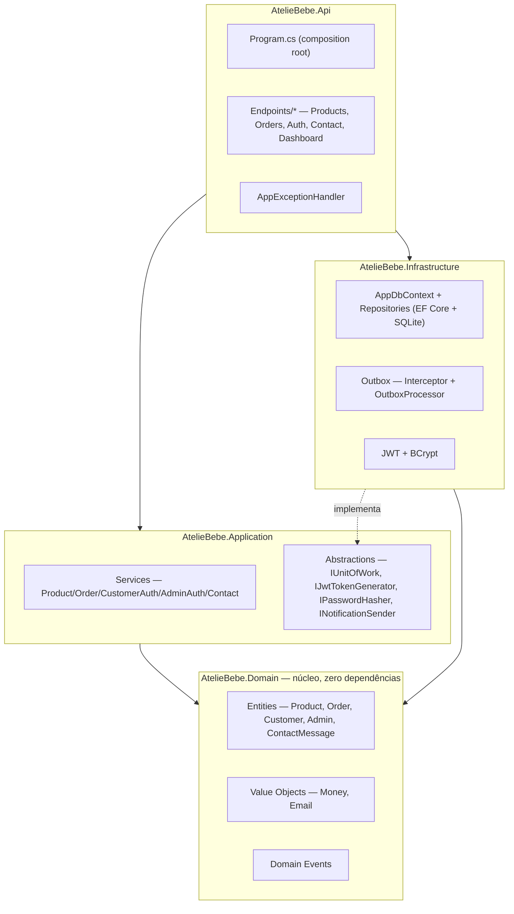
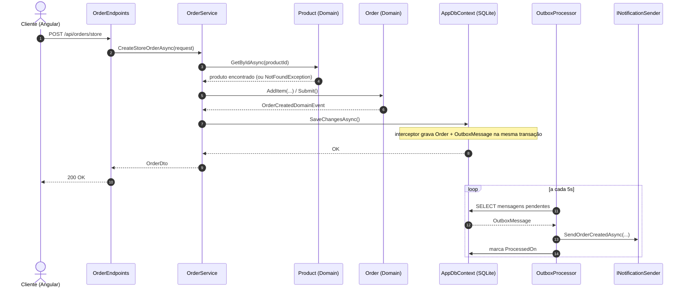
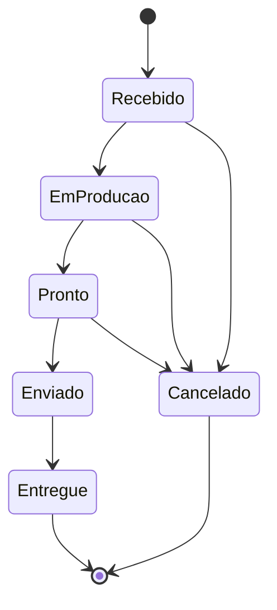
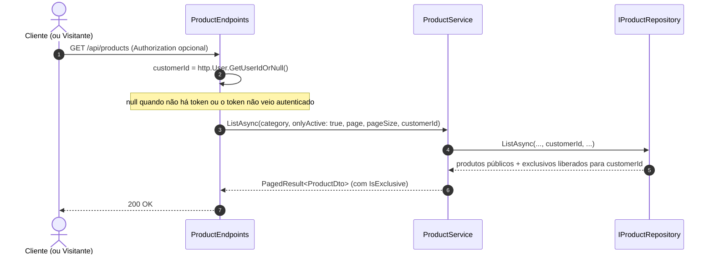
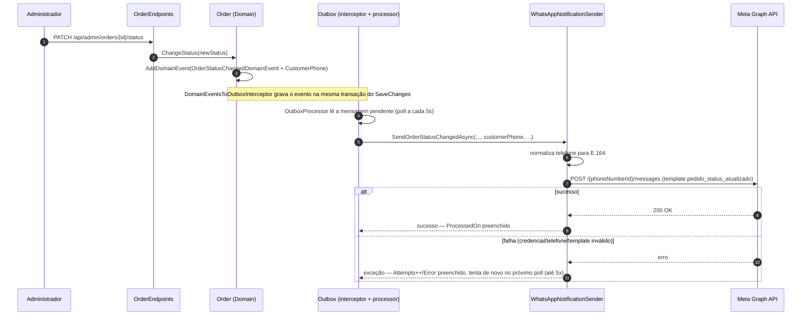

# Design Document — Ateliê Layette Baby

## Overview

O Ateliê Layette Baby é um monorepo com dois projetos independentes: uma API backend em **.NET 10** (Clean Architecture, ASP.NET Core Minimal APIs, EF Core + SQLite) e uma SPA frontend em **Angular 22** (standalone components, Bootstrap 5). Este documento descreve como os requisitos em `requirements.md` são satisfeitos pela arquitetura implementada.

## Architecture

### Camadas do backend

Clean Architecture em quatro projetos, dependências fluindo sempre para dentro (`Domain` não depende de nada):



### Fluxo ponta a ponta — criação de pedido de loja (Requisito 2)



### Máquina de estados do pedido (Requisito 8)



Implementada em `Order.ChangeStatus` (`server/src/AtelieBebe.Domain/Entities/Order.cs`) via um dicionário estático de transições permitidas — qualquer transição fora do mapa lança `DomainException`.

### Frontend

Angular standalone components, roteamento com lazy-loading (`loadComponent`), estado local via `signal`/`computed` (sem NgRx). Estrutura:

```
src/app/
├── core/            services (1 por feature do backend), models/DTOs, guards, interceptor HTTP
├── features/
│   ├── public/      home, shop, product-detail, cart, checkout, auth, my-account, contact, gallery, about
│   └── admin/       dashboard, products, orders, contact-messages, login
└── shared/          reservado para componentes reutilizáveis
```

`authInterceptor` decide qual token Bearer anexar (admin ou cliente) conforme a presença de `/admin/` na URL da requisição — mas só faz isso para requisições cuja URL começa com `environment.apiUrl`; qualquer outra chamada (ex.: `CepService` para a ViaCEP) passa direto, sem token (Requisito 2, item 13).

`CepService` (`core/services/cep.service.ts`) consulta `https://viacep.com.br/ws/{cep}/json/` (sem autenticação) e é usado pelo `Checkout` (Requisito 2): um `valueChanges` no campo de CEP, debounced e filtrado para 8 dígitos, dispara a busca e preenche rua/bairro/cidade/estado.

## Components and Interfaces

### Backend — serviços de aplicação

| Interface | Implementação | Requisitos atendidos |
|---|---|---|
| `IProductService` | `ProductService` | 1, 7 |
| `IOrderService` | `OrderService` | 2, 4, 8 |
| `ICustomerAuthService` | `CustomerAuthService` | 5 |
| `IAdminAuthService` | `AdminAuthService` | 6 |
| `IContactService` | `ContactService` | 9 |
| `IDashboardService` | `DashboardService` (Infrastructure/Persistence/Queries) | 10 |

### Backend — abstrações de infraestrutura

| Interface | Papel |
|---|---|
| `IUnitOfWork` | Agrega os repositórios (`Products`, `Orders`, `Customers`, `Admins`, `ContactMessages`) e `SaveChangesAsync` |
| `IPasswordHasher` | BCrypt hash/verify (Requisito 5, 6) |
| `IJwtTokenGenerator` | Emissão de token JWT com claims de papel `admin`/`customer` |
| `INotificationSender` | Ponto de extensão para envio real de notificações; hoje só `LoggingNotificationSender` |

### Endpoints REST (Minimal API)

| Método/Rota | Auth | Requisito |
|---|---|---|
| `GET /api/products`, `/featured`, `/categories`, `/{slug}` | Pública | 1 |
| `POST /api/orders/store` | Opcional (vincula se autenticado) | 2 |
| `POST /api/orders/custom` | Opcional | 3 (canal ainda implementado, não usado pela UI atual) |
| `GET /api/orders/{id}` | Pública | 4 |
| `GET /api/orders/mine` | `CustomerOnly` | 4 |
| `POST /api/auth/register`, `/login` | Pública | 5 |
| `POST /api/admin/auth/login` | Pública | 6 |
| `GET/POST/PUT/PATCH /api/admin/products/*` | `AdminOnly` | 7 |
| `GET/PATCH /api/admin/orders/*` | `AdminOnly` | 8 |
| `POST /api/contact` | Pública | 9 (canal reservado) |
| `GET /api/admin/contact-messages` | `AdminOnly` | 9 |
| `GET /api/admin/dashboard` | `AdminOnly` | 10 |

### Frontend — componentes por requisito

| Componente | Rota | Requisito |
|---|---|---|
| `Shop`, `Home`, `ProductDetail` | `/loja`, `/`, `/produto/:slug` | 1 |
| `CartPage`, `Checkout` | `/carrinho`, `/checkout` | 2 |
| `Contact` | `/contato` (e redirect de `/encomenda-personalizada`) | 3 |
| `OrderConfirmation`, `MyAccount` | `/pedido/:id`, `/minha-conta` | 4 |
| `LoginPage`, `RegisterPage` | `/entrar`, `/cadastro` | 5 |
| `AdminLogin` | `/admin/login` | 6 |
| `AdminProductList`, `AdminProductForm` | `/admin/produtos*` | 7 |
| `AdminOrderList`, `AdminOrderDetail` | `/admin/encomendas*` | 8 |
| `AdminContactMessages` | `/admin/mensagens` | 9 |
| `AdminDashboard` | `/admin/dashboard` | 10 |

## Requisito 13 — Paginação de listagens

### Backend

Um envelope genérico reutilizado pelas quatro listagens, em vez de quatro DTOs de paginação separados:

```csharp
// AtelieBebe.Application/Common/PagedResult.cs
public sealed record PagedResult<T>(IReadOnlyList<T> Items, int Page, int PageSize, int TotalItems)
{
    public int TotalPages => TotalItems == 0 ? 0 : (int)Math.Ceiling(TotalItems / (double)PageSize);
}
```

`Application/Common/Pagination.cs` centraliza a normalização (`page < 1 → 1`; `pageSize` fixado entre 1 e 100) — hoje usada de forma idêntica em quatro pontos, o suficiente para justificar extrair em vez de repetir o `Math.Clamp` quatro vezes.

Pontos alterados (assinatura ganha `page`/`pageSize`; retorno passa de `IReadOnlyList<T>`/`Task<...>` para `PagedResult<T>`):

| Camada | Membro | Endpoints afetados |
|---|---|---|
| `IProductRepository` | `ListAsync(category, onlyActive, page, pageSize, ct)` — usa `.Skip().Take()` + `.CountAsync()` no `IQueryable` do EF Core | `GET /api/products`, `GET /api/admin/products` |
| `IOrderRepository` | `ListAsync(status, page, pageSize, ct)` | `GET /api/admin/orders` |
| `IContactMessageRepository` | `ListAsync(page, pageSize, ct)` | `GET /api/admin/contact-messages` |
| `ProductService`, `OrderService`, `ContactService` | métodos `ListAsync` correspondentes passam a devolver `PagedResult<Dto>` | — |

`ListFeaturedAsync`, `ListCategoriesAsync`, `ListByCustomerAsync` (encomendas do cliente) **não** mudam — fora do escopo do Requisito 13.

Cada endpoint aplica seu próprio `pageSize` padrão antes de repassar ao serviço (loja pública: 12; as três listagens admin: 20), e ambos os parâmetros da query string são opcionais (`int page = 1, int pageSize = <default-do-endpoint>`).

### Frontend

- **Modelo** `client/src/app/core/models/pagination.model.ts`: `interface PagedResult<T> { items: T[]; page: number; pageSize: number; totalItems: number; totalPages: number; }`.
- **Componente reutilizável** `client/src/app/shared/components/pagination/` (dá finalmente um uso à pasta `shared/components`, hoje vazia): recebe `page`/`totalPages` de entrada, emite `pageChange`, desabilha "Anterior"/"Próxima" nos limites. Usado por `Shop`, `AdminProductList`, `AdminOrderList`, `AdminContactMessages`.
- **Serviços** (`ProductService.list/listAllForAdmin`, `OrderService.list` admin, `ContactService.list`) passam a aceitar `page`/`pageSize` e retornar `Observable<PagedResult<T>>`.
- **`Shop`** reflete a página atual na query string (`?pagina=N`), no mesmo padrão já usado para `?categoria=`, e volta para a página 1 ao trocar de categoria. As três listas do admin mantêm a página como estado local do componente (sem refletir na URL) — a navegação de volta/avançar do navegador é menos relevante ali do que na loja pública.

### Testing Strategy (adendo)

`PagedResult<T>.TotalPages` e a normalização de `page`/`pageSize` foram a primeira lógica não trivial da camada `Application` a ganhar testes — até então só `AtelieBebe.Domain.Tests` existia. `AtelieBebe.Application.Tests` (xUnit, referenciando `AtelieBebe.Application`) cobre: cálculo de `TotalPages` (incluindo total zero), `page` menor que 1, `pageSize` fora do intervalo `[1,100]`, e página solicitada além do fim retornando lista vazia com `totalItems`/`totalPages` corretos.

## Data Models

Entidades de domínio (`AtelieBebe.Domain/Entities`), todas herdando de `Entity` (Id + eventos de domínio) e implementando `IAggregateRoot` quando expostas por repositório próprio:

- **Product** — `Name, Slug, Description, Price (Money), Category, ImageUrl, Active, Featured`. Invariantes: nome/slug/categoria obrigatórios. Sem controle de estoque — todo produto é fabricado sob encomenda, então é sempre comprável em qualquer quantidade. Catálogo especializado (Requisito 1): `DbInitializer.SeedProductsAsync` remove qualquer produto cuja `Category` esteja fora do conjunto permitido ("Kit Ombro e Boca", "Fralda de Ombro", "Fralda de Boca") a cada inicialização, antes de semear os produtos que faltarem — não há relação de chave estrangeira entre `OrderItem.ProductId` e `Product`, então excluir um produto não afeta pedidos que já o referenciam.
- **Order** (raiz) + **OrderItem** (filho) — `CustomerId?, CustomerName, CustomerEmail (Email), Type (Loja|Personalizada), Status, Items[]`. `Total` é uma propriedade computada (soma dos subtotais dos itens), nunca persistida.
- **Customer** — `Name, Email (Email), PasswordHash, Phone?`.
- **Admin** — `Name, Email (Email), PasswordHash`. Única instância, semeada na inicialização.
- **ContactMessage** — `Name, Email (Email), Message`.

Value Objects:
- **Money** — `Amount (decimal), Currency`. Sempre arredondado a 2 casas (`AwayFromZero`); rejeita valores negativos; impede operações entre moedas diferentes.
- **Email** — normalizado (trim + minúsculas) e validado por regex na construção.

Eventos de domínio (todos `sealed record : DomainEventBase`, carregando `EventId`/`OccurredOn`): `OrderCreatedDomainEvent`, `OrderStatusChangedDomainEvent`, `CustomerRegisteredDomainEvent`, `ContactMessageReceivedDomainEvent`.

## Padrão Outbox (Requisito 11)

`DomainEventsToOutboxInterceptor` (interceptor de `SaveChanges` do EF Core) serializa cada evento de domínio pendente em uma linha `OutboxMessage` (`Type`, `Content` JSON, `OccurredOn`, `Attempts`, `ProcessedOn?`, `Error?`), gravada na mesma transação da mudança que a originou. `OutboxProcessor` (`BackgroundService`) faz *polling* a cada 5s, lotes de até 20, despachando por um `switch` sobre o tipo do evento para `INotificationSender`. Falha incrementa `Attempts` (máx. 5) e grava `Error`, sem interromper o lote.

## Error Handling

`AppExceptionHandler` (`IExceptionHandler` central) mapeia exceções para `ProblemDetails`:

| Exceção | HTTP |
|---|---|
| `NotFoundException` | 404 |
| `ConflictException` | 409 |
| `UnauthorizedAppException` | 401 |
| `DomainException` | 400 |
| Não tratada | 500 (mensagem genérica; detalhe completo só no log) |

## Testing Strategy

- **Backend — domínio** (`server/test/AtelieBebe.Domain.Tests`, xUnit): cobre as invariantes de domínio mais críticas — máquina de estados de `Order` (toda transição permitida e proibida), visibilidade/acesso exclusivo de `Product`, validação e igualdade de `Money`/`Email`, registro de `Customer`. 61 testes.
- **Backend — aplicação** (`server/test/AtelieBebe.Application.Tests`, xUnit): `PagedResult<T>.TotalPages` (incluindo total zero e página além do fim) e a normalização de `page`/`pageSize` em `Pagination.Normalize`. 20 testes.
- **Frontend** (`client/src/app/**/*.spec.ts`, Vitest): `CartService` (add/remover/limpar/totais/persistência, incluindo a chave de mesclagem por bordado), lógica de montagem da mensagem de WhatsApp em `Contact`, guards de rota (`adminGuard`, `customerGuard`), chamadas HTTP de `ProductService` via `HttpClientTestingController`. 26 testes.
- Não há testes de integração ponta a ponta automatizados; verificação de UI é feita manualmente via navegador (Playwright/CDP) a cada mudança de front-end relevante.

## Security

- Senhas: BCrypt (`BCryptPasswordHasher`), nunca texto plano (Requisito 5, 6, RNF02).
- Tokens: JWT HMAC-SHA256, claims `NameIdentifier/Name/Email/Role`, expiração configurável (`Jwt:ExpiryMinutes`, padrão 480 min). Segredo de assinatura fica em `dotnet user-secrets` local — **nunca** commitado (RNF08).
- Autorização: policies `AdminOnly`/`CustomerOnly` via `RequireAuthorization` nos grupos de endpoint.
- CORS: lista de origens permitidas configurável (`Cors:AllowedOrigins`), padrão `http://localhost:4200`.
- Enumeração de contas: mensagem de erro de login idêntica para e-mail inexistente e senha incorreta (Requisito 5, 6).
- `authInterceptor` só anexa o token Bearer a requisições para `environment.apiUrl` — nunca para domínios de terceiros como a ViaCEP (Requisito 2, item 13). Qualquer novo serviço que chame uma API externa herda essa proteção automaticamente, por ser aplicada no interceptor global.

## Requisito 14 e 15 — Produtos exclusivos por cliente e bordado

### Modelo de dados

`Product` (Domain) ganha uma coleção de acessos de cliente, controlada por comportamento (não uma lista pública mutável):

```csharp
private readonly List<ProductCustomerAccessEntry> _allowedCustomerAccess = new();
public IReadOnlyCollection<Guid> AllowedCustomerIds => _allowedCustomerAccess.Select(e => e.CustomerId).ToList().AsReadOnly();
public bool IsExclusive => _allowedCustomerAccess.Count > 0;

public void SetAllowedCustomers(IEnumerable<Guid> customerIds); // substitui o conjunto inteiro — usado pelo admin
public bool HasAccess(Guid? customerId) => !IsExclusive || (customerId is { } id && _allowedCustomerAccess.Any(e => e.CustomerId == id));
```

`ProductCustomerAccessEntry` é uma pequena entidade interna (`CustomerId` + FK sombra `ProductId`) que existe só para o EF Core mapear a coleção como uma tabela própria `ProductCustomerAccess (ProductId, CustomerId)` — mapeada em `ProductConfiguration`/`ProductCustomerAccessEntryConfiguration` como uma relação `HasMany().WithOne()` normal, e não como tipo owned: um tipo owned não pode ser consultado diretamente via `_dbContext.Set<T>()`, o que inviabilizaria o filtro `EXISTS` do repositório (abaixo). O Domain nunca referencia `ProductCustomerAccessEntry` diretamente — só `Guid`s via `AllowedCustomerIds`/`SetAllowedCustomers`/`HasAccess`. Sem relação com `OrderItem`/`Order`; a associação vale só para visibilidade no catálogo, não fica "congelada" no pedido depois de criado.

Toda leitura de `Product` que precise refletir `IsExclusive`/`AllowedCustomerIds` corretamente (`GetByIdAsync`, `GetBySlugAsync`, `ListAsync`, `ListFeaturedAsync`) faz `Include("_allowedCustomerAccess")` — sem isso a coleção fica vazia em memória e `IsExclusive` sempre lê `false`, mesmo com grants no banco.

`Order` não muda de modelo — o texto do bordado viaja em `OrderItem.OptionsJson` (campo já existente), como um JSON simples `{ "embroideryText": "ANA" }`.

### Backend — visibilidade (Requisito 14)

| Camada | Mudança |
|---|---|
| `IProductRepository.ListAsync`, `ListFeaturedAsync` | Ganham parâmetro `Guid? customerId`. Filtro SQL (`ApplyVisibility`): `!EXISTS(access WHERE ProductId = p.Id) OR (customerId != null AND EXISTS(access WHERE ProductId = p.Id AND CustomerId = @customerId))`. Em `ListAsync`, só aplicado quando `onlyActive: true` — a listagem admin (`onlyActive: false`) nunca filtra por visibilidade. `ListFeaturedAsync` também precisa do filtro: um produto exclusivo em destaque não pode vazar pelo card de "Destaques do ateliê" na home. |
| `IProductRepository.GetBySlugAsync` | Mesma regra — se o produto for exclusivo e o `customerId` não tiver acesso, o repositório retorna `null` (o serviço já trata `null` como 404 via `NotFoundException`, sem mudança na `Api`). |
| `IProductRepository.ListCategoriesAsync` | Ganha `Guid? customerId`, mesmo filtro, para a categoria de um produto exclusivo só aparecer no filtro de quem tem acesso. |
| `IProductRepository.SlugExistsAsync` (novo) | Checagem de unicidade de slug em `ProductService.CreateAsync`, sem o filtro de visibilidade — precisa detectar colisão mesmo com um produto exclusivo já usando o slug. |
| `ProductEndpoints.MapProductEndpoints` (`GET /api/products`, `/featured`, `/{slug}`, `/categories`) | Deixam de ser 100% anônimos: continuam **sem** `RequireAuthorization` (visitante sem token continua funcionando), mas passam a ler `http.User` via `ClaimsPrincipalExtensions.GetUserIdOrNull()` (extensão nova, usada também para simplificar `OrderEndpoints`) e repassam o `customerId` ao serviço. Token inválido/expirado não gera 401 aqui — sem `RequireAuthorization`, o middleware de autenticação simplesmente não popula `http.User` como autenticado, e o endpoint trata como anônimo. |
| `GET /api/admin/products` | Sem mudança de filtro — continua mostrando tudo, para todo administrador. |
| `ProductDto` (público) | Ganha `IsExclusive: bool` (sem listar os clientes — não é informação pública). |
| `AdminProductDto` (novo, usado só em `GET/PUT /api/admin/products/{id}...`) | `ProductDto` + `AllowedCustomerIds: Guid[]`. Produzido por `ProductService.GetForAdminAsync`/`SetAllowedCustomersAsync`; a listagem admin (`GET /api/admin/products`) continua usando `ProductDto` — não precisa da lista de clientes por item. |
| **Novo**: `GET /api/admin/customers` | `AdminOnly`. Lista clientes cadastrados (`Id, Name, Email`) via `ICustomerAdminService`, para popular o seletor no formulário de produto. Usa `ICustomerRepository.ListAsync` (novo método — o repositório só tinha `GetByEmailAsync`/`EmailExistsAsync`/`Add`). |
| **Novo**: `PUT /api/admin/products/{id}/customers` | `AdminOnly`. Corpo: `{ customerIds: Guid[] }`. Chama `Product.SetAllowedCustomers(...)` — substitui o conjunto inteiro (o formulário admin envia a seleção completa, não incrementalmente). |

### Backend — bordado (Requisito 15)

`OrderService.CreateStoreOrderAsync` tem uma lacuna a corrigir: hoje só repassa `itemRequest.OptionsJson` para itens **sem** `ProductId` (linha avulsa de encomenda personalizada); para itens de catálogo, `order.AddItem(...)` é chamado **sem** o quarto parâmetro. Passa a ser:

```csharp
order.AddItem(product.Id, product.Name, product.Price, itemRequest.Quantity, itemRequest.OptionsJson);
```

Sem validação extra no backend de que `OptionsJson` só venha preenchido para produtos exclusivos — é uma regra de UI (Requisito 15, item 2), não de integridade de dados; um `OptionsJson` presente em um produto público não quebra nada, só não é oferecido pela interface.

`AdminOrderDetail` (frontend) desserializa `OptionsJson` de cada item e, se tiver `embroideryText`, exibe "Bordado: {texto}" na linha do item.

### Frontend — visibilidade e formulário admin (Requisito 14)

- `Product` (model) ganha `isExclusive: boolean`; novo `AdminProduct extends Product` ganha `allowedCustomerIds: string[]` (retornado por `GET /api/admin/products/{id}`).
- Novo `CustomerAdminService.list()` → `GET /api/admin/customers`, com o model `CustomerSummary`. `AdminProductForm` ganha uma seção "Acesso exclusivo": lista de clientes com checkbox por cliente; ao salvar, chama `ProductService.setAllowedCustomers(id, customerIds)` → `PUT /api/admin/products/{id}/customers`. Produto novo (ainda sem ID) só ganha essa seção depois do primeiro salvamento.
- `Shop`/`Home`/`ProductDetail` não precisam de mudança de autenticação — o token já viaja via `authInterceptor` quando o cliente está logado; a API decide o que incluir.
- Produtos exclusivos exibidos para quem tem acesso ganham um badge visual "Exclusivo pra você" (`badge-soft`, mesmo padrão usado em outras páginas) — diferenciação de UX, não é um requisito de dado novo.

### Frontend — bordado em todos os produtos (Requisito 15)

> Escopo estendido a pedido do cliente: o bordado nasceu restrito a produtos exclusivos e agora vale para toda a loja (ver nota no Requisito 15 em `requirements.md`).

- `CartItem` (model) ganha `embroideryText?: string`.
- `CartService.add(product, quantity, embroideryText?)`: a chave de mesclagem passa de `product.id` para `(product.id, embroideryText ?? null)` — dois itens do mesmo produto com bordado diferente NÃO se somam; com o mesmo texto, somam a quantidade normalmente.
- Não existe mais botão de "adicionar rápido" em nenhuma grade de produto (`Shop`, `Home`) — todo card mostra um link "Personalizar" que leva para `ProductDetail`, único lugar onde o pedido pode ser montado, já que o bordado (obrigatório) precisa ser informado antes de ir ao carrinho.
- `ProductDetail` sempre mostra o campo "Texto para bordar" (obrigatório) e, ao lado, um teclado de alfabeto (A-Z, mais "espaço"/"limpar"/apagar-última-letra) que escreve no mesmo `embroideryText` signal — o cliente pode digitar direto no campo ou tocar nas letras, os dois métodos convergem para o mesmo texto (`appendLetter`/`appendSpace`/`removeLastLetter`/`clearEmbroideryText`, respeitando o `maxlength` de 30).
- `Checkout.submit()`: para cada item do carrinho, `optionsJson` passa de sempre `null` para `item.embroideryText ? JSON.stringify({ embroideryText: item.embroideryText }) : null`.
- `CartPage` exibe o texto do bordado abaixo do nome do produto em cada linha.

### Diagrama — resolução de visibilidade em `GET /api/products`



---

## Requisito 16 — Notificações por WhatsApp (proposto)

> Design ainda não implementado — depende do administrador criar a conta Meta WhatsApp Business Cloud API e obter as credenciais antes de o canal funcionar de fato.

### Por que Meta Cloud API (e a implicação de templates)

A API oficial só permite mensagem de **texto livre** dentro de uma janela de 24h após o cliente escrever para o número do ateliê ("customer service window"). Fora dessa janela — que é o caso de toda notificação automática que o sistema dispara (confirmação de pedido, mudança de status, boas-vindas, etc., iniciadas pela empresa) —, a mensagem PRECISA usar um *message template* pré-cadastrado e aprovado no Meta Business Manager. Isso não é uma escolha de implementação, é uma restrição da própria API: não existe forma de mandar texto livre automatizado fora da janela de 24h. Por isso o design já nasce em torno de templates, um por tipo de notificação.

### Novos templates a criar e aprovar no Meta Business Manager

| Nome do template | Evento | Variáveis (na ordem) |
|---|---|---|
| `pedido_recebido` | `OrderCreatedDomainEvent` | `{{1}}` nome do cliente, `{{2}}` código curto do pedido (8 primeiros caracteres do `OrderId`), `{{3}}` total em R$ |
| `pedido_status_atualizado` | `OrderStatusChangedDomainEvent` | `{{1}}` nome do cliente, `{{2}}` código curto do pedido, `{{3}}` novo status (rótulo em português, ex. "Em produção") |
| `boas_vindas_cliente` | `CustomerRegisteredDomainEvent` | `{{1}}` nome do cliente |
| `confirmacao_contato` | `ContactMessageReceivedDomainEvent` | `{{1}}` nome de quem enviou o contato |

Todos em português (`pt_BR`), categoria "Utility" (não "Marketing" — são transacionais, não promocionais, o que facilita a aprovação e evita a limitação de custo/opt-in de templates de marketing). O texto exato de cada template é definido no Meta Business Manager pelo administrador (fora do código); o backend só manda o nome do template e os valores das variáveis.

### Modelo de dados — telefone passa a ser obrigatório

- `Customer.Phone` e `Order.CustomerPhone` continuam `string?` no C#/banco (sem migration — não vale arriscar quebrar linhas existentes nulas com uma constraint `NOT NULL` retroativa). O que muda é a validação: `Customer.Register` e `Order.Create` passam a lançar `DomainException` quando o telefone vier nulo/vazio, no mesmo padrão que já existe para `Name`.
- `ContactMessage` (Domain) ganha uma propriedade nova `Phone` (obrigatória, mesma validação). Hoje a entidade só tem `Name`/`Email`/`Message` — precisa de migration (`AddPhoneToContactMessages`).
- Os quatro domain events que hoje só carregam e-mail ganham o telefone: `OrderCreatedDomainEvent`, `OrderStatusChangedDomainEvent`, `CustomerRegisteredDomainEvent`, `ContactMessageReceivedDomainEvent` — todos ganham um campo `Phone`/`CustomerPhone` no record.

> Nota de rastreamento com o Requisito 14: `/contato` no frontend hoje NÃO chama `POST /api/contact` — monta um link `wa.me/...` client-side (ver CLAUDE.md). O acceptance criteria 4 deste requisito (confirmação de contato) cobre o endpoint de backend, que "existe e funciona" mas não é exercitado pela página atual; a mudança fica pronta para quando/se a página voltar a usar esse fluxo.

### Backend — canal de envio

| Camada | Mudança |
|---|---|
| `INotificationSender` (Application/Abstractions) | Cada método ganha o telefone do destinatário como parâmetro (`SendOrderCreatedAsync`, `SendOrderStatusChangedAsync`, `SendWelcomeMessageAsync` — renomeado de `SendWelcomeEmailAsync` —, `SendContactAcknowledgementAsync`). |
| **Novo**: `WhatsAppOptions` (Infrastructure/Notifications) | `AccessToken`, `PhoneNumberId`, `ApiVersion` (default `v21.0`) — bound via `IOptions<WhatsAppOptions>`, seção `WhatsApp` do `appsettings.json`/user-secrets, mesmo padrão de `JwtOptions`. `AccessToken` fica em branco no `appsettings.json` versionado, como `Jwt:Secret`. |
| **Novo**: `WhatsAppNotificationSender : INotificationSender` (Infrastructure/Notifications) | `HttpClient` tipado (`AddHttpClient<INotificationSender, WhatsAppNotificationSender>()`) que faz `POST https://graph.facebook.com/{ApiVersion}/{PhoneNumberId}/messages` com `Authorization: Bearer {AccessToken}` e corpo `{ messaging_product: "whatsapp", to: <telefone E.164>, type: "template", template: { name, language: { code: "pt_BR" }, components: [{ type: "body", parameters: [...] }] } }`. Se `AccessToken`/`PhoneNumberId` estiverem vazios, lança uma exceção clara ("WhatsApp não configurado") — cai no fluxo de retry/erro do outbox já existente, sem derrubar a aplicação. Substitui `LoggingNotificationSender` no `AddInfrastructure`. |
| **Novo**: normalização de telefone (`WhatsAppPhoneFormatter`, Infrastructure/Notifications) | Remove tudo que não é dígito; se não começar com `55` (código do Brasil) e tiver 10-11 dígitos (DDD + número), prefixa `55`. É uma heurística best-effort para o formato E.164 que a Cloud API exige — não valida DDD nem o dígito 9 extra dos celulares. |
| `OutboxProcessor.DispatchAsync` | Passa a repassar o telefone de cada evento para o `INotificationSender` correspondente. |
| `Order.Submit()` / `Order.ChangeStatus()` | `AddDomainEvent(new OrderCreatedDomainEvent(Id, CustomerName, CustomerEmail.Value, CustomerPhone!, Total.Amount))` e o equivalente em `OrderStatusChangedDomainEvent` — `CustomerPhone` deixa de ser opcional na prática (validado obrigatório em `Order.Create`). |
| `Customer.Register` | Valida `phone` obrigatório (`DomainException` se vazio) e repassa no `CustomerRegisteredDomainEvent`. |
| `ContactMessage.Create` | Ganha parâmetro `phone` obrigatório; `ContactMessageReceivedDomainEvent` ganha o campo. |
| `RegisterCustomerRequest`, `CreateStoreOrderRequest`, `CreateCustomOrderRequest`, `SubmitContactRequest` | `Phone`/`CustomerPhone` deixam de ser opcionais na validação de negócio (o tipo no DTO pode continuar `string?` — a rejeição acontece no Domain, igual a `Name` hoje; sem duplicar validação na camada de aplicação). |

### Frontend — telefone obrigatório

- `register-page.html`/`.ts`: campo "Telefone (opcional)" vira "Telefone / WhatsApp", com `Validators.required` e mensagem de erro, igual ao padrão de `name`/`email`.
- `checkout.html`/`.ts`: campo "Telefone / WhatsApp" (já existia, sem validação) ganha `Validators.required` + `invalid-feedback`.
- `contact.ts`/`.html` (`/contato`): já tem campo de telefone para montar o link `wa.me`; nenhuma mudança de contrato aqui, pois a página não chama `ContactService.submit` (ver nota de rastreamento acima). Caso o backend de contato volte a ser usado, o campo de telefone já existe na UI.

### Diagrama — envio de notificação de mudança de status



## Requisito 17 — CPF no cadastro de cliente

### Modelo de dados

- **Novo value object** `Cpf` (Domain/ValueObjects, mesmo padrão de `Email`): `Cpf.Create(string)` remove tudo que não é dígito, rejeita comprimento ≠ 11, sequências de dígito repetido (`00000000000`, `11111111111`, etc.) e valida os dois dígitos verificadores pelo algoritmo padrão (módulo 11, pesos 10..2 e 11..2) — lança `DomainException` com a mesma mensagem em português usada pelos outros value objects em caso de valor inválido.
- `Customer.Cpf` é `Cpf?` (nullable) no C#/banco — **não retroativo**: contas existentes antes deste requisito ficam com `Cpf = null` depois da migration, sem quebrar ao carregar (o conversor do EF só chama `Cpf.Create` quando o valor do banco não é nulo). `Customer.Register(name, email, cpf, passwordHash, phone)` exige um `Cpf` não nulo — todo cadastro novo passa a ter CPF.
- Migration `AddCustomerCpf`: coluna `Customers.Cpf` (`TEXT`, `NULL`, tamanho 11) + índice único `IX_Customers_Cpf` — SQLite trata múltiplos `NULL` como distintos num índice único, então contas antigas sem CPF não conflitam entre si nem bloqueiam a unicidade das novas.
- `ICustomerRepository.CpfExistsAsync(string, ct)` (mesmo padrão de `EmailExistsAsync`) — `CustomerAuthService.RegisterAsync` valida unicidade antes de criar a conta, lançando `ConflictException("Já existe uma conta com este CPF.")`.

### Backend — mudanças por camada

| Camada | Mudança |
|---|---|
| `RegisterCustomerRequest` (Application/Auth) | Ganha campo `Cpf` (string, obrigatório — diferente de `Phone`, que continua `string?`). |
| `CustomerAuthService.RegisterAsync` | `Cpf.Create(request.Cpf)` (valida formato/checksum) → `CpfExistsAsync` (valida unicidade) → passa o `Cpf` para `Customer.Register`. Erros de formato viram HTTP 400 (`DomainException`), duplicidade vira HTTP 409 (`ConflictException`), no mesmo padrão já usado para e-mail. |

### Frontend — formulário de cadastro

- `register-page.ts`: novo `FormControl` `cpf` (`Validators.required` + `Validators.pattern` aceitando `000.000.000-00` ou só dígitos) enviado como `cpf` em `RegisterCustomerRequest`. Sem máscara de input (nenhuma lib de máscara no projeto) — o usuário digita livremente, com ou sem pontuação, e o backend normaliza.
- `register-page.html`: campo "CPF" adicionado entre "E-mail" e "Telefone / WhatsApp", mesmo padrão visual (`is-invalid`/`invalid-feedback`) dos demais campos.
- A validação de formato/checksum completa (dígitos verificadores) só existe no backend — o front-end faz uma checagem leve de formato e repassa a mensagem de erro do backend (`err.error.detail`) se o CPF for rejeitado, mesmo padrão já usado para os outros erros de cadastro.
- Novo `PhoneMaskDirective` (`shared/directives/phone-mask.directive.ts`, `[appPhoneMask]`) formata qualquer campo de telefone/WhatsApp como `(11) 91234-5678` conforme o usuário digita (usa `NgControl` para escrever o valor formatado de volta no `FormControl`). Aplicado em `register-page`, `checkout` e `contact` — os três lugares que coletam telefone.

## Requisito 18 — Listagem de clientes no admin

- Reaproveita a infraestrutura já existente para o seletor de clientes exclusivos (Requisito 14): `ICustomerAdminService.ListAsync()` → `GET /api/admin/customers` → `CustomerSummary[]` no frontend (`core/services/customer-admin.service.ts`). Não pagina — o mesmo motivo que já valia para o seletor (precisa da lista completa) vale aqui.
- `CustomerSummaryDto`/`CustomerSummary` (Application + frontend) ganham `Phone`, `Cpf`, `CreatedAt` — campos aditivos, não quebram o consumidor existente (o seletor de produtos só lê `id`/`name`/`email`).
- Nova tela `features/admin/customers/admin-customer-list` (`/admin/clientes`), com link no menu lateral do admin entre "Encomendas" e "Mensagens". Tabela simples (sem paginação, sem filtro) — mostra `—` quando `phone`/`cpf` vêm `null` (contas anteriores ao Requisito 17).

## Requisito 19 — CPF obrigatório no checkout

### Modelo de dados

- `Order.CustomerCpf` é `Cpf?` (nullable no C#/banco), mesmo padrão do Requisito 17 para `Customer.Cpf` — **não retroativo**: pedidos existentes antes deste requisito ficam com `CustomerCpf = null` depois da migration `AddOrderCpf` (coluna `Orders.CustomerCpf`, `TEXT`, `NULL`, tamanho 11, sem índice — CPF de pedido não precisa ser único, diferente do CPF de conta). `Order.Create(...)` exige um `Cpf` não nulo (lança `DomainException` caso contrário) — todo pedido novo passa a ter CPF, no mesmo padrão já usado para `customerPhone` obrigatório.
- `CreateStoreOrderRequest`/`CreateCustomOrderRequest` (Application/Orders) ganham `CustomerCpf` (string, obrigatório); `OrderService` chama `Cpf.Create(request.CustomerCpf)` antes de `Order.Create` — erro de formato vira HTTP 400 (`DomainException`), mesmo padrão do Requisito 17. `OrderDto.CustomerCpf` é `string?` (reflete pedidos antigos sem CPF).

### Frontend — formulário de checkout

- `checkout.ts`: novo `FormControl` `customerCpf` (`Validators.required` + `Validators.pattern`, mesma regra do cadastro) enviado em `CreateStoreOrderRequest`.
- `checkout.html`: campo "CPF" adicionado ao lado de "Telefone / WhatsApp" em "Seus dados", mesmo padrão visual (`is-invalid`/`invalid-feedback`, placeholder `000.000.000-00`) do campo equivalente em `register-page`.
- A encomenda personalizada (`CreateCustomOrderRequest`/`createCustomOrder`) não tem UI própria hoje (ver nota de rastreamento do Requisito 15 sobre `/contato`), então o campo CPF nesse DTO existe só no contrato do backend, sem tela associada.

## Requisito 20 — Login ou cadastro obrigatório para finalizar a compra

### Fluxo

- `app.routes.ts`: a rota `checkout` ganha `canActivate: [customerGuard]` (mesmo guard já usado em `minha-conta`).
- `customer.guard.ts`: passa a ler `state.url` e, ao redirecionar um visitante não autenticado, inclui `queryParams: { returnUrl: state.url }` na `UrlTree` para `/entrar` — antes redirecionava sem preservar o destino.
- `login-page.ts`/`register-page.ts`: novo signal `returnUrl` (lido de `route.snapshot.queryParamMap`, default `/minha-conta`); ao autenticar com sucesso, `router.navigateByUrl(this.returnUrl())` no lugar do `router.navigate(['/minha-conta'])` fixo anterior.
- `login-page.html`/`register-page.html`: o link cruzado para a outra tela (`Cadastre-se`/`Entrar`) propaga `[queryParams]="{ returnUrl: returnUrl() }"`, para não perder o destino ao trocar de tela; quando `returnUrl() === '/checkout'`, um alerta contextual explica que a autenticação é para finalizar o pedido.
- O carrinho (`CartService`, `localStorage`) não depende de autenticação e não é afetado pelo desvio para login/cadastro — o cliente volta ao checkout com os mesmos itens.
- Checkout deixa de ser acessível como convidado; o preenchimento manual de nome/e-mail/telefone/CPF no formulário de checkout continua existindo (não são lidos automaticamente da conta), só que agora sempre atrás de uma sessão autenticada.

## Requisito 21 — Pré-preenchimento de dados no checkout

- Novo endpoint `GET /api/auth/me` (`CustomerOnly`), implementado em `CustomerAuthService.GetProfileAsync` — busca o `Customer` pelo id do JWT (`ICustomerRepository.GetByIdAsync`, já existente) e retorna `CustomerProfileDto(Id, Name, Email, Phone, Cpf)`. Reaproveita o mesmo padrão de extração de id (`http.User.GetUserId()`) já usado em `GET /api/orders/mine`.
- `AuthService.getProfile()` (frontend) chama esse endpoint; `checkout.ts` (`ngOnInit`) o invoca para um cliente autenticado e preenche nome/e-mail/telefone/CPF — substituindo o preenchimento anterior (que só usava `name`/`email` do JWT decodificado em `AuthUser`, sem telefone/CPF).
- Endereço de entrega não tem um "endereço salvo" próprio no `Customer` — em vez de criar esse conceito, `checkout.ts` reaproveita `OrderService.listMine()` (já usado em `my-account`), que devolve os pedidos do cliente ordenados do mais recente para o mais antigo; o primeiro pedido com `shippingAddressJson` não nulo tem seu endereço parseado (`JSON.parse` para o tipo `ShippingAddress` já existente) e usado para `patchValue` de CEP/rua/número/complemento/bairro/cidade/estado. Como `patchValue` do CEP dispara o pipeline de busca do ViaCEP já existente (Requisito de checkout original), o endereço é revalidado/atualizado contra o CEP assim que preenchido — mesmo resultado, sem necessidade de tratamento especial.
- Todos os campos continuam sendo `FormControl`s normais — o pré-preenchimento não os torna somente-leitura, então o cliente pode corrigir qualquer valor antes de confirmar.

## Requisito 22 — Cálculo de frete no checkout

### Modelo de dados

- `Order.ShippingCost` (`Money`, nunca nulo, default `Money.Zero()`) — coluna `Orders.ShippingCostAmount` (`decimal(18,2)`, `DEFAULT 0` via `HasDefaultValueSql("0")`, para não quebrar pedidos existentes na migration `AddOrderShippingCost`), mesmo padrão de conversão `HasConversion` já usado em `OrderItem.UnitPrice`.
- `Order.Total` deixa de ser só a soma dos itens: `ItemsTotal` (nova propriedade computada, soma dos subtotais dos itens — o que `Total` calculava antes) `+ ShippingCost`. `Order.Create(...)` ganha um parâmetro opcional `Money? shippingCost = null` (default zero) — encomendas personalizadas e qualquer outro chamador que não passe frete continuam com `ShippingCost = 0`, sem mudança de comportamento.
- `CreateStoreOrderRequest` ganha `ShippingCost` (decimal, obrigatório) — calculado e enviado pelo frontend, no mesmo padrão de confiança já usado para `EstimatedPrice` na encomenda personalizada (não há gateway de pagamento validando o valor; é uma estimativa exibida ao cliente, não uma cobrança real). `OrderDto` ganha `ItemsTotal` e `ShippingCost` (além do `Total` já existente), para as telas mostrarem o detalhamento subtotal/frete/total.

### Frontend — cálculo da estimativa

- Novo `ShippingService` (`core/services/shipping.service.ts`), **sem chamada HTTP** — é só uma função pura `estimate(state: string, totalItems: number): number`. Não usa a API oficial dos Correios porque essa API (pós-2020) exige contrato/credenciais (usuário SIGEP ou cartão de postagem) que o ateliê não possui, e o cálculo oficial também precisaria de peso/dimensão por produto, que não existe no catálogo hoje.
- Tabela de tarifa-base por UF, agrupada por distância aproximada da origem (São Bernardo do Campo/SP): SP = R$12,90; Sul/Sudeste (PR, SC, RS, RJ, MG, ES) = R$18,90; Centro-Oeste/Nordeste = R$24,90; Norte = R$32,90 (UF desconhecida cai no valor do Centro-Oeste/Nordeste como default). Acréscimo de R$2,50 por item além do primeiro (`totalItems - 1`), somado à tarifa-base; o resultado (`estimatedRate`) recebe uma margem de 50% (`MARKUP_MULTIPLIER = 1.5`) antes de virar o valor final exibido/enviado — cobre embalagem e postagem, já que a tarifa-base sozinha reflete só uma aproximação do custo do Correios.
- `checkout.ts`: novo signal `destinationState` (atualizado via `form.controls.state.valueChanges`, tanto de digitação manual quanto do preenchimento automático por CEP/histórico) e `shippingCost = computed(() => shippingService.estimate(destinationState(), cart.totalItems()))` — recalcula automaticamente sempre que o estado ou a quantidade de itens do carrinho mudam. Enviado como `shippingCost` em `createStoreOrder(...)`.
- `checkout.html`: resumo do pedido passa a mostrar "Subtotal", "Frete estimado" e "Total" (subtotal + frete) separados, em vez de só um total.
- `order-confirmation.html` e `admin-order-detail.html`: mostram a mesma quebra (Subtotal/Frete/Total) quando `o.shippingCost` é maior que zero — pedidos antigos (frete zero) continuam mostrando só o total, sem uma linha de "Frete: R$ 0,00" sem sentido.

## Requisito 23 — CPF mascarado nas telas administrativas

- Novo `CpfMaskPipe` (`shared/pipes/cpf-mask.pipe.ts`, standalone), mesmo padrão de pasta de `shared/directives/`. `transform(cpf)`: remove tudo que não é dígito, valida que sobraram 11 dígitos (senão devolve o valor original sem tentar mascarar — protege contra dado malformado) e devolve `***.<dígitos 3-5>.<dígitos 6-8>-**`; `null`/`undefined`/string vazia viram `—`.
- Aplicado via `| cpfMask` em dois lugares — `admin-customer-list.html` (coluna CPF da tabela) e `admin-order-detail.html` (card "Cliente") — ambos os únicos pontos do frontend que hoje exibem CPF fora de um campo de formulário (formulários de cadastro/checkout continuam mostrando o valor real digitado pelo próprio usuário, sem máscara — não faz sentido mascarar o que a pessoa acabou de digitar).
- Só a exibição é mascarada — os endpoints (`GET /api/admin/customers`, `GET /api/admin/orders`) continuam retornando o CPF completo (sem máscara) na resposta JSON; a máscara é uma decisão de UI, não uma restrição de API. Reduz exposição na tela/print/compartilhamento de tela, mas não impede alguém com acesso ao painel de inspecionar a resposta de rede.
- `CpfMaskPipe` tem cobertura de teste unitário dedicada (`cpf-mask.pipe.spec.ts`) por lidar com dado pessoal sensível — casos: CPF cru (11 dígitos), CPF formatado, `null`/`undefined`/vazio, e valor inválido (não mascara).

## Requisitos 24-26 — Upload de imagens pelo admin (site, produto, galeria)

Os três requisitos compartilham a mesma infraestrutura de upload; documentados juntos.

### Armazenamento de arquivos

- Novo `IFileStorageService` (Application/Abstractions) — `SaveAsync(folder, fileName, stream)` devolve a URL pública; `DeleteAsync(url)` apaga o arquivo (best-effort, usado pela galeria ao remover uma foto). Implementação `LocalFileStorageService` (Infrastructure/Storage) salva em `Uploads:Path` (config; default `<content-root>/uploads` — em produção, deve apontar para uma pasta **fora** do diretório de publicação, ex. `/var/www/atelie-bebe/uploads` via `Uploads__Path` no `api.env`, porque `dotnet publish -o .../publish` substitui esse diretório inteiro a cada deploy).
- `Program.cs` monta `app.UseStaticFiles(...)` servindo essa pasta sob `Uploads:PublicPath` (default `/api/uploads`) — de propósito um prefixo `/api/...`, para reaproveitar a regra de proxy `/api/*` que o Nginx já tem em produção, sem precisar editar a config do Nginx.
- `ImageUploadValidator` (Api/Common) centraliza a validação (extensão em `.jpg/.jpeg/.png/.webp`, tamanho até 8MB) reaproveitada pelos três endpoints de upload abaixo.
- Frontend: como a API devolve URLs raiz-relativas (corretas em produção, mesma origem via Nginx), `resolveAssetUrl()` (`core/utils/asset-url.ts`) resolve essas URLs contra a origem real da API — necessário só em dev local, onde `ng serve` (porta 4200) e `dotnet run` (porta 5120) são origens diferentes; em produção é um no-op. Um `AssetUrlPipe` (`shared/pipes/asset-url.pipe.ts`) expõe a mesma função como `| assetUrl` para uso direto em template (cards de produto em loop, onde não dá para pré-processar em TS).

### Requisito 24 — Imagens do site (home-hero, about)

- `SiteImage` (Domain): `Key` (único) + `Url` + `UpdatedAt`; upsert por chave (`SiteImageService.SetImageAsync`). `GET /api/site-images` (público, lista todas) e `POST /api/admin/site-images/{key}` (multipart, admin-only, chave restrita a `home-hero`/`about` via `AllowedKeys` em `SiteImageEndpoints`).
- `home.ts`/`about.ts`: buscam a lista no `ngOnInit`, e se existir uma entrada para a chave do slot, substituem o `signal` que por padrão aponta para o asset estático atual (`/images/hero-fraldas.jpg`, `/images/sobre-fraldas.png`) — não há necessidade de seed no banco, o fallback já cobre a instalação nova.
- Tela admin `/admin/imagens` (`admin-site-images.ts`/`.html`): dois slots fixos (definidos em `SLOTS`, espelhando `AllowedKeys` do backend), cada um com prévia + botão de upload.

### Requisito 25 — Upload de foto do produto

- Não precisou de entidade nova — `Product.ImageUrl` já existe. Novo endpoint `POST /api/admin/products/uploads` (multipart) salva em `products/` e devolve só `{ url }`; o formulário (`admin-product-form.ts`) usa essa URL para dar `patchValue({ imageUrl: url })` no `FormControl` existente — o fluxo de salvar o produto (criar/editar) não muda.
- Campo "URL da imagem" continua um `<input type="text">` normal, editável — o botão de upload é um atalho ao lado, não substitui a digitação manual da URL.

### Requisito 26 — Galeria gerenciável

- `GalleryImage` (Domain): `Url` + `CreatedAt`, sem "slot" fixo — é uma coleção de tamanho variável (`GalleryImageService.AddAsync`/`DeleteAsync`, `IGalleryImageRepository.ListAsync` ordenado por `CreatedAt` desc). `DeleteAsync` remove a linha do banco E chama `IFileStorageService.DeleteAsync` para apagar o arquivo físico, evitando acúmulo de arquivos órfãos.
- `GET /api/gallery-images` (público) / `POST /api/admin/gallery-images` (multipart, cria) / `DELETE /api/admin/gallery-images/{id}` (admin-only).
- `gallery.ts` (público): busca a lista no `ngOnInit`; se vier vazia, mantém o array de 12 fotos placeholder (`picsum.photos`) que já existia — evita a página ficar vazia numa instalação nova, antes do primeiro upload. A navegação do lightbox (Requisito de galeria já existente) não muda, só a fonte dos dados.
- Tela admin `/admin/galeria` (`admin-gallery.ts`/`.html`): grade de fotos com botão de exclusão em cada uma + botão "Adicionar foto" no topo.
