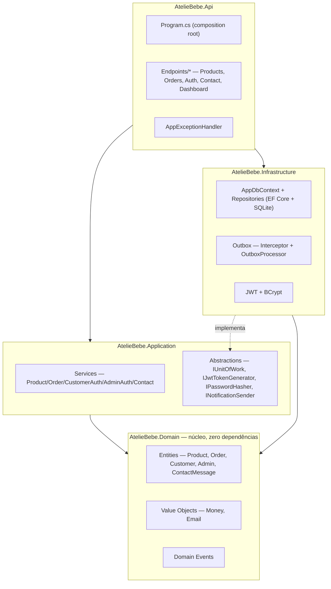
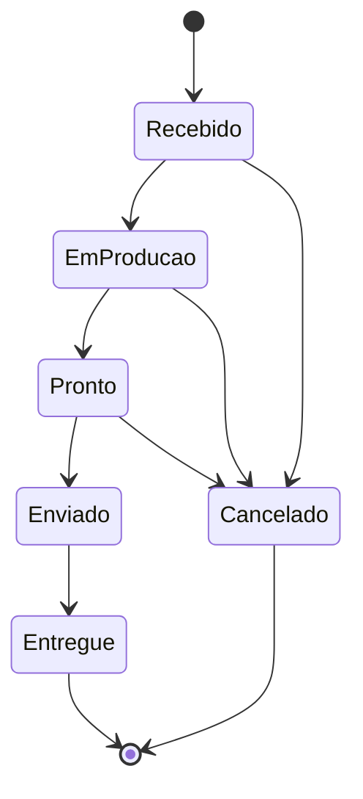

# Design Document — Ateliê Bebê

## Overview

O Ateliê Bebê é um monorepo com dois projetos independentes: uma API backend em **.NET 10** (Clean Architecture, ASP.NET Core Minimal APIs, EF Core + SQLite) e uma SPA frontend em **Angular 22** (standalone components, Bootstrap 5). Este documento descreve como os requisitos em `requirements.md` são satisfeitos pela arquitetura implementada.

## Architecture

### Camadas do backend

Clean Architecture em quatro projetos, dependências fluindo sempre para dentro (`Domain` não depende de nada):



### Fluxo ponta a ponta — criação de pedido de loja (Requisito 2)


### Máquina de estados do pedido (Requisito 8)



Implementada em `Order.ChangeStatus` (`server/src/AtelieBebe.Domain/Entities/Order.cs`) via um dicionário estático de transições permitidas — qualquer transição fora do mapa lança `DomainException`.

### Frontend

Angular standalone components, roteamento com lazy-loading (`loadComponent`), estado local via `signal`/`computed` (sem NgRx). Estrutura:

```
src/app/
├── core/            services (1 por feature do backend), models/DTOs, guards, interceptor HTTP
├── features/
│   ├── public/      home, shop, product-detail, cart, checkout, auth, my-account, contact, gallery, about
│   └── admin/       dashboard, products, orders, contact-messages, login
└── shared/          reservado para componentes reutilizáveis
```

`authInterceptor` decide qual token Bearer anexar (admin ou cliente) conforme a presença de `/admin/` na URL da requisição — mas só faz isso para requisições cuja URL começa com `environment.apiUrl`; qualquer outra chamada (ex.: `CepService` para a ViaCEP) passa direto, sem token (Requisito 2, item 13).

`CepService` (`core/services/cep.service.ts`) consulta `https://viacep.com.br/ws/{cep}/json/` (sem autenticação) e é usado pelo `Checkout` (Requisito 2): um `valueChanges` no campo de CEP, debounced e filtrado para 8 dígitos, dispara a busca e preenche rua/bairro/cidade/estado.

## Components and Interfaces

### Backend — serviços de aplicação

| Interface | Implementação | Requisitos atendidos |
|---|---|---|
| `IProductService` | `ProductService` | 1, 7 |
| `IOrderService` | `OrderService` | 2, 4, 8 |
| `ICustomerAuthService` | `CustomerAuthService` | 5 |
| `IAdminAuthService` | `AdminAuthService` | 6 |
| `IContactService` | `ContactService` | 9 |
| `IDashboardService` | `DashboardService` (Infrastructure/Persistence/Queries) | 10 |

### Backend — abstrações de infraestrutura

| Interface | Papel |
|---|---|
| `IUnitOfWork` | Agrega os repositórios (`Products`, `Orders`, `Customers`, `Admins`, `ContactMessages`) e `SaveChangesAsync` |
| `IPasswordHasher` | BCrypt hash/verify (Requisito 5, 6) |
| `IJwtTokenGenerator` | Emissão de token JWT com claims de papel `admin`/`customer` |
| `INotificationSender` | Ponto de extensão para envio real de notificações; hoje só `LoggingNotificationSender` |

### Endpoints REST (Minimal API)

| Método/Rota | Auth | Requisito |
|---|---|---|
| `GET /api/products`, `/featured`, `/categories`, `/{slug}` | Pública | 1 |
| `POST /api/orders/store` | Opcional (vincula se autenticado) | 2 |
| `POST /api/orders/custom` | Opcional | 3 (canal ainda implementado, não usado pela UI atual) |
| `GET /api/orders/{id}` | Pública | 4 |
| `GET /api/orders/mine` | `CustomerOnly` | 4 |
| `POST /api/auth/register`, `/login` | Pública | 5 |
| `POST /api/admin/auth/login` | Pública | 6 |
| `GET/POST/PUT/PATCH /api/admin/products/*` | `AdminOnly` | 7 |
| `GET/PATCH /api/admin/orders/*` | `AdminOnly` | 8 |
| `POST /api/contact` | Pública | 9 (canal reservado) |
| `GET /api/admin/contact-messages` | `AdminOnly` | 9 |
| `GET /api/admin/dashboard` | `AdminOnly` | 10 |

### Frontend — componentes por requisito

| Componente | Rota | Requisito |
|---|---|---|
| `Shop`, `Home`, `ProductDetail` | `/loja`, `/`, `/produto/:slug` | 1 |
| `CartPage`, `Checkout` | `/carrinho`, `/checkout` | 2 |
| `Contact` | `/contato` (e redirect de `/encomenda-personalizada`) | 3 |
| `OrderConfirmation`, `MyAccount` | `/pedido/:id`, `/minha-conta` | 4 |
| `LoginPage`, `RegisterPage` | `/entrar`, `/cadastro` | 5 |
| `AdminLogin` | `/admin/login` | 6 |
| `AdminProductList`, `AdminProductForm` | `/admin/produtos*` | 7 |
| `AdminOrderList`, `AdminOrderDetail` | `/admin/encomendas*` | 8 |
| `AdminContactMessages` | `/admin/mensagens` | 9 |
| `AdminDashboard` | `/admin/dashboard` | 10 |

## Requisito 13 — Paginação de listagens

### Backend

Um envelope genérico reutilizado pelas quatro listagens, em vez de quatro DTOs de paginação separados:

```csharp
// AtelieBebe.Application/Common/PagedResult.cs
public sealed record PagedResult<T>(IReadOnlyList<T> Items, int Page, int PageSize, int TotalItems)
{
    public int TotalPages => TotalItems == 0 ? 0 : (int)Math.Ceiling(TotalItems / (double)PageSize);
}
```

`Application/Common/Pagination.cs` centraliza a normalização (`page < 1 → 1`; `pageSize` fixado entre 1 e 100) — hoje usada de forma idêntica em quatro pontos, o suficiente para justificar extrair em vez de repetir o `Math.Clamp` quatro vezes.

Pontos alterados (assinatura ganha `page`/`pageSize`; retorno passa de `IReadOnlyList<T>`/`Task<...>` para `PagedResult<T>`):

| Camada | Membro | Endpoints afetados |
|---|---|---|
| `IProductRepository` | `ListAsync(category, onlyActive, page, pageSize, ct)` — usa `.Skip().Take()` + `.CountAsync()` no `IQueryable` do EF Core | `GET /api/products`, `GET /api/admin/products` |
| `IOrderRepository` | `ListAsync(status, page, pageSize, ct)` | `GET /api/admin/orders` |
| `IContactMessageRepository` | `ListAsync(page, pageSize, ct)` | `GET /api/admin/contact-messages` |
| `ProductService`, `OrderService`, `ContactService` | métodos `ListAsync` correspondentes passam a devolver `PagedResult<Dto>` | — |

`ListFeaturedAsync`, `ListCategoriesAsync`, `ListByCustomerAsync` (encomendas do cliente) **não** mudam — fora do escopo do Requisito 13.

Cada endpoint aplica seu próprio `pageSize` padrão antes de repassar ao serviço (loja pública: 12; as três listagens admin: 20), e ambos os parâmetros da query string são opcionais (`int page = 1, int pageSize = <default-do-endpoint>`).

### Frontend

- **Modelo** `client/src/app/core/models/pagination.model.ts`: `interface PagedResult<T> { items: T[]; page: number; pageSize: number; totalItems: number; totalPages: number; }`.
- **Componente reutilizável** `client/src/app/shared/components/pagination/` (dá finalmente um uso à pasta `shared/components`, hoje vazia): recebe `page`/`totalPages` de entrada, emite `pageChange`, desabilha "Anterior"/"Próxima" nos limites. Usado por `Shop`, `AdminProductList`, `AdminOrderList`, `AdminContactMessages`.
- **Serviços** (`ProductService.list/listAllForAdmin`, `OrderService.list` admin, `ContactService.list`) passam a aceitar `page`/`pageSize` e retornar `Observable<PagedResult<T>>`.
- **`Shop`** reflete a página atual na query string (`?pagina=N`), no mesmo padrão já usado para `?categoria=`, e volta para a página 1 ao trocar de categoria. As três listas do admin mantêm a página como estado local do componente (sem refletir na URL) — a navegação de volta/avançar do navegador é menos relevante ali do que na loja pública.

### Testing Strategy (adendo)

`PagedResult<T>.TotalPages` e a normalização de `page`/`pageSize` foram a primeira lógica não trivial da camada `Application` a ganhar testes — até então só `AtelieBebe.Domain.Tests` existia. `AtelieBebe.Application.Tests` (xUnit, referenciando `AtelieBebe.Application`) cobre: cálculo de `TotalPages` (incluindo total zero), `page` menor que 1, `pageSize` fora do intervalo `[1,100]`, e página solicitada além do fim retornando lista vazia com `totalItems`/`totalPages` corretos.

## Data Models

Entidades de domínio (`AtelieBebe.Domain/Entities`), todas herdando de `Entity` (Id + eventos de domínio) e implementando `IAggregateRoot` quando expostas por repositório próprio:

- **Product** — `Name, Slug, Description, Price (Money), Category, ImageUrl, Stock, Active, Featured`. Invariantes: nome/slug/categoria obrigatórios, estoque ≥ 0, `LowStockThreshold = 3`. Catálogo especializado (Requisito 1): `DbInitializer.SeedProductsAsync` remove qualquer produto cuja `Category` esteja fora do conjunto permitido ("Kit Ombro e Boca", "Fralda de Ombro", "Fralda de Boca") a cada inicialização, antes de semear os produtos que faltarem — não há relação de chave estrangeira entre `OrderItem.ProductId` e `Product`, então excluir um produto não afeta pedidos que já o referenciam.
- **Order** (raiz) + **OrderItem** (filho) — `CustomerId?, CustomerName, CustomerEmail (Email), Type (Loja|Personalizada), Status, Items[]`. `Total` é uma propriedade computada (soma dos subtotais dos itens), nunca persistida.
- **Customer** — `Name, Email (Email), PasswordHash, Phone?`.
- **Admin** — `Name, Email (Email), PasswordHash`. Única instância, semeada na inicialização.
- **ContactMessage** — `Name, Email (Email), Message`.

Value Objects:
- **Money** — `Amount (decimal), Currency`. Sempre arredondado a 2 casas (`AwayFromZero`); rejeita valores negativos; impede operações entre moedas diferentes.
- **Email** — normalizado (trim + minúsculas) e validado por regex na construção.

Eventos de domínio (todos `sealed record : DomainEventBase`, carregando `EventId`/`OccurredOn`): `OrderCreatedDomainEvent`, `OrderStatusChangedDomainEvent`, `CustomerRegisteredDomainEvent`, `ProductLowStockDomainEvent`, `ContactMessageReceivedDomainEvent`.

## Padrão Outbox (Requisito 11)

`DomainEventsToOutboxInterceptor` (interceptor de `SaveChanges` do EF Core) serializa cada evento de domínio pendente em uma linha `OutboxMessage` (`Type`, `Content` JSON, `OccurredOn`, `Attempts`, `ProcessedOn?`, `Error?`), gravada na mesma transação da mudança que a originou. `OutboxProcessor` (`BackgroundService`) faz *polling* a cada 5s, lotes de até 20, despachando por um `switch` sobre o tipo do evento para `INotificationSender`. Falha incrementa `Attempts` (máx. 5) e grava `Error`, sem interromper o lote.

## Error Handling

`AppExceptionHandler` (`IExceptionHandler` central) mapeia exceções para `ProblemDetails`:

| Exceção | HTTP |
|---|---|
| `NotFoundException` | 404 |
| `ConflictException` | 409 |
| `UnauthorizedAppException` | 401 |
| `DomainException` | 400 |
| Não tratada | 500 (mensagem genérica; detalhe completo só no log) |

## Testing Strategy

- **Backend — domínio** (`server/test/AtelieBebe.Domain.Tests`, xUnit): cobre as invariantes de domínio mais críticas — máquina de estados de `Order` (toda transição permitida e proibida), `Product.Reserve`/`SetStock` e emissão de evento de estoque baixo, validação e igualdade de `Money`/`Email`, registro de `Customer`. 58 testes.
- **Backend — aplicação** (`server/test/AtelieBebe.Application.Tests`, xUnit): `PagedResult<T>.TotalPages` (incluindo total zero e página além do fim) e a normalização de `page`/`pageSize` em `Pagination.Normalize`. 20 testes.
- **Frontend** (`client/src/app/**/*.spec.ts`, Vitest): `CartService` (add/remover/limpar/totais/persistência), lógica de montagem da mensagem de WhatsApp em `Contact`, guards de rota (`adminGuard`, `customerGuard`), chamadas HTTP de `ProductService` via `HttpClientTestingController`. 25 testes.
- Não há testes de integração ponta a ponta automatizados; verificação de UI é feita manualmente via navegador (Playwright/CDP) a cada mudança de front-end relevante.

## Security

- Senhas: BCrypt (`BCryptPasswordHasher`), nunca texto plano (Requisito 5, 6, RNF02).
- Tokens: JWT HMAC-SHA256, claims `NameIdentifier/Name/Email/Role`, expiração configurável (`Jwt:ExpiryMinutes`, padrão 480 min). Segredo de assinatura fica em `dotnet user-secrets` local — **nunca** commitado (RNF08).
- Autorização: policies `AdminOnly`/`CustomerOnly` via `RequireAuthorization` nos grupos de endpoint.
- CORS: lista de origens permitidas configurável (`Cors:AllowedOrigins`), padrão `http://localhost:4200`.
- Enumeração de contas: mensagem de erro de login idêntica para e-mail inexistente e senha incorreta (Requisito 5, 6).
- `authInterceptor` só anexa o token Bearer a requisições para `environment.apiUrl` — nunca para domínios de terceiros como a ViaCEP (Requisito 2, item 13). Qualquer novo serviço que chame uma API externa herda essa proteção automaticamente, por ser aplicada no interceptor global.
